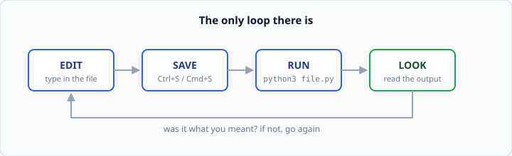
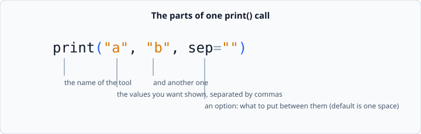
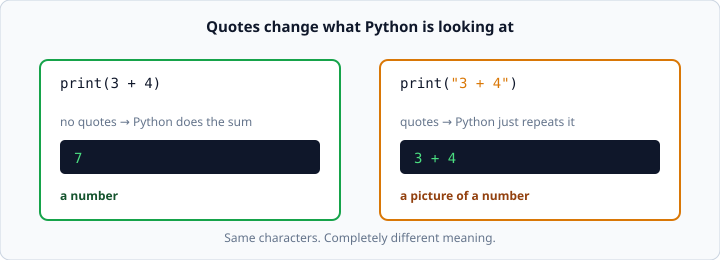

# Running Python, and `print()`

*Week 1 · Day 1 · about 25 minutes*

> By the end of this you can create a file, run it, and make Python show you exactly
> what you meant.

---

## Read the official documentation first

Always start at the source. This is the real Python documentation, written by the
people who build the language. Open these, skim them, then come back here.

| Page | What it gives you |
|---|---|
| [**`print()` — Built-in Functions**](https://docs.python.org/3.14/library/functions.html#print) | The exact, complete definition of `print` |
| [**An Informal Introduction to Python**](https://docs.python.org/3.14/tutorial/introduction.html) | The official gentle walkthrough |
| [**Using the Python Interpreter**](https://docs.python.org/3.14/tutorial/interpreter.html) | How Python actually runs your file |

The `print()` page will look dense the first time. That is normal and it is not a
problem. You are not reading it to understand every word today — you are learning
*where the truth lives*, so that in week 6, when a blog post and the docs disagree,
you already know which one wins.

Here is the one line from that page that matters today:

> `print(*objects, sep=' ', end='\n', ...)`

By the end of this article that line will make complete sense.

---

## The loop you will run ten thousand times

Programming is not typing. It is a loop of four steps, and you never leave it.



Every professional developer, on every day of their career, is somewhere inside that
loop. The loop is the job. Get comfortable in it now.

### Step 1 — make a file

Create a file whose name ends in `.py`. That ending is how everyone (you, your editor,
Python itself) knows it contains Python code.

Call it `hello.py`. Put one line inside:

```python
print("Hello, world!")
```

### Step 2 — save it

Actually save it. `Ctrl+S` on Windows and Linux, `Cmd+S` on a Mac.

An unsaved file is the single most common reason a beginner's change "does nothing".
Python reads the file **on disk**, not the file on your screen. If you have not saved,
those are two different things.

### Step 3 — run it

Open a terminal in the same folder as your file, and type:

```bash
python3 hello.py
```

### Step 4 — look

```
Hello, world!
```

That is it. That is the whole job, forever. Everything else in this course is a bigger
version of these four steps.

> **If `python3` says "command not found"** — Python is not installed, or your terminal
> cannot find it. Fix that before anything else; nothing below will work until you can
> run a file. On Windows the command is often `python` instead of `python3`.

---

## What `print()` actually does

`print()` takes whatever you give it and shows it on the screen. That's the whole
promise. But it has some behaviour worth knowing on day one.



### One value

```python
print("Hello")
```
```
Hello
```

### Many values

Separate them with commas. Python puts **one space** between each one, automatically.

```python
print("a", "b")
```
```
a b
```

Notice you did not ask for that space. Python added it. That default is written right
there in the docs as `sep=' '`.

### Changing the separator

`sep` is short for *separator*. You can set it to anything:

```python
print("a", "b", sep="")
print("a", "b", sep="---")
```
```
ab
a---b
```

### Changing the line ending

`end` is what Python puts at the *end*. The default is `'\n'`, which means "start a new
line". Change it and two prints land on the same line:

```python
print("Loading", end="")
print("...done")
```
```
Loading...done
```

You now understand the whole signature line from the documentation. Go back and read it
again — it should be readable now:

```
print(*objects, sep=' ', end='\n', ...)
```

That is what the docs are for. They are terse, not difficult.

---

## The most important idea today

Look at these two lines closely.



```python
print(3 + 4)      # 7
print("3 + 4")    # 3 + 4
```

Same characters, opposite meanings.

- **Without quotes**, `3 + 4` is a *calculation*. Python works it out and prints the
  answer.
- **With quotes**, `"3 + 4"` is *text*. Python has no opinion about it. It just shows it
  to you, character for character.

Text in quotes is called a **string** (short for "string of characters"). It is one of
the four types you meet tomorrow.

This distinction — a number versus a picture of a number — is the source of a genuinely
large share of beginner bugs. Sit with it for thirty seconds. It comes back all week,
and it comes back hard on Day 2 when you meet `input()`.

---

## Comments

A `#` means "the rest of this line is for humans, ignore it".

```python
# This whole line is a note to myself. Python skips it.
print("this runs")      # and Python skips this bit too
```

Comments cost nothing and are read far more often than they are written. Use them to
say **why**, not **what**:

```python
price = price * 1.18    # bad:  multiply price by 1.18
price = price * 1.18    # good: add 18% GST
```

The code already says *what*. Only you know *why*.

---

## Traps that catch everybody

**Missing a bracket.** Python reads your line, gets to the end, and finds the `(` was
never closed:

```python
print("hello"
```
```
SyntaxError: '(' was never closed
```

**Capital P.** Python is case-sensitive. `Print` is not `print`.

```python
Print("hello")
```
```
NameError: name 'Print' is not defined. Did you mean: 'print'?
```

Notice how helpful that message is — it even guesses your fix. Python 3.14 error
messages are genuinely good. Read them.

**Smart quotes.** If you copy code from a website or a chat app, you sometimes get
`"` and `"` (curly) instead of `"` (straight). Python only accepts straight quotes.
This produces a confusing `SyntaxError` and it is worth recognising on sight.

---

## Check yourself

Predict the output of each line **before** you run it. Write your prediction down. Then
run it and see.

```python
print("2" + "2")
print(2 + 2)
print("2" * 3)
print(2 * 3)
```

<details>
<summary>Answers</summary>

```
22
4
222
6
```

With quotes, `+` glues text together and `*` repeats it. Without quotes, they are
ordinary arithmetic. Same operators, different behaviour depending on the **type** of
the thing on either side — which is exactly tomorrow's topic.
</details>

If any of those four surprised you, that surprise is the most valuable thing that
happened to you today. Note it down and bring it to the live hour.

---

## What you can now do

- [ ] Create a `.py` file, save it, and run it with `python3`
- [ ] Print one value, and several values
- [ ] Change the separator with `sep=` and the line ending with `end=`
- [ ] Explain the difference between `3 + 4` and `"3 + 4"`
- [ ] Write a comment, and say why comments should explain *why*

**Next:** [Strings and quotes](strings-and-quotes.md) — what to do when the text you
want to print contains a quote mark.
