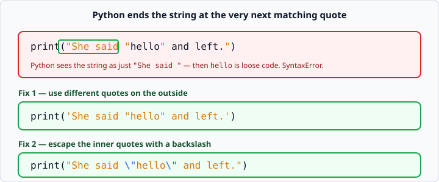
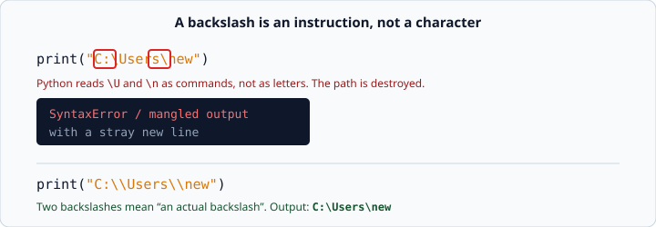

# Strings and quotes

*Week 1 · Day 1 · about 15 minutes*

> By the end of this you can print any text you like — including text that contains
> quote marks, tabs, backslashes and new lines.

---

## Read the official documentation first

| Page | What it gives you |
|---|---|
| [**Text — An Informal Introduction**](https://docs.python.org/3.14/tutorial/introduction.html#text) | The friendly tour of strings |
| [**String and Bytes literals**](https://docs.python.org/3.14/reference/lexical_analysis.html#strings) | The formal rules, including the full escape-sequence table |
| [**`str` — Text Sequence Type**](https://docs.python.org/3.14/library/stdtypes.html#text-sequence-type-str) | Everything a string can do |

The escape-sequence table in that second link is the reference you will come back to.
Bookmark it.

---

## What a string is

A **string** is text. You mark text with quotes so Python knows not to try to run it as
code.

Python accepts single quotes and double quotes. They behave identically.

```python
print('hello')
print("hello")
```
```
hello
hello
```

There is no "correct" one. Pick whichever avoids the problem below.

---

## The problem: a quote inside a quote

This is broken:

```python
print("She said "hello" and left.")
```
```
SyntaxError: invalid syntax
```

Here is why. Python does not read your intention. It reads left to right, and the moment
it sees a `"` it starts a string; the moment it sees the *next* `"` it ends it.



So Python thinks your string is just `"She said "`, and then it finds the word `hello`
sitting there as bare code, which means nothing. Hence the error.

### Fix 1 — swap the outside quotes

If your text contains double quotes, wrap it in single quotes:

```python
print('She said "hello" and left.')
```
```
She said "hello" and left.
```

And the other way round, if your text contains an apostrophe:

```python
print("It's fine.")
```
```
It's fine.
```

This is the reason Python gives you two kinds of quote. Use it. It is almost always the
tidiest fix.

### Fix 2 — escape the inner quotes

Put a backslash `\` in front of the quote. The backslash means *"the next character is
text, not punctuation"*:

```python
print("She said \"hello\" and left.")
```
```
She said "hello" and left.
```

Use this when your text contains **both** kinds of quote and swapping won't save you.

---

## Escape sequences

A backslash starts a small instruction inside a string. These are the ones you need
this week:

| You type | You get |
|---|---|
| `\n` | a new line |
| `\t` | a tab |
| `\"` | a literal `"` |
| `\'` | a literal `'` |
| `\\` | a literal `\` |

`\n` lets one `print()` produce several lines:

```python
print("Name\tScore")
print("Ana\t91")
print("first line\nsecond line")
```
```
Name	Score
Ana	91
first line
second line
```

> **`\t` is not "a few spaces".** A tab jumps to the next tab stop, which depends on
> where you already are. If you need columns that line up exactly and predictably, use
> spaces. Use `\t` only when you actually want a tab character.

---

## The trap that catches everybody

You want to print a Windows file path. You write the obvious thing:

```python
print("C:\Users\new")
```



It does not work — and it fails in a way that is confusing, because `\U` and `\n` are
both instructions. `\n` silently inserts a line break in the middle of your path, and
`\U` starts a Unicode escape that then complains it is malformed.

To print an actual backslash, you need **two** of them:

```python
print("C:\\Users\\new")
```
```
C:\Users\new
```

Read that as: the first backslash says *"the next character is plain text"*, and the
next character happens to be a backslash. So you get one.

This rule is universal. Whenever you want a real backslash in a string, double it.

---

## Check yourself

Write three `print()` calls — exactly three — that produce exactly these three lines:

```
She said "hello" and left.
Path: C:\Users\new
Name	Score
```

(The third line has a real tab between the two words.)

<details>
<summary>One valid answer</summary>

```python
print('She said "hello" and left.')
print("Path: C:\\Users\\new")
print("Name\tScore")
```

The first could also use `\"` escapes. The second **must** double the backslashes. The
third must use `\t`, not spaces.
</details>

---

## What you can now do

- [ ] Write text with single or double quotes and know why both exist
- [ ] Put a quote mark inside a string, two different ways
- [ ] Use `\n` and `\t`
- [ ] Explain why `"C:\Users\new"` is broken and how to fix it
- [ ] Find the full escape table in the official documentation without being told where

**Next:** [Variables and types](../day-2/variables-and-types.md) — giving values names,
and the four kinds of value you will use constantly.
