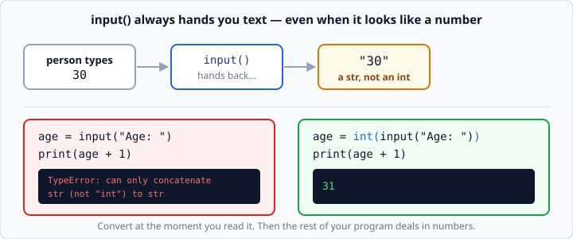

# `input()` and type conversion

*Week 1 · Day 2 · about 20 minutes*

> By the end of this you can ask a person for information and turn what they typed into
> a number you can actually calculate with.

---

## Read the official documentation first

| Page | What it gives you |
|---|---|
| [**`input()`**](https://docs.python.org/3.14/library/functions.html#input) | The exact definition — read the return type carefully |
| [**`int()`**](https://docs.python.org/3.14/library/functions.html#int) | Turning text into a whole number |
| [**`float()`**](https://docs.python.org/3.14/library/functions.html#float) | Turning text into a decimal number |
| [**`str()`**](https://docs.python.org/3.14/library/functions.html#func-str) | Turning anything into text |

One sentence on the `input()` page decides everything in this article:

> "The function then reads a line from input, converts it to a string (stripping a
> trailing newline), and returns that."

**Returns a string.** Always. Every time. Even when the person typed `30`.

---

## Asking a question

```python
name = input("Name: ")
print(f"Hello, {name}!")
```

When you run it, the program stops, prints `Name: `, and waits. Whatever the person
types and then presses Enter becomes the value of `name`.

```
Name: Sam
Hello, Sam!
```

Two small habits that pay off:

- **Put the prompt inside `input()`**, not in a separate `print()`. It keeps the cursor
  on the same line, which is what people expect.
- **End your prompt with a space**: `"Name: "` not `"Name:"`. Otherwise the person's
  typing runs straight into your colon.

The automated tests in this course type answers into your program in a fixed order and
check your prompt text exactly. Copy the prompt from the exercise, character for
character, including the trailing space.

---

## The biggest trap of the week

```python
age = input("Age: ")
print(age + 1)
```
```
Age: 30
TypeError: can only concatenate str (not "int") to str
```



The person typed digits. It *looks* like a number on screen. It is not. `input()` handed
you the **text** `"30"`, and `"30" + 1` is meaningless — Python cannot glue a number
onto text, and it will not silently guess what you meant.

That refusal is a feature. A language that guesses is a language where your payroll
program quietly does the wrong thing.

### The fix: convert immediately

```python
age = int(input("Age: "))
print(age + 1)
```
```
Age: 30
31
```

Read it inside-out: `input()` runs first and gives `"30"`; `int()` takes that and gives
the number `30`; `=` puts it in `age`.

**Convert at the moment you read the value.** From that line onwards, `age` is a number
and the rest of your program never has to think about it again. Converting later, half
way down the file, is how you end up with the same bug three times.

---

## Which converter to use

| Function | Turns text into | Use it for |
|---|---|---|
| `int()` | whole number | ages, years, quantities, counts |
| `float()` | decimal number | prices, temperatures, measurements |
| `str()` | text | putting a number into text the old way |

```python
year     = int(input("Birth year: "))    # 1990 -> 1990
bill     = float(input("Bill: "))        # 42.50 -> 42.5
quantity = int(input("Quantity: "))      # 3 -> 3
```

**Rule of thumb: if a decimal point could ever appear, use `float()`.** A price can be
`4.50`. A quantity of coffees cannot be `2.5`. Pick accordingly.

### `int()` is strict

```python
int("30")       # 30
int("30.5")     # ValueError: invalid literal for int() with base 10: '30.5'
int("thirty")   # ValueError
float("30.5")   # 30.5   <- float is happy with it
```

`int()` will not round for you. If a decimal string might arrive, use `float()` and
convert afterwards if you need a whole number.

### What happens when someone types nonsense

```python
age = int(input("Age: "))
```
```
Age: banana
ValueError: invalid literal for int() with base 10: 'banana'
```

Your program crashes. **That is the correct behaviour for this week** — you have no
tools to handle it yet. Handling bad input properly is `try` / `except`, and that is
week 3. Do not go looking for it now; the fence exists for a reason.

---

## `str()` and why you rarely need it

`str()` turns anything into text:

```python
count = 4
print("You have " + str(count) + " items")
```
```
You have 4 items
```

That works, but it is the clumsy old way. The f-string does the conversion for you:

```python
print(f"You have {count} items")
```

Use f-strings. `str()` is worth knowing because you will see it in other people's code,
not because you should write it often.

---

## Putting it together

Here is the shape of nearly every program you write this week:

```python
# 1. constants at the top, named
TAX_RATE = 0.08

# 2. read input, converting as you go
price    = float(input("Price: "))
quantity = int(input("Quantity: "))

# 3. calculate
subtotal = price * quantity
tax      = subtotal * TAX_RATE
total    = subtotal + tax

# 4. print, formatted for a human
print(f"Subtotal: ${subtotal:.2f}")
print(f"Tax: ${tax:.2f}")
print(f"Total: ${total:.2f}")
```
```
Price: 12.50
Quantity: 2
Subtotal: $25.00
Tax: $2.00
Total: $27.00
```

Notice `TAX_RATE` is a named variable at the top, not `0.08` buried in the middle of a
sum. When the tax rate changes you edit one line, and anyone reading the file can see
what the number means. Capital letters are the convention for a value that never
changes.

---

## Check yourself

Predict each line before running it.

```python
print(int("7") + 1)
print("7" + "1")
print(float("7"))
print(int(7.9))
print(str(7) + "1")
```

<details>
<summary>Answers</summary>

```
8
71
7.0
7
71
```

`int(7.9)` is `7`, not `8` — `int()` chops the decimal off, it does not round. If you
want rounding, that is `round()`.
</details>

---

## What you can now do

- [ ] Ask a person a question with `input()` and use their answer
- [ ] State from memory what type `input()` returns
- [ ] Explain the `TypeError` from `input("Age: ") + 1` and fix it
- [ ] Choose between `int()` and `float()` for a given value
- [ ] Convert at the point of reading, and name your constants

**Next:** [`if` / `elif` / `else`](../day-3/if-elif-else.md) — making your program take
different paths.
