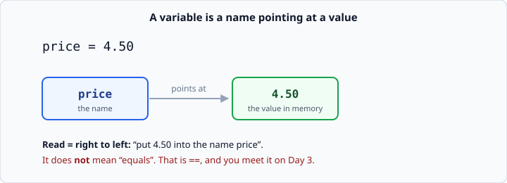
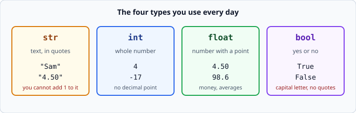
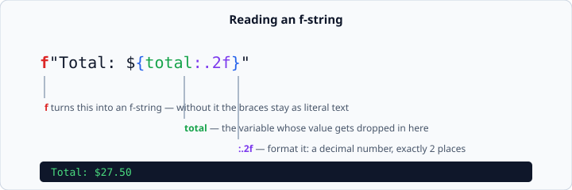

# Variables and types

*Week 1 · Day 2 · about 25 minutes*

> By the end of this you can store a value under a name, know what kind of value it is,
> do arithmetic with it, and format the result to look like money.

---

## Read the official documentation first

| Page | What it gives you |
|---|---|
| [**Using Python as a Calculator**](https://docs.python.org/3.14/tutorial/introduction.html#using-python-as-a-calculator) | Numbers, arithmetic, and first variables |
| [**`type()`**](https://docs.python.org/3.14/library/functions.html#type) | The built-in that tells you what something is |
| [**Numeric Types — `int`, `float`**](https://docs.python.org/3.14/library/stdtypes.html#numeric-types-int-float-complex) | The complete arithmetic table |
| [**Formatted string literals (f-strings)**](https://docs.python.org/3.14/tutorial/inputoutput.html#formatted-string-literals) | Dropping values into text |
| [**Format Specification Mini-Language**](https://docs.python.org/3.14/library/string.html#format-specification-mini-language) | What `:.2f` and its relatives mean |

That last page is where `:.2f` is actually defined. You will use it for the rest of
your career. It is worth two minutes now.

---

## What a variable is

Yesterday your programs printed the same thing every time. A **variable** is what makes
them react.

```python
price = 4.50
```



The `=` sign is the part people get wrong. In maths, `=` states a fact. In Python it is
an **instruction**: *"take the thing on the right, and put it into the name on the
left."*

Read it right to left. Once you do, this stops being strange:

```python
price = 4.50
price = price + 1     # perfectly normal
print(price)          # 5.5
```

Right to left: work out `price + 1`, which is `5.50`; put that into `price`. The old
value is gone. Nothing is contradictory — it is just two steps in time.

### Names matter more than you think

```python
p = 4.50          # bad
x = 3             # bad
temp = 0.08       # bad
```

```python
price = 4.50      # good
people_count = 3  # good
tax_rate = 0.08   # good
```

You are not writing this for Python. Python does not care. You are writing it for
yourself in three weeks, and for the interviewer who reads your project in week 12.
`temp` tells them nothing. `tax_rate` tells them everything.

Rules for names: letters, digits and underscores; cannot start with a digit; no spaces.
The convention in Python is `lower_case_with_underscores`.

---

## The four types

Every value in Python has a **type** — a kind. These four cover nearly everything you
do in week 1.



```python
name  = "Sam"     # str   - text, always in quotes
count = 4         # int   - whole number
price = 4.50      # float - number with a decimal point
is_ok = True      # bool  - True or False, capitalised, no quotes
```

Type is not decoration. It decides what an operator *does*:

```python
print(2 + 2)          # 4     -> two ints: arithmetic
print("2" + "2")      # 22    -> two strs: glued together
print("ab" * 3)       # ababab -> str times int: repeated
```

Same `+`. Different behaviour. This is why "a number versus a picture of a number" from
Day 1 matters so much.

### Ask Python when you are not sure

```python
price = 4.50
print(type(price))        # <class 'float'>
print(type("4.50"))       # <class 'str'>
```

`type()` is a debugging tool you should reach for early and often. When something
mystifying happens, printing the type of the thing usually explains it in one line.

### `True` and `False`

Capital first letter. No quotes.

```python
is_ok = True      # correct
is_ok = true      # NameError: name 'true' is not defined
is_ok = "True"    # this is text, not a bool. Different thing.
```

---

## Arithmetic

| Operator | Meaning | Example |
|---|---|---|
| `+` `-` `*` | add, subtract, multiply | `3 * 4` → `12` |
| `/` | divide — **always gives a float** | `7 / 2` → `3.5` |
| `//` | floor division, throws away the remainder | `7 // 2` → `3` |
| `%` | remainder ("modulo") | `7 % 2` → `1` |
| `**` | power | `2 ** 3` → `8` |

Two of these are worth dwelling on.

**`/` always gives a float, even when it divides evenly.**

```python
print(6 / 3)      # 2.0   <- not 2
print(6 // 3)     # 2
```

**`%` is how you test divisibility.** A number is even when `n % 2 == 0`. You need this
tomorrow.

```python
print(10 % 2)     # 0  -> even
print(11 % 2)     # 1  -> odd
```

### Use parentheses even when you do not need to

Python follows the usual order of operations: `**` first, then `*` `/` `//` `%`, then
`+` `-`.

```python
print(2 + 3 * 4)        # 14, not 20
print((2 + 3) * 4)      # 20
```

Do not rely on the reader remembering the table. `(a + b) / 2` is kinder than
`a + b / 2` is wrong, and the second one is a real bug that ships.

---

## f-strings

An f-string lets you drop values straight into text. Put an `f` immediately before the
opening quote, and put variable names inside `{ }`.

```python
name = "Sam"
total = 27.5
print(f"Hello {name}, you owe {total}")
```
```
Hello Sam, you owe 27.5
```

Without the `f`, the braces are just braces:

```python
print("Hello {name}")     # Hello {name}
```

Forgetting the `f` is a very common mistake, and it does not raise an error — it just
prints the wrong thing. If your output contains literal curly braces, that is the cause.

### Formatting money

`27.5` is not how money looks. Add `:.2f` inside the braces.



```python
total = 27.5
print(f"Total: ${total:.2f}")     # Total: $27.50
print(f"Total: ${total}")         # Total: $27.5   <- looks broken, is broken
```

`:.2f` means *"format as a decimal number with exactly two places"*. `:.1f` gives one
place. This is how every number shown to a human should be formatted.

You can also pad to a width, which is how you line up columns:

```python
print(f"{'Coffee':<15}{3.4:>6.2f}")
```
```
Coffee           3.40
```

`<15` means "left-aligned in 15 characters", `>6.2f` means "right-aligned in 6
characters, two decimal places". All of it is in the
[Format Specification Mini-Language](https://docs.python.org/3.14/library/string.html#format-specification-mini-language)
page from the top of this article.

---

## One thing that will look like a bug

```python
print(0.1 + 0.2)
```
```
0.30000000000000004
```

This is not a bug in Python, and it is not a bug in your computer. Floats are stored in
binary, and some decimal fractions have no exact binary form — the same way `1/3` has no
exact decimal form. Tiny errors creep in.

The practical consequences for you today:

1. **Always print money with `:.2f`.** The rounding hides it.
2. **Never test two floats with `==`.** `0.1 + 0.2 == 0.3` is `False`.

The official write-up is
[Floating-Point Arithmetic: Issues and Limitations](https://docs.python.org/3.14/tutorial/floatingpoint.html).
Read it when you have twenty minutes — it is one of the best pages in the docs, and it
is a genuinely good interview answer.

---

## Check yourself

Predict each line before running it.

```python
print(7 / 2)
print(7 // 2)
print(7 % 2)
print(2 ** 10)
print("7" + "1")
price = 5
price = price * 2
print(price)
```

<details>
<summary>Answers</summary>

```
3.5
3
1
1024
71
10
```

`"7" + "1"` is `71` because both sides are strings — `+` glues, it does not add.
</details>

---

## What you can now do

- [ ] Store a value in a well-named variable, and reassign it
- [ ] Read `=` right to left, and explain why `price = price + 1` is not nonsense
- [ ] Name the four basic types and check one with `type()`
- [ ] Use `/`, `//`, `%` and `**`, and say what `%` is for
- [ ] Write an f-string, and format a number to two decimal places
- [ ] Explain why `0.1 + 0.2` is not `0.3`

**Next:** [`input()` and type conversion](input-and-type-conversion.md) — the biggest
trap of the week.
