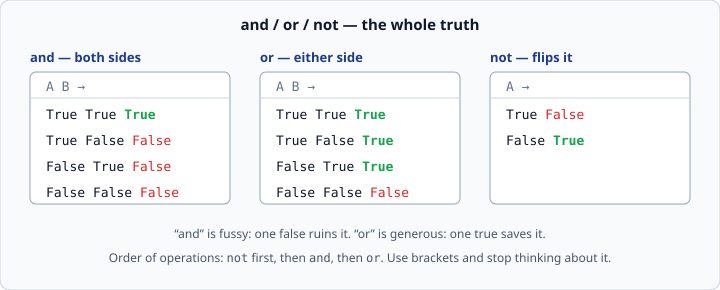
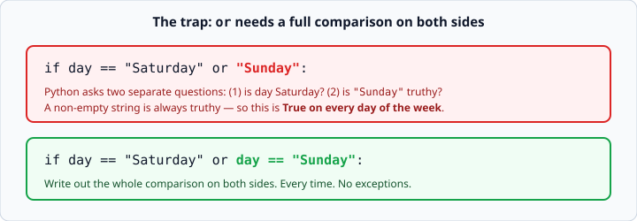

# Boolean logic — `and`, `or`, `not`

*Week 1 · Day 3 · about 15 minutes*

> By the end of this you can combine several conditions into one, and you will recognise
> the `or` trap that catches almost every beginner.

---

## Read the official documentation first

| Page | What it gives you |
|---|---|
| [**Boolean Operations — `and`, `or`, `not`**](https://docs.python.org/3.14/library/stdtypes.html#boolean-operations-and-or-not) | The exact definitions, including short-circuiting |
| [**Truth Value Testing**](https://docs.python.org/3.14/library/stdtypes.html#truth-value-testing) | Which values count as false — this explains the trap below |
| [**`bool`**](https://docs.python.org/3.14/library/functions.html#bool) | The built-in that shows you what Python thinks is true |

---

## The three words

Python spells its logic operators as English words, not symbols. There is no `&&` and
no `||` here.



```python
if age >= 18 and has_ticket:
    print("Come in")

if day == "Saturday" or day == "Sunday":
    print("Weekend")

if not is_banned:
    print("Allowed")
```

- **`and`** — both sides must be true. It is fussy: one false ruins it.
- **`or`** — either side is enough. It is generous: one true saves it.
- **`not`** — flips a true to a false and back.

### Order of operations

`not` binds tightest, then `and`, then `or`. Which means this:

```python
if a or b and c:
```

is really `a or (b and c)` — probably not what you meant if you read left to right.

**Do not memorise the table. Use brackets.**

```python
if (a or b) and c:      # says exactly what it means
```

Brackets cost nothing, remove all doubt, and make the line survive being edited by
someone in a hurry six months from now.

---

## The trap

This looks completely reasonable and is completely broken:

```python
if day == "Saturday" or "Sunday":
    print("Weekend")
```

It prints `Weekend` on a Tuesday. It prints `Weekend` always.



Here is why. `or` does not know you are still talking about `day`. It sees two separate
expressions and asks a question about each:

1. `day == "Saturday"` → maybe `True`, maybe `False`
2. `"Sunday"` → is this truthy?

And a non-empty string is **truthy** — Python treats it as true. So the second half is
always true, so the `or` is always true.

The fix is to write the comparison out in full on both sides:

```python
if day == "Saturday" or day == "Sunday":
```

**Every side of an `or` must be a complete question.** No shortcuts. Say the variable
name again.

> Python 3.14 will not warn you about this. It is valid code that does something
> other than what you meant — which is the worst kind of bug and the reason it is
> worth ten minutes of your attention today.

---

## Truthiness

The trap above is a special case of a bigger rule: Python can treat *any* value as
true or false, not just `True` and `False`.

These are **falsy** — they behave like `False`:

```python
False
0
0.0
""          # the empty string
```

Everything else you have met is **truthy**, including `"0"`, `"False"`, and `-1`.

```python
print(bool(""))         # False
print(bool("hello"))    # True
print(bool(0))          # False
print(bool("0"))        # True   <- a string with a zero in it. Not empty. Truthy.
```

`bool()` is the tool for checking. When a condition behaves strangely, print
`bool(the_thing)` and the mystery usually ends there.

This is genuinely useful once you know it:

```python
name = input("Name: ")
if not name:
    print("You did not type anything.")
```

`not name` is true when `name` is the empty string. Clean and readable.

---

## Short-circuiting

Python stops evaluating as soon as the answer is settled.

```python
if age >= 18 and has_ticket:
```

If `age >= 18` is false, the whole `and` must be false, so Python **never looks at**
`has_ticket`. Likewise `or` stops at the first true.

Today this is just a curiosity. From week 3 it becomes a technique — it is how you check
something exists before you use it, in one line. File it away.

---

## Writing conditions people can read

A condition that needs a comment is usually a condition that needs a variable.

```python
# hard work to read
if (age >= 18 and age < 65) and (day != "Sunday") and not is_banned:
    print("Allowed")
```

```python
# says the same thing, out loud
is_working_age = 18 <= age < 65
is_open        = day != "Sunday"

if is_working_age and is_open and not is_banned:
    print("Allowed")
```

Note `18 <= age < 65` — Python lets you chain comparisons exactly like maths does, and
it means what you would expect. Most languages cannot do this. It is one of the genuinely
nice things about Python.

### Name your booleans as questions

`is_banned`, `has_ticket`, `is_open`. A name starting with `is_` or `has_` tells the
reader instantly that this is a yes/no value, and it makes the `if` line read like a
sentence.

Then avoid this, which every beginner writes once:

```python
if has_ticket == True:      # noise
if has_ticket:              # same thing, better
```

`has_ticket` is already `True` or `False`. Comparing it to `True` adds nothing.

---

## Check yourself

Predict each one.

```python
print(True and False)
print(True or False)
print(not True)
print(bool(""))
print(bool("False"))
print(5 > 3 and 2 > 4)

day = "Tuesday"
print(day == "Saturday" or "Sunday")
```

<details>
<summary>Answers</summary>

```
False
True
False
False
True
False
Sunday
```

The last one is the surprise. It does not print `True` — it prints `Sunday`. Python's
`or` returns the first truthy *value*, not a boolean. In an `if` that value is then
treated as true, which is exactly how the bug hides. Seeing `Sunday` printed here should
now make complete sense to you.
</details>

---

## What you can now do

- [ ] Use `and`, `or` and `not`, and state their truth tables
- [ ] Use brackets instead of relying on operator precedence
- [ ] Explain why `day == "Saturday" or "Sunday"` is always true
- [ ] List the falsy values, and use `bool()` to check one
- [ ] Name a boolean variable so the `if` line reads like English
- [ ] Write `if has_ticket:` instead of `if has_ticket == True:`

**Next:** [Reading Python tracebacks](../day-4/reading-python-tracebacks.md) — the skill
nobody teaches and every interview tests.
