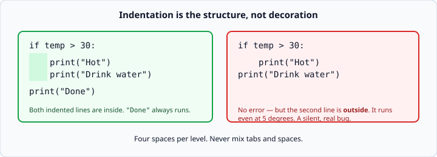
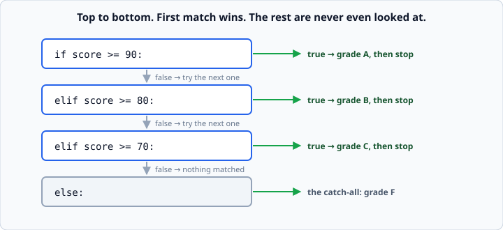

# `if` / `elif` / `else`

*Week 1 · Day 3 · about 25 minutes*

> By the end of this your program can take different paths depending on what it was
> given — and you can check the boundaries by hand instead of hoping.

---

## Read the official documentation first

| Page | What it gives you |
|---|---|
| [**`if` Statements — Tutorial**](https://docs.python.org/3.14/tutorial/controlflow.html#if-statements) | The friendly introduction |
| [**The `if` statement — Reference**](https://docs.python.org/3.14/reference/compound_stmts.html#the-if-statement) | The exact rules |
| [**Comparisons**](https://docs.python.org/3.14/library/stdtypes.html#comparisons) | The full list of comparison operators |
| [**Truth Value Testing**](https://docs.python.org/3.14/library/stdtypes.html#truth-value-testing) | What counts as true and false |

Days 1 and 2 ran top to bottom, every line, every time. Today that stops.

---

## Comparison gives you a `bool`

Before you can branch, you need a question with a yes/no answer. Comparison operators
produce exactly that — a `True` or a `False`.

```python
print(5 > 3)        # True
print(5 == 3)       # False
print(5 != 3)       # True
```

| Operator | Means |
|---|---|
| `==` | equal to |
| `!=` | not equal to |
| `<` `>` | less than / greater than |
| `<=` `>=` | less than or equal / greater than or equal |

### `=` assigns. `==` compares.

This is the single most common beginner bug, and it will happen to you today.

```python
score = 90      # assignment: put 90 into score
score == 90     # comparison: is score 90? -> True
```

Python 3 helps you here. Writing `if score = 90:` is a `SyntaxError`, not a silent
disaster — the language refuses to let you make the classic mistake. But you will still
type it, so recognise the error when it appears.

---

## `if`

```python
temperature = 31

if temperature > 30:
    print("Hot")
```

Two things on that line are not decoration:

**1. The colon.** Every `if` line ends with `:`. Forget it and you get
`SyntaxError: expected ':'`.

**2. The indentation.** Four spaces. In most languages indentation is a courtesy; in
Python it *is* the structure. It is how Python knows what belongs inside the `if`.



Getting it wrong gives you one of two outcomes:

```python
if temperature > 30:
print("Hot")
```
```
IndentationError: expected an indented block after 'if' statement on line 1
```

That one is loud and easy. The dangerous one is the version on the right of the diagram
above — code that indents *less* than you meant, runs without any error, and quietly
does the wrong thing at the wrong time. Those are the bugs that survive to production.

**Use four spaces. Let your editor insert them. Never mix tabs and spaces** — they look
identical on screen and Python treats them as different.

---

## `else`

`else` catches everything the `if` did not.

```python
if temperature > 30:
    print("Hot")
else:
    print("Not hot")
```

`else` has no condition of its own. It cannot — it is the leftovers.

---

## `elif`

When there are more than two paths, `elif` (short for "else if") chains them.

```python
if score >= 90:
    print("A")
elif score >= 80:
    print("B")
elif score >= 70:
    print("C")
else:
    print("F")
```



### Order matters enormously

Python checks top to bottom and **stops at the first condition that is true**. Once one
branch runs, every remaining branch is skipped without even being evaluated.

Which means this is broken:

```python
if score >= 70:
    print("C")
elif score >= 80:
    print("B")
elif score >= 90:
    print("A")
```

A score of 95 gets a **C**. It matched `>= 70` first, and Python never looked further.

The rule: **when your conditions overlap, order them from most specific to least
specific.** For a grade ladder that means highest first.

### `elif` versus a stack of `if`s

These are not the same thing:

```python
# one decision, four possible outcomes
if score >= 90: ...
elif score >= 80: ...

# two independent decisions, both are checked
if score >= 90: ...
if score >= 80: ...
```

With separate `if`s, a score of 95 triggers **both**. Use `elif` when the branches are
alternatives; use separate `if`s when they are genuinely unrelated questions.

---

## Checking your boundaries

This is the part that separates code that works from code that nearly works.

Your grade table says 90 and above is an A, and 80–89 is a B. So test **89, 90, 79, 80**
by hand. Not 85 and 95 — those tell you nothing. The interesting numbers are always the
ones sitting exactly on the line.

```python
if score >= 90:      # 90 -> A. correct.
if score > 90:       # 90 -> falls through to B. wrong.
```

The difference between `>` and `>=` is one character and it is wrong half the time. It
has a name — an **off-by-one error** — and it is in shipped software everywhere.

Here is one to sit with:

```python
age = 65
if age > 65:
    print("senior")
elif age > 18:
    print("adult")
else:
    print("minor")
```

A 65-year-old gets `adult`. Is that what the code *meant* to say? Almost certainly not.
Nothing about that code looks wrong, which is precisely the problem.

**Get in the habit now: for every boundary in your conditions, write down the two
numbers either side of it and trace them by hand.**

---

## Nesting

An `if` can live inside another `if`. Indent one more level:

```python
if is_member:
    if spend > 100:
        print("Free delivery")
```

That works. But it often reads better flattened with `and`:

```python
if is_member and spend > 100:
    print("Free delivery")
```

Prefer the flat version when the two conditions belong together. Reach for nesting when
the outer condition has its own `else`:

```python
if is_member:
    if spend > 100:
        print("Free delivery")
    else:
        print("Spend a bit more for free delivery")
else:
    print("Members get free delivery over $100")
```

---

## Order of operations in a chain

When a calculation has stages, the **order you apply them in changes the answer**. This
comes up in today's cinema-ticket exercise and it is worth seeing plainly.

```python
BASE = 12.00

# work out the age price FIRST
if age < 13:
    price = 8.00
elif age >= 65:
    price = 9.00
else:
    price = BASE

# THEN apply the discount to whatever that came to
if day == "Tuesday":
    price = price - 2.00
```

A 12-year-old on a Tuesday pays `8.00 - 2.00` = **$6.00**. If you applied the discount
first, or wrote the Tuesday rule as another `elif` in the same chain, you would get a
different — wrong — answer.

The tell: **`elif` means "instead of". A separate `if` means "as well as".** Age and day
are independent facts, so they need two separate decisions.

---

## Check yourself

```python
score = 85

if score >= 80:
    print("B")
elif score >= 90:
    print("A")
else:
    print("F")
```

1. What does this print for `score = 85`?
2. What does it print for `score = 95`?
3. What is wrong, and what is the fix?

<details>
<summary>Answers</summary>

1. `B` — correct by accident.
2. `B` — wrong. 95 matched `>= 80` first and Python stopped there.
3. The conditions are in the wrong order. Put the most specific (highest) first:
   `if score >= 90` … `elif score >= 80` … `else`.

The `elif score >= 90` branch in the original can **never** run. Any score that would
reach it was already caught above. Unreachable code like this is a strong smell — if a
branch can never be true, either the order is wrong or the branch should not exist.
</details>

---

## What you can now do

- [ ] Write a comparison and say what type it produces
- [ ] Explain the difference between `=` and `==`
- [ ] Write `if` / `elif` / `else` with correct colons and four-space indentation
- [ ] Explain why order matters in an `elif` chain, and spot an unreachable branch
- [ ] Test the boundaries of a condition by hand instead of guessing
- [ ] Choose between `elif` ("instead of") and a second `if` ("as well as")

**Next:** [Boolean logic](boolean-logic.md) — combining conditions with `and`, `or`
and `not`, and the trap that catches everyone.
