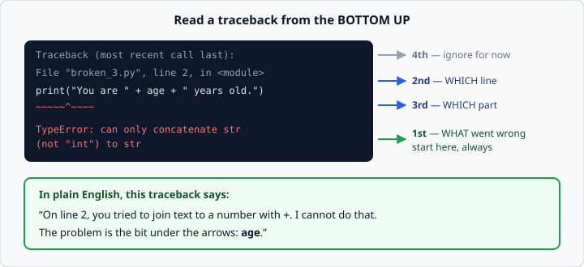
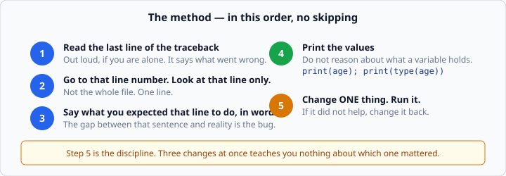

# Reading Python tracebacks

*Week 1 · Day 4 · about 20 minutes*

> By the end of this you can look at an error message, say what went wrong and where,
> and fix code you did not write.

---

## Read the official documentation first

| Page | What it gives you |
|---|---|
| [**Errors and Exceptions — Tutorial**](https://docs.python.org/3.14/tutorial/errors.html) | Syntax errors versus exceptions, explained gently |
| [**Built-in Exceptions**](https://docs.python.org/3.14/library/exceptions.html) | Every error type Python can raise, and what each one means |
| [**`traceback`**](https://docs.python.org/3.14/library/traceback.html) | The module behind the output you are reading |

Bookmark the **Built-in Exceptions** page. When you meet an error type you have not seen
before, that page is where you look it up — not a search engine, not a chat window. It
is short, alphabetical, and definitive.

---

## The mindset first

There are no new concepts today. Today is about the skill nobody teaches and every
interview tests: **being handed broken code and staying calm.**

Here is something worth internalising early, because most beginners believe the
opposite.

Professional programmers do not write code that works. They write code that is broken,
read the error, and fix it — dozens of times an hour, for their whole career. The error
message is not a punishment and not a sign you are not cut out for this. It is the most
useful output your program produces.

A red wall of text on your screen is Python trying very hard to help you. Learn to read
it and it stops being scary within a week.

---

## Anatomy of a traceback

```
Traceback (most recent call last):
  File "/Users/sam/code/broken_3.py", line 2, in <module>
    print("You are " + age + " years old.")
                       ~~~~~^~~~~
TypeError: can only concatenate str (not "int") to str
```

**Read it from the bottom up. Always.**



| Where | What it tells you |
|---|---|
| **Last line** | *What* went wrong: the error type, and a sentence explaining it |
| **The line above** | *Which line of your code*: the file, the line number, and the code itself |
| **The `~~~^~~~` marks** | *Which part* of that line. The `^` points at the culprit |
| **Everything above that** | How Python got there. Ignore it this week |

The top of a traceback is the least useful part, which is unfortunate, because it is the
part beginners read. `Traceback (most recent call last):` is a fixed heading. It never
changes and it never tells you anything.

> Python 3.14's error messages are genuinely excellent. They often name the variable,
> suggest the fix, and draw arrows at the exact characters. Earlier versions did not.
> Read the whole message — the suggestion at the end is right more often than not.

---

## The five errors you will meet today

| Error | Usually means |
|---|---|
| `SyntaxError` | Python could not even read your file. A missing bracket, quote, or colon — **often on the line *before* the one it points at** |
| `IndentationError` | Your spacing does not match your structure |
| `NameError` | You used a name Python has never seen. Almost always a typo, or using something before you created it |
| `TypeError` | You did something to a value that its **type** does not support. Adding text to a number is the classic |
| `ValueError` | The type was right but the **value** was not. `int("hello")` — it *is* text, it is just not a number |

Two of those need a note.

### `SyntaxError` points at the wrong line, on purpose

```python
print("hello"
print("world")
```
```
  File "x.py", line 2
    print("world")
    ^^^^^
SyntaxError: '(' was never closed
```

It blames line 2. The bug is on line 1. Python read line 1, found no closing bracket,
kept reading hopefully, and only gave up when line 2 made no sense as a continuation.

**When a `SyntaxError` names a line that looks perfect, look at the line above it.**
This one rule will save you hours over the next three months.

### `TypeError` versus `ValueError`

The difference is worth being precise about, because it is a good interview answer.

```python
int("hello")     # ValueError - it IS a string, just not a numeric one
"3" + 3          # TypeError  - a str and an int cannot be added at all
```

`TypeError` means *"the kind of thing is wrong"*. `ValueError` means *"the kind is
right, the contents are not"*.

---

## The sixth error, which has no message

| **A logic bug** | It runs. It finishes. It gives the wrong answer. |

There is no traceback. Python did exactly what you told it to; you told it the wrong
thing.

```python
length = 7
width  = 3
area   = length + width       # runs fine. prints 10. should be 21.
print(f"Area: {area}")
```

This is the dangerous kind, and the only defence is **knowing what the right answer
should have been before you run it.** Work out `7 × 3 = 21` on paper first. Then, when
the program says 10, you have somewhere to start.

That habit — deciding the expected answer in advance — is also the entire idea behind
the tests you have been running all week, and behind everything in week 4.

---

## The method

When something breaks, do these in order. Do not skip to guessing.



1. **Read the last line of the traceback.** Out loud if you are alone.
2. **Go to the line number it names.** Look at that line only.
3. **Say what you expected that line to do**, in words.
4. **Print the values.** `print(age)`, `print(type(age))`. Do not reason about what a
   variable contains — go and look.
5. **Change one thing.** Run it. If it did not help, change it back.

Step 4 is the one beginners skip, and it is the one that solves the problem. You will
sit and stare at a line trying to *deduce* what `age` holds. Stop deducing. Put a
`print(type(age))` above it and find out in two seconds.

Step 5 is the discipline that separates debugging from thrashing. Changing three things
at once and getting a different error teaches you nothing about which change did what.

---

## Worked example

```python
age = input("Age: ")
print("You are " + age + " years old.")
```
```
Age: 30
TypeError: can only concatenate str (not "int") to str
```

Wait — that message says the problem is adding an `int`. But `input()` returns a `str`,
so surely both sides are strings?

**Step 4. Stop guessing, go and look.**

```python
age = input("Age: ")
print(type(age))          # <class 'str'>
```

So `age` really is a string, and the real code must be different from what you assumed.
Sure enough, the actual file was:

```python
age = int(input("Age: "))
print("You are " + age + " years old.")
```

There it is. Line 1 converts to `int`, line 2 tries to glue that number onto text.

Two valid fixes, and it is worth knowing why one is better:

```python
print("You are " + str(age) + " years old.")     # works
print(f"You are {age} years old.")               # better
```

The f-string handles the conversion itself and reads like the sentence it produces.

---

## Check yourself

Name the error each of these produces, without running them.

```python
# a
print("hello)

# b
prnt("hello")

# c
age = "30"
print(age + 1)

# d
print(int("thirty"))

# e
if True:
print("yes")
```

<details>
<summary>Answers</summary>

- **a** — `SyntaxError`: the string was never closed.
- **b** — `NameError: name 'prnt' is not defined. Did you mean: 'print'?` — Python even
  suggests the fix.
- **c** — `TypeError`: `str` and `int` cannot be added.
- **d** — `ValueError`: it is a string, but not one that represents a number.
- **e** — `IndentationError: expected an indented block after 'if' statement`.
</details>

---

## Write it down

Fixing five bugs by trying things teaches you almost nothing. Writing down what each
error *meant* is what turns today into a skill you still have in week 12.

For every bug you fix this week, record three lines:

1. What the error said
2. What was actually wrong
3. What you will look for next time you see that message

"Tell me about a bug you found and how you found it" is a real interview question, asked
in most first rounds. The person with a notebook full of these answers it well. The
person who fixed things by changing lines until the red went away does not.

---

## What you can now do

- [ ] Read a traceback from the bottom up and say what went wrong, and where
- [ ] Name the five common error types and what each one usually means
- [ ] Know to look at the line *above* the one a `SyntaxError` points at
- [ ] Explain the difference between `TypeError` and `ValueError`
- [ ] Recognise a logic bug, which has no traceback at all
- [ ] Debug by printing values and changing one thing at a time

**Next:** the week 1 milestone. Read `week-01/milestone/README.md` tonight so it is not
new in the morning.
