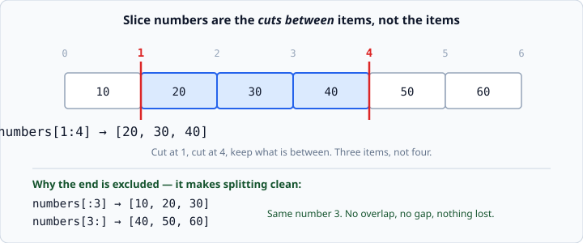

# Indexing and slicing

*Week 2 · Day 1 · about 15 minutes*

> By the end of this you can take any piece out of a list — the first three, the last
> three, every other one, or the whole thing backwards.

---

## Read the official documentation first

| Page | What it gives you |
|---|---|
| [**Strings and slicing — Tutorial**](https://docs.python.org/3.14/tutorial/introduction.html#text) | Where slicing is first explained, on strings |
| [**Common Sequence Operations**](https://docs.python.org/3.14/library/stdtypes.html#common-sequence-operations) | The `s[i:j:k]` row is the formal definition |
| [**`range()`**](https://docs.python.org/3.14/library/functions.html#func-range) | Same start/stop/step idea, which you meet tomorrow |

---

## One index gives an item. Two give a list.

```python
numbers = [10, 20, 30, 40, 50, 60]

print(numbers[1])       # 20            <- an item
print(numbers[1:4])     # [20, 30, 40]  <- a list
```

That difference matters. `numbers[1]` is a number you can do arithmetic on.
`numbers[1:1]` is a **list** — even when it turns out to be empty.

---

## The end is not included

```python
numbers = [10, 20, 30, 40, 50, 60]
print(numbers[1:4])     # [20, 30, 40]
```

`[1:4]` gives you three items, not four. This feels wrong for about a week and then
feels right forever.

Here is the mental model that makes it click. **The numbers are not the items. They are
the cuts between the items.**



Cut at position 1. Cut at position 4. Keep what is between the cuts. Three items.

### Why it is designed that way

Because it makes splitting a list clean:

```python
numbers[:3]     # [10, 20, 30]
numbers[3:]     # [40, 50, 60]
```

Same number `3` in both. No overlap, no gap, nothing counted twice, nothing lost. If
the end were included you would have to write `[:3]` and `[4:]`, and you would get it
wrong regularly.

There is also a nice consequence: **the length of `a[i:j]` is `j - i`.** `[1:4]` is 3
long. No counting required.

---

## Leaving parts out

Any part of a slice can be left blank, and Python fills in the obvious thing.

```python
numbers = [10, 20, 30, 40, 50, 60]

print(numbers[:3])      # [10, 20, 30]     from the start
print(numbers[3:])      # [40, 50, 60]     to the end
print(numbers[:])       # the whole list
print(numbers[-3:])     # [40, 50, 60]     the last three
print(numbers[:-1])     # everything except the last one
```

`numbers[-3:]` is how you take "the last three" without knowing the length. Compare it
to `numbers[len(numbers)-3:]`, which does the same thing and is worse in every way.

---

## The third number: step

```python
numbers[start:stop:step]
```

```python
print(numbers[::2])     # [10, 30, 50]    every second one
print(numbers[1::2])    # [20, 40, 60]    every second one, starting at 1
print(numbers[::-1])    # [60, 50, 40, 30, 20, 10]   backwards
```

`[::-1]` — a step of minus one — is the standard Python idiom for "reversed". You will
see it constantly. Read it as: no start, no stop, go backwards.

---

## Slicing never raises `IndexError`

This is the interesting difference, and it is worth understanding rather than
memorising.

```python
letters = ["a", "b", "c"]

print(letters[5])       # IndexError: list index out of range
print(letters[1:99])    # ['b', 'c']       <- no error at all
print(letters[5:9])     # []               <- no error, just empty
```

**Indexing asks for one specific item.** If it is not there, there is nothing to hand
back, so Python has to raise an error.

**Slicing asks for a range.** "Give me everything from 5 to 9" has a perfectly sensible
answer when there is nothing there: an empty list. So Python clamps the numbers to what
exists and hands back whatever it found.

This is genuinely useful. `items[:10]` gives you "up to the first ten" and works
whether the list has 3 items or 300.

But it also hides bugs. An empty list where you expected data is a silent problem, and
it usually shows up three functions later as a mystifying `IndexError` on something
else. When a slice surprises you, print its `len()`.

---

## Slicing copies

```python
original = [1, 2, 3]
piece = original[:]      # a NEW list with the same contents
piece.append(4)

print(original)          # [1, 2, 3]   <- untouched
print(piece)             # [1, 2, 3, 4]
```

A slice always builds a new list. That makes `[:]` the quick way to copy a list, which
matters because this does *not* copy:

```python
a = [1, 2, 3]
b = a                    # two names, ONE list
b.append(4)
print(a)                 # [1, 2, 3, 4]   <- surprise
```

`b = a` gives the same list a second name. Remember the Day 2 picture from last week:
a variable is a name pointing at a value. Two names can point at the same list.

You do not need this today, but when a list changes and you cannot see why, this is
almost always the reason. File it away.

---

## Strings slice too

Everything above works on strings, because a string is also a sequence:

```python
word = "python"
print(word[0])      # p
print(word[-1])     # n
print(word[:3])     # pyt
print(word[::-1])   # nohtyp
```

One difference: **strings cannot be changed in place.**

```python
word[0] = "P"       # TypeError: 'str' object does not support item assignment
```

Lists are *mutable* (changeable). Strings are *immutable*. To "change" a string you
build a new one — which is why `word[::-1]` gives you a new reversed string rather than
reversing the one you had.

---

## Check yourself

```python
letters = ["a", "b", "c"]
print(letters[1:1])
print(len(letters[1:99]))
print(letters[::-1])
print(letters[-2:])
print(letters[:-2])
```

<details>
<summary>Answers</summary>

```
[]
2
['c', 'b', 'a']
['b', 'c']
['a']
```

The first is the interesting one. `[1:1]` means "cut at 1, cut at 1, keep what is
between" — and there is nothing between a cut and itself. Empty list, no error. Compare
that with `letters[3]`, which *is* an error, and you have the whole indexing-versus-
slicing distinction in two lines.
</details>

---

## What you can now do

- [ ] Take a slice with `[start:stop]` and explain why the stop is excluded
- [ ] Leave out the start or the stop, and use negative numbers
- [ ] Use a step, including `[::-1]` for reversed
- [ ] Say why `letters[5]` is an error but `letters[5:9]` is not
- [ ] Copy a list with `[:]`, and explain why `b = a` does not copy
- [ ] Slice a string, and say why you cannot assign into one

**Next:** [`for` loops and `range`](../day-2/for-loops-and-range.md) — doing something
to every item without writing it out once per item.
