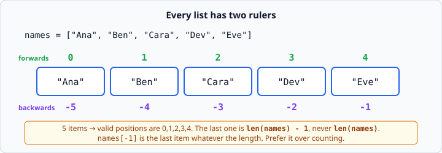
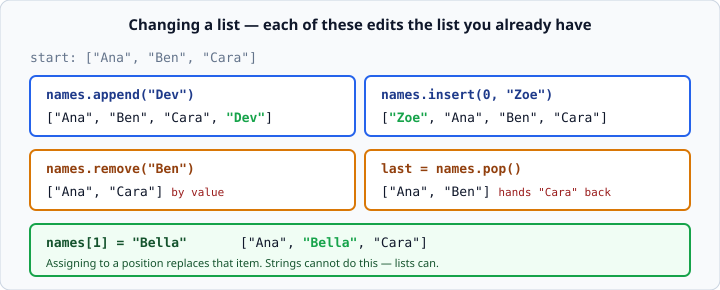

# Python lists

*Week 2 · Day 1 · about 25 minutes*

> By the end of this you can keep many values under one name, reach any of them, and
> change the list after you have made it.

---

## Read the official documentation first

| Page | What it gives you |
|---|---|
| [**Lists — An Informal Introduction**](https://docs.python.org/3.14/tutorial/introduction.html#lists) | The gentle first tour |
| [**More on Lists**](https://docs.python.org/3.14/tutorial/datastructures.html#more-on-lists) | Every list method, with examples |
| [**`len()`**](https://docs.python.org/3.14/library/functions.html#len) | How many items are in a thing |
| [**Sequence Types — `list`**](https://docs.python.org/3.14/library/stdtypes.html#sequence-types-list-tuple-range) | The formal reference for everything below |

The **More on Lists** page is the one to keep open today. It is a short, complete table
of everything a list can do, and you will want it beside you for the exercises.

---

## Why lists exist

Last week, every value needed its own name.

```python
name1 = "Ana"
name2 = "Ben"
name3 = "Cara"
```

That falls apart immediately. What if there are fifty names? What if you do not know how
many there will be until the program runs?

A **list** holds many values under one name, in order.

```python
names  = ["Ana", "Ben", "Cara"]
prices = [4.50, 7.25, 2.45]
empty  = []
```

Square brackets, values separated by commas. A list can hold anything, including a mix:

```python
mixed = ["Ana", 12, 4.50]
```

Python allows that, but it is usually a warning sign. If your items are "a name and an
age and a price", those are three different *fields* of one thing, and what you actually
want is a dictionary — which is Wednesday.

---

## Positions start at zero

This is the thing to get straight today, because everything else stands on it.



```python
names = ["Ana", "Ben", "Cara"]

print(names[0])     # Ana    <- the FIRST item is at position 0
print(names[1])     # Ben
print(names[2])     # Cara
print(names[3])     # IndexError: list index out of range
```

A list of 3 items has valid positions **0, 1, 2**. The last position is always
`len(list) - 1`, never `len(list)`.

That "minus one" is where off-by-one errors live, and they will be with you for your
whole career. Make friends with it now.

### Counting backwards

Negative positions count from the end:

```python
print(names[-1])    # Cara   <- the last one
print(names[-2])    # Ben    <- second from last
```

**Prefer `names[-1]` over `names[len(names) - 1]`.** It is shorter, it is clearer, and
crucially it keeps working when the list changes length. Any time you find yourself
typing a literal position near the end of a list, reach for a negative index instead.

---

## `len()` and `in`

```python
names = ["Ana", "Ben", "Cara"]

print(len(names))           # 3
print("Ben" in names)       # True
print("Zoe" in names)       # False
print("Zoe" not in names)   # True
```

`in` gives you a `bool`, so it drops straight into an `if`:

```python
if "Ben" in names:
    print("Found him")
```

`len()` works on strings too — `len("hello")` is `5`. It works on almost every
collection you will meet this week.

---

## Changing a list

Here is something genuinely new. Almost everything you met in week 1 could not be
changed — you could only replace it. A list **can** be modified in place.



```python
names = ["Ana", "Ben", "Cara"]

names[1] = "Bella"          # replace position 1
names.append("Dev")         # add to the end
names.insert(0, "Zoe")      # add at a position, shifting the rest right
names.remove("Cara")        # remove by value  (ValueError if it is not there)
last = names.pop()          # remove the LAST item and hand it back to you
first = names.pop(0)        # remove by position and hand it back
```

Two things worth noticing.

**`.append()` is the one you will use ten times more than the rest.** The pattern is
always the same shape: start with an empty list, then add to it as you go.

```python
basket = []
basket.append("apple")
basket.append("bread")
print(basket)               # ['apple', 'bread']
```

You will write that pattern hundreds of times. Tomorrow it goes inside a loop and
becomes the second-most-important idea of the week.

**`.remove()` deletes by value; `.pop()` deletes by position.** When you do not know
what the item *is* — because a person typed it — you must use `.pop(0)`, not
`.remove(whatever)`.

### The methods that return nothing

This catches everyone once:

```python
names = ["Ana", "Ben"]
names = names.append("Cara")     # WRONG
print(names)                     # None
```

`.append()` changes the list and returns `None`. It does not hand you a new list. So
assigning its result throws your list away and replaces it with nothing.

```python
names.append("Cara")             # right. Just call it.
```

Rule of thumb: **if a method changes the list, do not assign its result.** `.pop()` is
the exception — it both changes the list *and* hands you the removed item, which is
exactly why it is useful.

---

## Printing a list

Printing a list directly gives you the brackets and commas for free:

```python
numbers = [10, 20, 30]
print(numbers)                     # [10, 20, 30]
print(f"Numbers: {numbers}")       # Numbers: [10, 20, 30]
```

You do not need to build that text yourself. Note that strings inside show with quotes:

```python
print(["a", "b"])                  # ['a', 'b']
```

That is Python showing you the *structure*, which is what you want while debugging.

---

## Check yourself

```python
letters = ["a", "b", "c"]
print(letters[3])
print(letters[-1])
print(len(letters))
letters.append("d")
print(letters)
x = letters.pop()
print(x, letters)
```

<details>
<summary>Answers</summary>

```
IndexError: list index out of range
c
3
['a', 'b', 'c', 'd']
d ['a', 'b', 'c']
```

The first line stops the program. Comment it out to see the rest.
</details>

---

## What you can now do

- [ ] Create a list, and an empty list
- [ ] Reach any item by position, forwards and backwards
- [ ] Explain why the last position is `len(list) - 1`
- [ ] Use `len()` and `in`
- [ ] Add with `.append()` and `.insert()`, remove with `.remove()` and `.pop()`
- [ ] Say why `names = names.append(x)` is a bug

**Next:** [Indexing and slicing](indexing-and-slicing.md) — taking a piece of a list.
