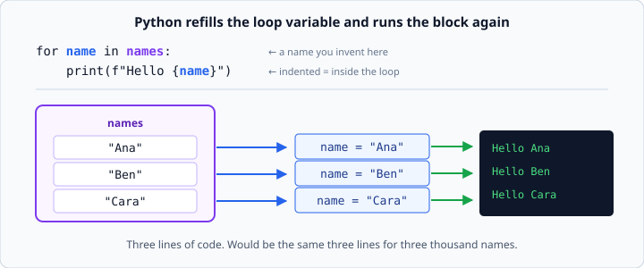
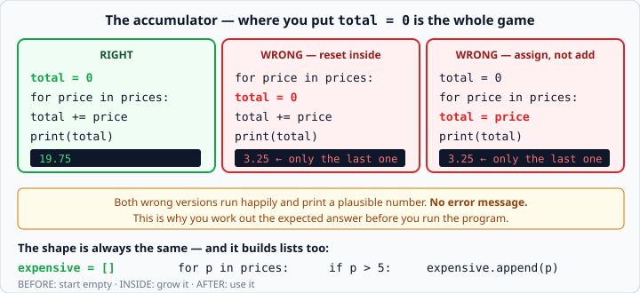

# `for` loops and `range`

*Week 2 · Day 2 · about 25 minutes*

> By the end of this you can do something to every item in a collection without writing
> it out once per item — and you know where to put `total = 0`.

---

## Read the official documentation first

| Page | What it gives you |
|---|---|
| [**`for` Statements — Tutorial**](https://docs.python.org/3.14/tutorial/controlflow.html#for-statements) | The friendly introduction |
| [**The `range()` Function**](https://docs.python.org/3.14/tutorial/controlflow.html#the-range-function) | Start, stop, step |
| [**`enumerate()`**](https://docs.python.org/3.14/library/functions.html#enumerate) | Getting the position alongside the item |
| [**`zip()`**](https://docs.python.org/3.14/library/functions.html#zip) | Walking two lists together |
| [**`sum()`**](https://docs.python.org/3.14/library/functions.html#sum) · [**`max()`**](https://docs.python.org/3.14/library/functions.html#max) · [**`min()`**](https://docs.python.org/3.14/library/functions.html#min) | The shortcuts you earn today |

---

## This is the day programming starts paying for itself

Yesterday, printing ten names meant ten `print()` lines. Today it is three lines —
and it is the same three lines whether there are ten names or ten thousand.

```python
names = ["Ana", "Ben", "Cara"]

for name in names:
    print(f"Hello {name}")
```
```
Hello Ana
Hello Ben
Hello Cara
```



Here is exactly what happens. `name` is a variable you are **inventing on that line** —
it did not exist before. Python puts the first item into it, runs the indented block,
puts the second item into it, runs the block again, and keeps going until the list is
exhausted.

The colon and the indentation work exactly like `if`. Everything indented is inside the
loop; the first unindented line afterwards runs once, at the end.

```python
for name in names:
    print(name)          # runs 3 times
print("Done")            # runs once
```

**Name the loop variable properly.** `for n in names` costs the same as
`for name in names` and tells the reader nothing. The singular of the list name is
almost always right: `for price in prices`, `for task in tasks`.

---

## `range` — a stretch of numbers

Sometimes you want to loop a fixed number of times, or over numbers you do not have in
a list.

```python
for i in range(5):
    print(i)
```
```
0
1
2
3
4
```

Five numbers, starting at 0, and **none of them is 5**. Same rule as slicing: the stop
value is not included.

```python
range(5)            # 0 1 2 3 4
range(1, 6)         # 1 2 3 4 5        start, stop
range(10, 0, -2)    # 10 8 6 4 2       start, stop, step
range(0, 10, 3)     # 0 3 6 9
```

Notice `range(10, 0, -2)` stops at 2, not 0 — because 0 is the stop value and stop
values are excluded. To include 0, you need `range(10, -1, -2)`.

That is exactly the kind of boundary you should check by hand before running, the same
way you checked `>=` versus `>` last week.

### `range` is not a list

```python
print(range(5))          # range(0, 5)   <- not [0, 1, 2, 3, 4]
print(list(range(5)))    # [0, 1, 2, 3, 4]
```

`range` produces its numbers one at a time as the loop asks for them, rather than
building the whole list in memory. `range(1000000)` costs nothing. This is a genuinely
good design and it comes back when you meet generators much later.

For now: if you need to *see* it, wrap it in `list()`. If you are looping over it, you
do not need to.

### Do not use `range(len(x))` to walk a list

Beginners coming from other languages write this:

```python
for i in range(len(names)):      # works, but clumsy
    print(names[i])
```

Python's way is simpler and cannot go out of bounds:

```python
for name in names:               # do this
    print(name)
```

Only reach for positions when you genuinely need the number — and even then,
`enumerate()` below is better.

---

## The accumulator — the most important pattern this week

You want a total. You cannot add up ten numbers in one expression. So you make a
variable **before** the loop and grow it **inside**.

```python
prices = [4.50, 12.00, 3.25]

total = 0                     # BEFORE the loop. Start empty.
for price in prices:
    total = total + price     # INSIDE. Grow it.
print(total)                  # AFTER the loop. Use it.
```
```
19.75
```

`total = total + price` reads oddly until you read it right to left: *work out
`total + price`, then put the answer back into `total`.* Same rule as week 1.

There is a shorthand, and it is what you should write:

```python
total += price      # exactly the same thing
```

### Where you put `total = 0` is the whole game



Both wrong versions in that diagram **run perfectly happily** and print a plausible
number. There is no error message. There is no red text. There is just a wrong answer
that looks like a right one.

This is the bug that is coming for you on Thursday, and the defence is the one from
last week: **work out the expected answer before you run the program.** Three prices
of 4.50, 12.00 and 3.25 come to 19.75. If your program says 3.25, you know immediately.

### The same shape builds a list

```python
expensive = []                     # BEFORE: start empty
for price in prices:
    if price > 5:
        expensive.append(price)    # INSIDE: grow it
print(expensive)                   # AFTER: use it
```
```
[12.0]
```

Before, inside, after. Learn that shape. You will write it for the rest of your life,
and in week 3 you will learn the one-line version — but not until you can write this
one without thinking.

---

## `enumerate` — when you need the position too

```python
names = ["Ana", "Ben", "Cara"]

for i, name in enumerate(names):
    print(f"{i}. {name}")
```
```
0. Ana
1. Ben
2. Cara
```

Two variables on the left, because `enumerate` hands back two things each time round —
the position and the item.

Humans number from 1, so:

```python
for i, name in enumerate(names, start=1):
    print(f"{i}. {name}")
```
```
1. Ana
2. Ben
3. Cara
```

Use `start=1` rather than writing `i + 1` in the f-string. It says what you mean, and
you only have to get it right in one place.

---

## `zip` — two lists at once

```python
names  = ["Ana", "Ben"]
scores = [91, 78]

for name, score in zip(names, scores):
    print(f"{name}: {score}")
```
```
Ana: 91
Ben: 78
```

`zip` stops at the shorter list. If `names` has 3 items and `scores` has 2, you get 2
rounds and no warning — which is occasionally what you want and occasionally a silent
bug. Check the lengths match when it matters.

---

## Lining up columns

Now that you are printing many rows, they should line up. The f-string format spec does
this:

```python
print(f"{'Item':<12}{'Price':>8}")
for name, price in zip(names, prices):
    print(f"{name:<12}{price:>8.2f}")
```
```
Item           Price
Ana            4.50
Ben           12.00
```

- `<12` — left-aligned, 12 characters wide
- `>8` — right-aligned, 8 characters wide
- `^20` — centred, 20 characters wide

**Numbers go right, text goes left.** That is the convention in every report you will
ever produce, and it is right-aligned numbers that make a column of figures readable.

---

## The shortcuts you have now earned

```python
print(sum(prices))      # add them all up
print(len(prices))      # how many
print(max(prices))      # biggest
print(min(prices))      # smallest
print(round(19.756, 2)) # 19.76
```

Write the accumulator loop version at least once first, so you know what these are doing
for you. Then use them — `sum(prices)` is clearer than four lines of loop, and clarity
is the only thing you are optimising for this year.

An average is `sum(prices) / len(prices)`. Watch out for an empty list: that is a
`ZeroDivisionError`, and it is a real bug in real software.

---

## Check yourself

```python
total = 0
for n in [1, 2, 3]:
    total = n
print(total)
```

```python
for n in [1, 2, 3]:
    total = 0
    total += n
print(total)
```

Both print something. Neither prints 6. Work out *why* for each, separately — they are
wrong for different reasons.

<details>
<summary>Answers</summary>

Both print `3`.

**The first** uses `=` instead of `+=`. Each round throws away the running total and
replaces it with the current item. After the last round it holds 3.

**The second** resets `total` to 0 at the top of every round, adds one item, then resets
again next time. After the last round it holds 0 + 3.

Different mistakes, same misleading output: *the last item*. Whenever a total comes out
equal to the final element of your list, look at these two lines first.
</details>

---

## What you can now do

- [ ] Write a `for` loop over a list, naming the loop variable well
- [ ] Use `range()` with one, two and three arguments, and say why the stop is excluded
- [ ] Write the accumulator pattern with the reset in the right place
- [ ] Explain what goes wrong when the reset is inside the loop
- [ ] Build a list inside a loop with `.append()`
- [ ] Use `enumerate()` with `start=1`, and `zip()` for two lists
- [ ] Align columns with `{x:<12}` and `{n:>8.2f}`

**Next:** [`while` loops](while-loops.md) — repeating until something changes.
