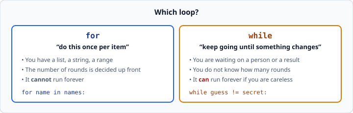

# `while` loops

*Week 2 · Day 2 · about 15 minutes*

> By the end of this you can repeat something until a condition changes — and you can
> get out of an infinite loop without panicking.

---

## Read the official documentation first

| Page | What it gives you |
|---|---|
| [**First Steps Towards Programming**](https://docs.python.org/3.14/tutorial/introduction.html#first-steps-towards-programming) | Where `while` is introduced |
| [**The `while` statement — Reference**](https://docs.python.org/3.14/reference/compound_stmts.html#the-while-statement) | The exact rules, including `else` |
| [**`break` and `continue`**](https://docs.python.org/3.14/tutorial/controlflow.html#break-and-continue-statements) | Leaving a loop early, and skipping a round |

---

## `for` runs once per item. `while` runs until a condition is false.

```python
count = 0
while count < 3:
    print(count)
    count += 1
```
```
0
1
2
```

Read it as a sentence: *while count is less than 3, do this.* Python checks the
condition, runs the block, checks again, runs again, and stops the moment the condition
is false.

The structure is identical to `if` — a condition, a colon, an indented block. The only
difference is that `if` runs the block at most once and `while` runs it until told to
stop.

---

## Which loop to use



**Use `for` when you know what you are looping over.** A list, a string, a `range` — the
number of rounds is settled before the loop starts, and it cannot run forever.

**Use `while` when you do not know how many times** — usually because you are waiting on
a person, or on a result you have not got yet.

The classic `while` is asking someone a question until they give a good answer:

```python
secret = 7
guess = int(input("Guess: "))

while guess != secret:
    if guess < secret:
        print("Too low")
    else:
        print("Too high")
    guess = int(input("Guess: "))

print("Correct!")
```

You cannot write that with a `for`, because you have no idea how many guesses it will
take.

---

## The infinite loop

If nothing inside the loop ever makes the condition false, it runs forever.

```python
count = 0
while count < 3:
    print(count)        # count never changes. This never stops.
```

Your terminal fills with zeros. **Press <kbd>Ctrl</kbd>+<kbd>C</kbd> to stop it.**

You will do this today. It is not a disaster, it is not damage, and it happens to
professionals regularly. Learn the keystroke and it becomes a shrug.

The cause is always one of two things:

1. **You forgot to change the variable in the condition** — no `count += 1`.
2. **You changed the wrong variable**, or changed it in a way that never reaches the
   stopping point.

So the check is mechanical: **look at the variable in your `while` condition, then find
the line inside the loop that changes it.** If there is no such line, you have an
infinite loop. Do this before you run, and you will rarely need Ctrl+C.

---

## Reading input inside a `while`

Notice the shape of the guessing game above. The `input()` appears **twice** — once
before the loop and once at the bottom of it.

```python
guess = int(input("Guess: "))     # get the first one

while guess != secret:
    ...
    guess = int(input("Guess: ")) # get the next one
```

That duplication bothers people, and there is a way around it using `while True` and
`break`:

```python
count = 0
while True:
    guess = int(input("Guess: "))
    count += 1
    if guess == secret:
        break
    elif guess < secret:
        print("Too low")
    else:
        print("Too high")

print(f"Correct! It took {count} guesses.")
```

`while True` means "loop forever", and `break` is what gets you out. It looks alarming
and it is completely standard — it is often the clearest way to write "do this, then
check whether to stop".

Both versions are fine. Write whichever one you can explain.

---

## Counting rounds

A very common need: how many times did the loop run?

```python
count = 0
while ...:
    count += 1        # increment as the FIRST thing inside
    ...
```

Where you put `count += 1` decides whether the final guess is counted. If the person
guesses 3, then 9, then 7 and gets it right, "how many guesses did it take" is **3** —
the correct one counts too. Put the increment at the top of the loop body, before any
`break`, and it always includes the round you are in.

This is the same off-by-one thinking as `>` versus `>=`. Trace it with a three-guess
run on paper before you trust it.

---

## `break` and `continue`

These work in both `for` and `while` loops.

```python
for n in numbers:
    if n < 0:
        continue        # skip the rest of THIS round, go to the next
    if n > 100:
        break           # stop the loop entirely
    print(n)
```

- **`continue`** — abandon this round, carry on with the next item
- **`break`** — leave the loop now, do not check the condition again

`break` is the more useful of the two. `continue` is often better written as an `if`
around the body:

```python
for n in numbers:
    if n >= 0:          # same thing, and easier to read
        print(n)
```

Reach for `continue` when the skip condition is genuinely an exception to the rule, and
the body is long enough that wrapping it in an `if` would push everything sideways.

---

## A trap: `break` only leaves one loop

```python
for row in grid:
    for cell in row:
        if cell == target:
            break        # leaves the INNER loop only
```

The outer loop carries on. You do not need nested loops today, but when you meet them in
week 2's exercises, remember that `break` escapes exactly one level.

---

## Check yourself

```python
# a
n = 5
while n > 0:
    print(n)
    n -= 1

# b
n = 5
while n > 0:
    print(n)

# c
count = 0
while count < 3:
    count += 1
print(count)
```

1. What does **a** print?
2. What is wrong with **b**?
3. What does **c** print — 2, 3, or 4?

<details>
<summary>Answers</summary>

1. `5 4 3 2 1`, each on its own line. It stops when `n` reaches 0, because `0 > 0` is
   false.
2. `n` never changes, so the condition never becomes false. Infinite loop. Ctrl+C.
3. `3`. The loop runs with `count` at 0, 1 and 2 — three rounds — and each adds one, so
   it exits holding 3. Then the condition `3 < 3` is false. Tracing this by hand, one
   round at a time, is exactly the skill being built.
</details>

---

## What you can now do

- [ ] Write a `while` loop with a condition that eventually becomes false
- [ ] Choose between `for` and `while` and justify it
- [ ] Recognise an infinite loop before running, and stop one with Ctrl+C
- [ ] Use `while True` with `break`
- [ ] Count rounds correctly, including the final one
- [ ] Use `break` and `continue`, and say what `break` does in a nested loop

**Next:** [Python dictionaries](../day-3/python-dictionaries.md) — looking things up by
name instead of by position.
