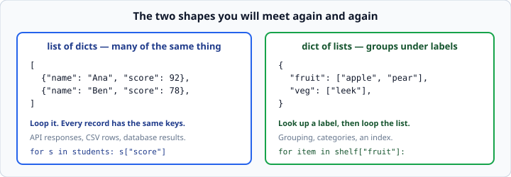
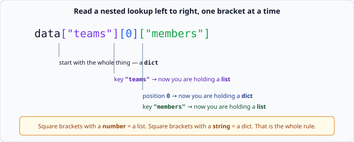

# Nested data — lists of dicts

*Week 2 · Day 3 · about 15 minutes*

> By the end of this you can read data that is more than one level deep without getting
> lost, and you can debug it when you do.

---

## Read the official documentation first

| Page | What it gives you |
|---|---|
| [**Nested List Comprehensions**](https://docs.python.org/3.14/tutorial/datastructures.html#nested-list-comprehensions) | The section where nesting is introduced (ignore the comprehension syntax — that is week 3) |
| [**Mapping Types — `dict`**](https://docs.python.org/3.14/library/stdtypes.html#mapping-types-dict) | Values can be any object, including other containers |
| [**`json`**](https://docs.python.org/3.14/library/json.html) | Where you will meet this shape for real, in week 3 |

---

## Real data is nested

Everything you have built so far was flat: a list of numbers, a dict of fields. Real
data is not flat, because real things have parts.



**A list of dicts** is "many of the same thing" — students, orders, search results. Every
record has the same keys. This is what a web API sends you, what a CSV file becomes, and
what a database query returns. It is by far the most common shape in the working world.

**A dict of lists** is "groups under labels" — items by category, tasks by day. You look
up a label, then loop the list you find.

You can go deeper — a list of dicts where one field is itself a list of dicts — and in
week 5 you will. The technique does not change.

---

## Reading a nested lookup

The only skill here is reading left to right and keeping track of what you are holding.



```python
data = {
    "teams": [
        {"name": "Red", "members": ["Ana", "Ben"]},
        {"name": "Blue", "members": ["Cara"]},
    ]
}

print(data["teams"][0]["members"][1])      # Ben
```

Do not try to understand that in one go. Take it one bracket at a time, and say out loud
what you are holding after each step:

| So far | You are holding |
|---|---|
| `data` | a dict |
| `data["teams"]` | a list |
| `data["teams"][0]` | a dict |
| `data["teams"][0]["members"]` | a list |
| `data["teams"][0]["members"][1]` | a string — `"Ben"` |

**Square brackets with a number means a list. Square brackets with a string means a
dict.** That is the whole rule, and it lets you read any nested expression, however
ugly, without guessing.

---

## Looping two levels

```python
for team in data["teams"]:
    print(team["name"])
    for member in team["members"]:
        print(f"  - {member}")
```
```
Red
  - Ana
  - Ben
Blue
  - Cara
```

The outer loop hands you one **dict** per round. The inner loop hands you one **string**
per round. The indentation shows the structure, exactly as it did with `if`.

Name your loop variables after what they actually are. `for team in data["teams"]` is
readable; `for t in d["teams"]` is a puzzle you set for your future self.

### An accumulator across two levels

```python
total_members = 0
for team in data["teams"]:
    total_members += len(team["members"])

print(total_members)        # 3
```

Same pattern as always. Before, inside, after — the only new thing is that "inside"
happens to reach one level down.

---

## Building nested data

You build it the same way you read it: outside in.

```python
students = []                                   # start empty
students.append({"name": "Ana", "score": 92})   # add a record
students.append({"name": "Ben", "score": 78})
```

Or to group things — a dict of lists, built as you go:

```python
by_grade = {}
for student in students:
    grade = "pass" if student["score"] >= 80 else "fail"
    if grade in by_grade:
        by_grade[grade].append(student["name"])
    else:
        by_grade[grade] = [student["name"]]

print(by_grade)     # {'pass': ['Ana'], 'fail': ['Ben']}
```

That is the counting pattern again, with a list instead of a number. *"Seen this group
before? add to its list. Never seen it? start a new list with one item in it."*

> The `"pass" if ... else "fail"` on one line is a **ternary expression**. It is behind
> the week 1 fence but not the week 2 one — write it as a normal `if`/`else` if you
> prefer; they are identical.

---

## When it goes wrong

Nested data produces confusing errors, and the confusion is almost always the same
thing: **you think you are holding one kind of container and you are holding another.**

```python
for student in students:
    print(student[0])
```
```
KeyError: 0
```

`KeyError` — not `IndexError`. That tells you `student` is a **dict**, and you treated it
like a list. The error names the problem precisely, if you read it.

The reverse:

```python
print(data["teams"]["name"])
```
```
TypeError: list indices must be integers or slices, not str
```

`data["teams"]` is a list, and you tried to use a string on it. You forgot the `[0]`.

### The two-second fix

Do not stare at it. **Print the thing and print its type.**

```python
print(type(student))        # <class 'dict'>
print(student)              # {'name': 'Ana', 'score': 92}
```

One of those two lines answers the question every single time. This is step 4 of the
debugging method from last week, and nested data is where it earns its keep.

For anything deeper than two levels, print as you descend:

```python
print(type(data))                    # dict
print(type(data["teams"]))           # list
print(type(data["teams"][0]))        # dict
```

You will find the level where your assumption broke, and it takes ten seconds.

---

## Check yourself

```python
inventory = {
    "fruit": [
        {"name": "apple", "qty": 3},
        {"name": "pear", "qty": 5},
    ],
    "veg": [
        {"name": "leek", "qty": 2},
    ],
}
```

1. What expression gives you the string `"pear"`?
2. What is `type(inventory["fruit"])`?
3. Write a loop that prints the total quantity across every category.

<details>
<summary>Answers</summary>

1. `inventory["fruit"][1]["name"]` — dict key, list position, dict key.
2. `<class 'list'>`.
3. ```python
   total = 0
   for category in inventory:
       for item in inventory[category]:
           total += item["qty"]
   print(total)      # 10
   ```
   Looping a dict gives you its **keys**, so `category` is `"fruit"` then `"veg"`, and
   `inventory[category]` is the list underneath. `for category, items in
   inventory.items()` is the tidier version.
</details>

---

## What you can now do

- [ ] Recognise a list of dicts and a dict of lists, and say where each comes from
- [ ] Read a nested lookup one bracket at a time and name what you are holding
- [ ] Use the number-versus-string rule to tell a list access from a dict access
- [ ] Write a two-level loop with correct indentation
- [ ] Build a dict of lists with the grouping pattern
- [ ] Diagnose `KeyError: 0` and `TypeError: list indices must be integers`
- [ ] Debug depth by printing `type()` at each level

**Next:** [Tuples and sets](../day-4/tuples-and-sets.md) — fixed groups, and each thing
once.
