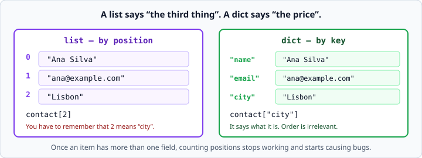
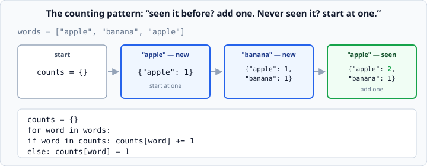
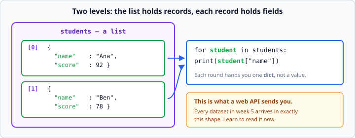

# Python dictionaries

*Week 2 · Day 3 · about 25 minutes*

> By the end of this you can store data with names attached, look it up safely, and
> count how many times each thing appeared.

---

## Read the official documentation first

| Page | What it gives you |
|---|---|
| [**Dictionaries — Tutorial**](https://docs.python.org/3.14/tutorial/datastructures.html#dictionaries) | The friendly introduction |
| [**Mapping Types — `dict`**](https://docs.python.org/3.14/library/stdtypes.html#mapping-types-dict) | Every method, including `.get()` |
| [**Looping Techniques**](https://docs.python.org/3.14/tutorial/datastructures.html#looping-techniques) | `.items()`, and looping over two things at once |
| [**`sorted()`**](https://docs.python.org/3.14/library/functions.html#sorted) | Producing output in a stable order |

---

## Why dictionaries exist

A list says *"the third thing"*. A dictionary says *"the price"*.



Once your data has more than one field per item, counting positions stops working and
starts causing bugs. Nobody can remember that index 2 means "city", and the day someone
inserts a field at the front, every number in your program is wrong.

```python
contact = {
    "name": "Ana Silva",
    "email": "ana@example.com",
    "city": "Lisbon",
}

print(contact["name"])          # Ana Silva
```

Curly braces. Each entry is a **key**, a colon, and a **value**. Square brackets to look
things up — same as a list, but a key goes inside instead of a position.

That trailing comma after the last entry is deliberate. It is legal Python, and it means
adding a line later produces a one-line diff instead of a two-line one. Get in the habit.

### Keys and values

- **Keys** are almost always strings. They must be unique — a second `"name"` entry
  replaces the first.
- **Values** can be anything: numbers, strings, lists, other dicts.
- **Order does not matter.** There is no "third item" in a dict and you never want one.
  (Modern Python does remember insertion order, but relying on that is a bad habit.)

---

## Adding, changing, and the error you will hit

```python
contact["phone"] = "555-0182"       # adds it   - the key did not exist
contact["city"]  = "Porto"          # changes it - the key did exist
print(contact["fax"])               # KeyError: 'fax'
```

The same square brackets do both adding and changing. Python does not ask which you
meant, which is convenient and occasionally a bug — a typo in a key name silently
creates a new entry rather than updating the one you meant.

`KeyError` is the dict version of `IndexError`, and it means the same thing: **you asked
for something that is not there.**

### `.get()` — asking safely

```python
print(contact.get("fax"))               # None      - no error
print(contact.get("fax", "unknown"))    # unknown   - your fallback
```

Use `.get()` whenever you are not certain the key exists — which is most of the time
when the key came from a person typing at a prompt.

```python
country = input("Country: ")
print(f"Capital: {capitals.get(country, 'unknown')}")
```

That program cannot crash. `capitals[country]` can, and will, the first time somebody
types a country you did not think of.

> Note the single quotes inside the f-string's braces. You cannot reuse the same quote
> character that opened the f-string, so alternate them.

---

## Checking and looping

```python
print("email" in contact)       # True
```

**`in` checks keys, not values.** This catches people out:

```python
d = {"a": 1, "b": 2}
print("a" in d)     # True   <- "a" is a key
print(1 in d)       # False  <- 1 is a value, and `in` does not look at values
```

If you genuinely need to search the values, say so: `1 in d.values()`.

### The three ways to loop

```python
for key in contact:                     # keys
    print(key)

for value in contact.values():          # values
    print(value)

for key, value in contact.items():      # both — this is the one you want
    print(f"{key}: {value}")
```

`.items()` hands you two things each time round, so you write two names on the left.
This is the same shape as `enumerate()` from yesterday, and tomorrow you will find out
why: both are handing you a **tuple**.

---

## Counting things — a pattern worth memorising

This shape comes up constantly, and it is a genuine interview question.



```python
words = ["apple", "banana", "apple"]

counts = {}
for word in words:
    if word in counts:
        counts[word] += 1
    else:
        counts[word] = 1

print(counts)       # {'apple': 2, 'banana': 1}
```

Read it as: *"seen it before? add one. Never seen it? start at one."*

The `else` branch exists because `counts[word] += 1` on a key that does not exist yet is
a `KeyError` — there is nothing there to add one to.

It is the accumulator pattern from yesterday, with a dict instead of a number. Before,
inside, after: start empty, grow it, use it.

### Printing it in a stable order

A dict's order is not something you should depend on, so sort the keys before printing:

```python
for word in sorted(counts):
    print(f"{word}: {counts[word]}")
```
```
apple: 2
banana: 1
```

`sorted(counts)` gives you the **keys** in alphabetical order. This matters more than it
looks: a program whose output changes between runs is one you cannot write a test for,
and every exercise this week is graded by a test.

---

## A list of dicts — how real data looks

This is the shape of nearly every dataset you will meet, and it is exactly what comes
back from a web API in week 5.



```python
students = [
    {"name": "Ana", "score": 92},
    {"name": "Ben", "score": 78},
]

for student in students:
    print(student["name"], student["score"])
```

Two levels. The **list** holds records; each **record** holds fields.

The loop hands you one whole dict each time round — not a value. So `student` is a dict,
and you reach into it with a key. Getting comfortable saying that sentence out loud is
most of the battle.

### Working with it

```python
total = 0
for student in students:
    total += student["score"]

average = total / len(students)
print(f"Average: {average:.1f}")
```

Accumulator, again. Notice you never typed a score into your own code — the data lives
in one place and the program works whatever is in it. That is the entire point.

---

## Lining up columns

Money got `:.2f`. Columns get a width and a direction:

```python
print(f"{'Ana':<10}|")     # Ana       |     <  left, padded to 10
print(f"{92:>6}|")         #     92|         >  right, padded to 6
print(f"{'x':^7}|")        #    x   |        ^  centred
```

Combine them: `f"{price:>8.2f}"` means *right-aligned, 8 wide, 2 decimal places.*

```python
print(f"{'NAME':<12}{'SCORE':>6}")
print("-" * 18)
for student in students:
    print(f"{student['name']:<12}{student['score']:>6}")
```
```
NAME         SCORE
------------------
Ana             92
Ben             78
```

`"-" * 18` builds the rule for you. Do not type eighteen dashes by hand and then miscount.

**Numbers go right, text goes left.** That is a convention, not a rule, and it is why
every well-made table you have ever seen looks the way it does — right-aligned digits
line up by place value, so you can compare them at a glance.

---

## Check yourself

```python
d = {"a": 1, "b": 2}
print(d["c"])
print(d.get("c"))
print(d.get("c", 0))
print("a" in d)
print(1 in d)
print(len(d))
```

<details>
<summary>Answers</summary>

```
KeyError: 'c'
None
0
True
False
2
```

The interesting one is `1 in d` → `False`. The value `1` *is* in there. But `in` on a
dict asks about **keys**, always. Being clear on this now will save you an hour later
this week.
</details>

---

## What you can now do

- [ ] Create a dict, and say why it beats a list once items have fields
- [ ] Add, change and read entries, and explain `KeyError`
- [ ] Use `.get()` with a default so your program cannot crash on user input
- [ ] Say what `in` checks on a dict
- [ ] Loop with `.items()`
- [ ] Write the counting pattern from memory
- [ ] Print a dict's keys in a stable order with `sorted()`
- [ ] Read a list of dicts and produce a lined-up table

**Next:** [Nested data — lists of dicts](nested-data.md) — going deeper than two levels
without getting lost.
