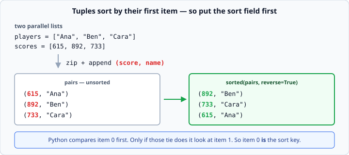

# Sorting in Python

*Week 2 · Day 4 · about 15 minutes*

> By the end of this you can put anything in order — including records — using only what
> is inside this week's fence.

---

## Read the official documentation first

| Page | What it gives you |
|---|---|
| [**`sorted()`**](https://docs.python.org/3.14/library/functions.html#sorted) | The built-in you will use |
| [**Sorting Techniques — HOW TO**](https://docs.python.org/3.14/howto/sorting.html) | The full guide. Read the first section now, the rest in week 3 |
| [**Comparing Sequences**](https://docs.python.org/3.14/tutorial/datastructures.html#comparing-sequences-and-other-types) | **The key page today** — how Python compares tuples |
| [**`reversed()`**](https://docs.python.org/3.14/library/functions.html#reversed) | The other way to flip an order |

> The Sorting HOW-TO leads with `key=`, which is behind this week's fence. Read it, note
> that it exists, and then come back and do it the way below — you will meet `key=`
> properly in week 3 and it will make far more sense for having done this first.

---

## `sorted()`

```python
print(sorted([3, 1, 2]))                 # [1, 2, 3]
print(sorted([3, 1, 2], reverse=True))   # [3, 2, 1]
print(sorted(["Cara", "Ana"]))           # ['Ana', 'Cara']
```

`sorted()` gives you a **new** list and leaves the original alone:

```python
numbers = [3, 1, 2]
result = sorted(numbers)
print(numbers)      # [3, 1, 2]   <- untouched
print(result)       # [1, 2, 3]
```

That is usually what you want. There is also a `.sort()` method that reorders the list
in place and returns `None` — it is behind the fence this week precisely because
`numbers = numbers.sort()` is such an easy way to lose your data.

`sorted()` works on anything you can loop over — lists, sets, tuples, dict keys:

```python
print(sorted(set(visitors)))     # deduplicate, then order
print(sorted(counts))            # a dict gives its keys
```

### Text sorts by character code

```python
print(sorted(["banana", "Apple", "cherry"]))
# ['Apple', 'banana', 'cherry']
```

Capital letters come before lowercase ones, so `"Zebra"` sorts before `"apple"`. That is
rarely what a human wants, but the fix (`key=str.lower`) needs `key=`, so file it away
for week 3. For now, keep your data consistently cased.

---

## The ranking problem

Here is the real lesson of the day.

You have players and scores, and you want the top three. The grown-up way is
`sorted(records, key=lambda r: r["score"])` — and both `key=` and `lambda` are behind
the fence, on purpose.

There is a way to do it with what you already have, and it is not a workaround. It is a
real technique you will still be using in five years.

---

## Tuples compare item by item

```python
print(sorted([(3, "c"), (1, "a"), (2, "b")]))
# [(1, 'a'), (2, 'b'), (3, 'c')]
```

Python compares two tuples the way you compare two words alphabetically: **look at the
first item; if those differ, you have your answer; only if they tie do you look at the
second.**

```python
(1, "z") < (2, "a")      # True  - 1 < 2, the letters never get looked at
(1, "a") < (1, "z")      # True  - first items tie, so "a" < "z" decides
```

Which gives you the whole trick.

---

## Put the sort field first



```python
players = ["Ana", "Ben", "Cara"]
scores  = [615, 892, 733]

pairs = []
for name, score in zip(players, scores):
    pairs.append((score, name))          # score FIRST — that is the whole trick

ranked = sorted(pairs, reverse=True)     # highest score first

for score, name in ranked:
    print(f"{name:<12}{score:>4}")
```
```
Ben          892
Cara         733
Ana          615
```

Item 0 of the tuple **is** the sort key. Build the pair with the thing you want to sort
by in front, and `sorted()` needs no help at all.

Then unpack in the loop — `for score, name in ranked` — and print them in whatever order
the report wants. The tuple order controls sorting; the f-string controls display. They
are independent.

### Top three

```python
for score, name in ranked[:3]:
    print(f"{name:<12}{score:>4}")
```

A slice. And because slices do not raise `IndexError`, this works fine even if there are
only two players.

---

## The tie-breaking problem

This one is worth understanding rather than memorising, because your instructor may ask.

```python
pairs = [(90, "Ana"), (90, "Ben")]
print(sorted(pairs, reverse=True))
# [(90, 'Ben'), (90, 'Ana')]
```

Ana and Ben tied on 90. With `reverse=True`, Python compares the names too — and
reverses *that* as well. So equal scores come out in **reverse alphabetical** order.

Nobody wants that. Ana should come first.

There is a clean fix and it is not on this week's fence. Knowing the problem exists is
enough for now — but be able to say, on Friday:

> "`reverse=True` reverses the whole comparison, including the tie-breaker, so ties come
> out backwards by name. I would fix it by sorting on the negative score with the name
> ascending, or with a `key=` function once I have those."

That answer is worth more than the fix.

---

## Numbers versus text, one more time

```python
print(sorted(["10", "9", "100"]))     # ['10', '100', '9']
print(sorted([10, 9, 100]))           # [9, 10, 100]
```

The first sorts as **text**: `"1"` comes before `"9"`, so `"100"` lands before `"9"`.
It is not broken; it is doing exactly what you asked.

This is the week 1 lesson — a number versus a picture of a number — showing up in a new
place. When a sort comes out in a bafflingly wrong order, print `type()` on one of the
items. It is usually a `str` that should have been an `int`, and the cause is usually an
`input()` that was never converted.

---

## Check yourself

```python
print(sorted([(2, "b"), (1, "z"), (1, "a")]))
print(sorted([3, 1, 2], reverse=True))
print(sorted("cab"))
nums = [3, 1, 2]
print(sorted(nums), nums)
```

<details>
<summary>Answers</summary>

```
[(1, 'a'), (1, 'z'), (2, 'b')]
[3, 2, 1]
['a', 'b', 'c']
[1, 2, 3] [3, 1, 2]
```

The first shows tie-breaking: both `1`s tie, so `"a"` before `"z"` decides. The third
shows `sorted()` on a string gives a list of characters, not a string. The fourth
confirms the original is untouched.
</details>

---

## What you can now do

- [ ] Sort a list with `sorted()`, ascending and descending
- [ ] Explain why `sorted()` returns a new list and what that protects you from
- [ ] Say how Python compares two tuples
- [ ] Build `(sort_field, other)` tuples and rank records without `key=`
- [ ] Take the top N with a slice
- [ ] Explain why `reverse=True` breaks ties backwards
- [ ] Diagnose a sort that came out wrong because the values were strings

**Next:** the week 2 milestone — a sales report from raw records. It is Wednesday's
`records.py` with more columns and a ranking, so read
`week-02/milestone/README.md` tonight.
