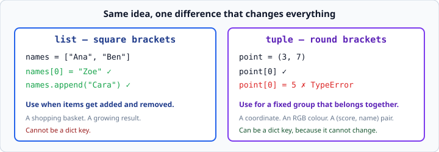
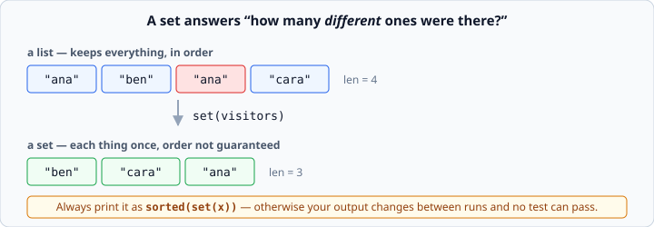

# Tuples and sets

*Week 2 · Day 4 · about 20 minutes*

> By the end of this you can group values that belong together, pull them apart in one
> line, and answer "how many different ones were there?"

---

## Read the official documentation first

| Page | What it gives you |
|---|---|
| [**Tuples and Sequences**](https://docs.python.org/3.14/tutorial/datastructures.html#tuples-and-sequences) | Tuples, and why they exist next to lists |
| [**Sets**](https://docs.python.org/3.14/tutorial/datastructures.html#sets) | Uniqueness and set operations |
| [**`set`**](https://docs.python.org/3.14/library/stdtypes.html#set-types-set-frozenset) | The formal reference |
| [**`zip()`**](https://docs.python.org/3.14/library/functions.html#zip) | Walking two lists together |

---

## Tuples — a list that cannot change

```python
point = (3, 7)
print(point[0])         # 3
print(len(point))       # 2

point[0] = 5            # TypeError: 'tuple' object does not support item assignment
```



Everything you can *read* from a list works on a tuple. Nothing you can *change* does.
No `.append()`, no `.pop()`, no assigning to a position.

### When to use which

**Use a tuple when the thing is a fixed group that belongs together.** A coordinate
`(3, 7)`. A red-green-blue colour `(255, 128, 0)`. A `(score, name)` pair. The number of
parts is fixed by what the thing *is*, and each position means something different.

**Use a list when items get added and removed**, and every item plays the same role.

A quick test: if you would ever want to `.append()` to it, it is a list.

### Why immutability is useful

Two real payoffs, and both come up soon.

**A tuple can be a dictionary key. A list cannot.**

```python
locations = {(0, 0): "home", (3, 7): "shop"}      # fine
locations = {[0, 0]: "home"}                      # TypeError: unhashable type: 'list'
```

Dict keys have to stay still. If a key could change after you filed it, Python would
never find it again. That is the whole reason for the restriction.

**A tuple says "this will not change" to whoever reads your code.** That is a message
worth sending.

### The one-item tuple trap

```python
a = (5)         # this is just the number 5 in brackets
b = (5,)        # THIS is a one-item tuple
print(type(a))  # <class 'int'>
print(type(b))  # <class 'tuple'>
```

The comma makes the tuple, not the brackets. Which is also why this works:

```python
point = 3, 7            # brackets are optional
print(point)            # (3, 7)
```

You will not need one-item tuples this week, but when a function mysteriously returns
`(value,)` in week 3, this is why.

---

## Unpacking — pulling a tuple apart

```python
point = (3, 7)
x, y = point            # x is 3, y is 7
```

One line instead of `x = point[0]` and `y = point[1]`. Clearer, and it cannot get the
positions wrong silently.

You have already been using this without noticing:

```python
for i, name in enumerate(names):        # enumerate hands back tuples
for key, value in contact.items():      # so does .items()
for name, score in zip(names, scores):  # and so does zip
```

Every one of those hands you a two-item tuple each round, and the two names on the left
unpack it. Yesterday that was just syntax you copied. Now you know what it *is*.

**The counts must match:**

```python
x, y = (3, 7, 9)        # ValueError: too many values to unpack (expected 2)
x, y, z = (3, 7)        # ValueError: not enough values to unpack (expected 3, got 2)
```

That error message is unusually clear. When you see it, count the names and count the
items.

### Swapping

```python
a, b = b, a
```

That is the whole swap. No temporary variable. The right-hand side is built into a
tuple first, then unpacked into the names on the left — which is why it works.

---

## Sets — each thing once

```python
visitors = ["ana", "ben", "ana", "cara"]
unique = set(visitors)

print(unique)           # {'ana', 'ben', 'cara'}
print(len(unique))      # 3
```



A set is the right answer to **"how many different ones were there?"** Duplicates
collapse automatically — you do not check for them, you do not write an `if`, it just
happens.

Sets use curly braces like dicts, but with no colons. One catch:

```python
empty_set = set()       # this is an empty set
empty_dict = {}         # this is an empty DICT, not a set
```

`{}` was taken by dictionaries first, so an empty set needs `set()`.

### Order is not guaranteed

This is the thing that will bite you. A set has no order, and printing one may give a
different arrangement on a different run or a different machine.

**So always sort it before printing:**

```python
print(sorted(set(visitors)))    # ['ana', 'ben', 'cara']   -- every time
```

A program whose output changes between runs cannot be tested, and every exercise this
week is graded by a test. `sorted()` hands you back a **list**, which is what you want
for printing anyway.

### `in` on a set is fast

```python
if "ana" in unique:
    print("seen before")
```

Checking membership in a set is much faster than in a list, and the difference grows
with size. On the tiny data of this week it does not matter. On the week 9 corpus it
will. When you find yourself repeatedly asking "have I seen this one?", a set is the
tool.

---

## `zip` — walking two lists together

```python
products = ["Widget", "Gadget"]
prices   = [4.50, 12.00]

for product, price in zip(products, prices):
    print(f"{product}: ${price:.2f}")
```
```
Widget: $4.50
Gadget: $12.00
```

`zip` pairs them up position by position and hands you a tuple each round.

Use this instead of `for i in range(len(products))`. It is shorter, it cannot go out of
bounds, and it says what you mean.

### The quiet data loss

```python
print(list(zip([1, 2, 3], ["a", "b"])))
# [(1, 'a'), (2, 'b')]
```

**`zip` stops at the shorter list, silently.** The `3` is gone and nothing told you.

Sit with that for a moment. It is the kind of bug that reaches production, because
nothing goes wrong until the day the two lists stop being the same length — and then
your report is missing a row and nobody knows why.

If the lists should always match, check:

```python
if len(products) != len(prices):
    print("WARNING: lists are different lengths")
```

Which is really an argument for not having two parallel lists at all. A list of dicts
cannot get out of step with itself. Keep that in mind when you design Friday's report.

---

## Check yourself

```python
print(set([1, 2, 2, 3]) == set([3, 2, 1]))
print(len(set("hello")))
a, b = (1, 2)
print(b, a)
t = (5,)
print(type(t))
print(list(zip([1, 2, 3], ["a", "b"])))
```

<details>
<summary>Answers</summary>

```
True
4
2 1
<class 'tuple'>
[(1, 'a'), (2, 'b')]
```

`len(set("hello"))` is 4 because a string is a sequence of characters, and `l` appears
twice: `{'h', 'e', 'l', 'o'}`. Sets work on any sequence, not just lists.
</details>

---

## What you can now do

- [ ] Create a tuple and say why you cannot change it
- [ ] Choose between a tuple and a list for a given piece of data
- [ ] Explain why a tuple can be a dict key and a list cannot
- [ ] Unpack a tuple, and recognise unpacking in `enumerate`, `.items()` and `zip`
- [ ] Swap two variables in one line
- [ ] Build a set to count distinct values, and print it with `sorted()`
- [ ] Use `zip`, and say what happens when the lists are different lengths

**Next:** [Sorting in Python](sorting-in-python.md) — putting things in order, including
records.
