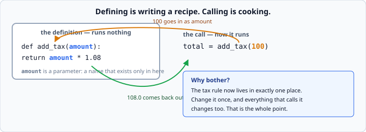
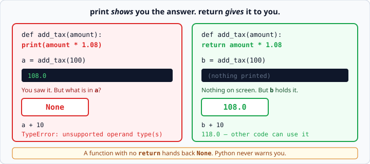

# Defining and calling functions

*Week 3 · Day 1 · about 30 minutes*

> By the end of this you can package a piece of logic under a name, hand it inputs, and
> get an answer back — and you will not confuse `return` with `print`.

---

## Read the official documentation first

| Page | What it gives you |
|---|---|
| [**Defining Functions**](https://docs.python.org/3.14/tutorial/controlflow.html#defining-functions) | The core tutorial. Read the whole section |
| [**Default Argument Values**](https://docs.python.org/3.14/tutorial/controlflow.html#default-argument-values) | `def f(x, rate=0.08)` |
| [**Keyword Arguments**](https://docs.python.org/3.14/tutorial/controlflow.html#keyword-arguments) | Calling with `rate=0.20` |
| [**Documentation Strings**](https://docs.python.org/3.14/tutorial/controlflow.html#documentation-strings) | The convention for docstrings |
| [**PEP 8 — Style Guide**](https://peps.python.org/pep-0008/#function-and-variable-names) | How to name things |

---

## Defining one

```python
def add_tax(amount):
    return amount * 1.08
```

- **`def`** starts the definition. The name is yours to choose.
- **`amount`** is a **parameter** — a variable that only exists inside this function.
- The colon and the indent, again, exactly like `if` and `for`.
- **`return`** hands a value back to whoever called it.

Defining a function runs nothing at all. It is a recipe sitting on a shelf. **Calling**
it is what cooks:

```python
total = add_tax(100)        # now it runs. total is 108.0
```



The value you pass in — `100` — is called an **argument**. It gets bound to the
parameter name `amount` for the duration of that one call.

### Naming

Functions *do* things, so name them with verbs: `add_tax`, `split_bill`,
`count_passing`. Lowercase with underscores, like variables.

A name like `process` or `handle_data` is a warning sign — if you cannot say what it
does in one verb and one noun, the function is probably doing two things.

---

## `return` is not `print` — read this bit twice

This is the mistake almost everyone makes today. It is worth twenty minutes of your
attention now, rather than an hour of confusion on Friday.

```python
def add_tax_wrong(amount):
    print(amount * 1.08)        # shows a number on screen

def add_tax_right(amount):
    return amount * 1.08        # hands a number BACK
```

They look identical when you run them. They are completely different.



```python
a = add_tax_wrong(100)      # prints 108.0, and a is None
b = add_tax_right(100)      # prints nothing, and b is 108.0

print(a + 10)               # TypeError: unsupported operand type(s) for +: 'NoneType' and 'int'
print(b + 10)               # 118.0
```

A function that prints has **shown** you the answer. A function that returns has
**given** it to you. Only the second one can be used by other code — and other code is
the entire point of writing functions.

> **A function with no `return` hands back `None`.** Python does not warn you. You find
> out later, somewhere else, with a `TypeError` that points at a line where nothing is
> wrong.

That last sentence is the reason this matters. The error appears far from the mistake.
When you get a `TypeError` mentioning `NoneType`, the question to ask is always: *which
function did I expect to return something, and does it actually have a `return`?*

**Rule for this week: your functions return, and your `print()` calls live outside
them.** There is one exception — a function whose entire job is displaying something —
and you will know when you have written one.

---

## Several parameters, and returning early

```python
def split_bill(total, people):
    if people <= 0:
        return 0                # stops here, hands back 0
    return total / people       # only reached if people > 0
```

`return` ends the function **immediately**. Everything after it in that call is skipped.

Using that to handle the awkward case first, then getting on with the real work, is
called a **guard clause**. It keeps your functions flat instead of wrapping the real
logic in an ever-deeper `if`:

```python
# guard clause — flat, easy to read
def split_bill(total, people):
    if people <= 0:
        return 0
    return total / people

# the nested version — same behaviour, harder to follow
def split_bill(total, people):
    if people > 0:
        return total / people
    else:
        return 0
```

With two branches it barely matters. With four it matters a great deal, and week 4's
code will have four.

---

## Default arguments

```python
def add_tax(amount, rate=0.08):
    return amount * (1 + rate)

add_tax(100)              # 108.0     uses the default
add_tax(100, 0.20)        # 120.0     overrides it
add_tax(100, rate=0.20)   # 120.0     same, but says what the number means
```

**Parameters with defaults must come after ones without.** `def f(rate=0.08, amount)`
is a `SyntaxError`, because Python could not tell which value you meant.

Naming the argument at the call site — `rate=0.20` — costs nothing and stops
`add_tax(100, 0.20)` from being a mystery to whoever reads it next, including you.

A rule that serves well: **if an argument is a bare number or a `True`/`False`, name
it.** `count_passing(scores, 70)` is a puzzle; `count_passing(scores, threshold=70)`
is a sentence.

> One warning for later: never use a list or a dict as a default value
> (`def f(items=[])`). It behaves in a way that surprises everyone. The
> [official note on it](https://docs.python.org/3.14/tutorial/controlflow.html#default-argument-values)
> is worth reading now so it does not catch you in week 5.

---

## Docstrings

```python
def split_bill(total, people):
    """Return each person's share of a bill, rounded to 2 decimal places."""
    return round(total / people, 2)
```

A sentence in triple quotes, on the first line of the function body.

**Say what it returns, not how it works.** The code already says how; nobody needs
`"""Divides total by people."""` — they can see that. What they cannot see is that it
rounds, or what happens when `people` is zero.

Docstrings are not decoration. `help(split_bill)` prints them, your editor shows them
on hover, and in week 4 they become part of how your project is judged.

---

## Functions calling functions

```python
def price_label(amount):
    """Return an amount formatted as money, e.g. '$4.50'."""
    return f"${amount:.2f}"

def summary_line(name, amount):
    """Return one report row: name left-aligned in 12, then the price."""
    return f"{name:<12} {price_label(amount)}"
```

`summary_line` does not know how a price is formatted, and does not need to. Change
`price_label` once — to add a currency symbol, or use commas for thousands — and
everything that uses it changes too.

**That is the whole reason functions exist**, and it is what today is really teaching.
Not "shorter code". One place to change each idea.

The opposite — the same `f"${x:.2f}"` copied into nine places — is how a codebase gets
to the state where a one-line change takes a day and three of the nine get missed.

---

## Check yourself

```python
def double(n):
    print(n * 2)

result = double(5)
print(result)
print(result + 1)
```

Three lines of output, and the last one is an error. Say what each does *before* you
run it.

<details>
<summary>Answers</summary>

```
10
None
TypeError: unsupported operand type(s) for +: 'NoneType' and 'int'
```

1. `10` — printed from inside the function, during the call.
2. `None` — `double` has no `return`, so `result` is `None`.
3. `TypeError` — you cannot add 1 to `None`.

If you can explain all three, today has landed. If line 2 surprised you, go back and
read the `return` versus `print` section again — this exact confusion is Thursday's
`broken_1.py`.
</details>

---

## What you can now do

- [ ] Define a function with `def`, parameters, and a `return`
- [ ] Explain the difference between defining and calling
- [ ] State exactly what a function with no `return` hands back
- [ ] Diagnose a `TypeError` mentioning `NoneType`
- [ ] Use a guard clause to handle the awkward case first
- [ ] Give a parameter a default, and name arguments at the call site
- [ ] Write a docstring that says what the function returns
- [ ] Call one function from another, and say why that is the point

**Next:** [Return values and scope](return-values-and-scope.md) — why a function cannot
reach outside itself, and why that is a feature.
