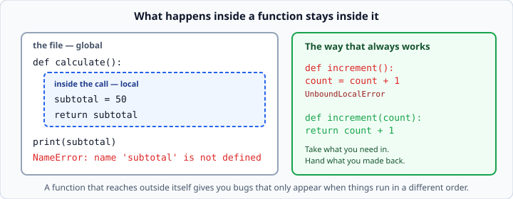

# Return values and scope

*Week 3 · Day 1 · about 20 minutes*

> By the end of this you know where a variable lives, why a function cannot change one
> outside itself, and why that restriction is a feature rather than an annoyance.

---

## Read the official documentation first

| Page | What it gives you |
|---|---|
| [**Scopes and Namespaces**](https://docs.python.org/3.14/tutorial/classes.html#python-scopes-and-namespaces) | The formal explanation |
| [**`return` statement**](https://docs.python.org/3.14/reference/simple_stmts.html#the-return-statement) | What `return` does exactly |
| [**`None`**](https://docs.python.org/3.14/library/constants.html#None) | The value you get when there is no `return` |
| [**Built-in Exceptions — `UnboundLocalError`**](https://docs.python.org/3.14/library/exceptions.html#UnboundLocalError) | The error in this article |

---

## Local variables

A variable created inside a function exists only while that function is running.

```python
def calculate():
    subtotal = 50           # exists only during this call
    return subtotal

print(calculate())          # 50
print(subtotal)             # NameError: name 'subtotal' is not defined
```



This is called **scope**. `subtotal` is *local* to `calculate`. When the call finishes,
it is gone.

That sounds like a limitation. It is the opposite. It means you can name a variable
`total` inside a function without wondering whether some other part of the program is
already using that name. Every function gets a clean sheet.

---

## The error that catches people

```python
count = 0

def increment():
    count = count + 1       # UnboundLocalError
```
```
UnboundLocalError: cannot access local variable 'count' where it is not associated with a value
```

This looks unfair. There *is* a `count`, right there at the top of the file.

Here is what happened. Python scans the function body before running it. It sees
`count = ...` and decides: *`count` is a local variable of this function.* So when the
line runs, it tries to read the local `count` — which has not been given a value yet —
and fails.

**Assigning to a name anywhere in a function makes that name local for the whole
function.** That is the rule, and it is worth being able to state.

Note the asymmetry:

```python
tax_rate = 0.08

def total(amount):
    return amount * (1 + tax_rate)      # this is FINE — only reading
```

Reading an outer variable works. Assigning to one does not.

### The fix

There is a keyword (`global`) that makes the broken version work. **Do not use it.** It
is not on this week's fence and it is not on most professional codebases' either.

The fix is to pass things in and hand things back:

```python
def increment(count):
    return count + 1        # take it in, hand it back

count = 0
count = increment(count)    # the caller decides what to do with the answer
```

**A function should take what it needs as parameters and return what it produced.**

A function that reaches outside itself gives you bugs that only appear when things run
in a different order — and "runs in a different order" describes every program with a
user in it, every web request, and everything you build from week 5 onwards.

---

## Returning more than one thing

```python
def min_max(numbers):
    """Return the smallest and largest numbers as a pair."""
    return min(numbers), max(numbers)

low, high = min_max([3, 9, 1])
print(low, high)            # 1 9
```

Python does not really return two things — it builds a **tuple** and returns that, and
you unpack it on the way out. Exactly the mechanism from last Thursday.

```python
result = min_max([3, 9, 1])
print(result)               # (1, 9)
print(type(result))         # <class 'tuple'>
```

Two or three return values is fine and idiomatic. If you find yourself returning five,
you want a dict — the caller should not have to remember that position 3 is the tax.

---

## What `return` with nothing does

These three are identical. All hand back `None`:

```python
def a():
    return None

def b():
    return          # bare return

def c():
    pass            # falls off the end
```

A bare `return` is useful for leaving early from a function that has nothing to give
back:

```python
def show_report(records):
    if not records:
        return                      # nothing to show, stop here
    for record in records:
        print(record["name"])
```

That is a guard clause again. `if not records` reads as "if the list is empty", using
the truthiness rule from week 1.

---

## Mutable arguments — the exception to everything above

Here is the one case where a function *can* change something outside itself, and it
catches everybody exactly once.

```python
def add_item(basket, item):
    basket.append(item)         # no return, and yet...

my_basket = ["apple"]
add_item(my_basket, "bread")
print(my_basket)                # ['apple', 'bread']   <- it changed!
```

Why? Because `basket` and `my_basket` are two names pointing at **the same list**.
`.append()` modifies that list, and both names see the change.

Compare with:

```python
def rename(name):
    name = "changed"            # rebinds the local name only

my_name = "Ana"
rename(my_name)
print(my_name)                  # Ana   <- untouched
```

The rule that covers both:

- **Assigning to the parameter name** (`name = ...`) only affects the local name.
- **Calling a method that mutates the object** (`.append()`, `d[k] = v`) affects the
  object everyone can see.

Lists, dicts and sets are mutable. Numbers, strings and tuples are not — which is
another reason immutability is useful, and why a tuple is the safer thing to pass
around.

### What to do about it

For this week: **prefer returning a new thing over modifying what you were given.**

```python
# harder to reason about
def add_tax_to_all(prices):
    for i in range(len(prices)):
        prices[i] = prices[i] * 1.08

# easier — the caller can see exactly what changed
def add_tax_to_all(prices):
    return [price * 1.08 for price in prices]
```

(That second one uses a comprehension, which is Thursday. Write it as a loop with
`.append()` until then — the point stands either way.)

Both styles exist in real code. The returning style is easier to test, easier to reason
about, and much harder to get subtly wrong. Reach for it by default.

---

## Reading a traceback across functions

Now that functions call functions, tracebacks have layers:

```
Traceback (most recent call last):
  File "app.py", line 12, in <module>
    show_report(records)
  File "app.py", line 8, in show_report
    total = add_all(records)
  File "app.py", line 4, in add_all
    return record["amount"]
KeyError: 'amount'
```

Still read it bottom-up: the last line is *what*, and the frame above it is *where*. But
now there is a second question:

> **Which frame is the actual bug?**

The bottom frame is where the error *surfaced*. The bug is often one frame **up** — in
whoever passed the bad value in. Here, `add_all` is innocent; it was handed records with
no `"amount"` key, and the real bug is wherever those records were built.

Reading a traceback as a **chain of blame** rather than a single line is the skill that
separates a week-3 student from a week-1 one. Start at the bottom, then walk upwards
asking "was the input to this frame already wrong?" until the answer is no.

---

## Check yourself

```python
# a
def f():
    x = 1
f()
print(x)

# b
rate = 0.1
def g(amount):
    return amount * rate
print(g(100))

# c
def h(items):
    items.append(4)
nums = [1, 2, 3]
h(nums)
print(nums)

# d
def k(n):
    n = n + 1
num = 5
k(num)
print(num)
```

<details>
<summary>Answers</summary>

- **a** — `NameError`. `x` was local to `f` and is gone.
- **b** — `10.0`. Reading an outer variable is fine; only assigning is not.
- **c** — `[1, 2, 3, 4]`. `.append()` mutates the shared list.
- **d** — `5`. Assigning to `n` rebinds the local name only.

**c** and **d** together are the whole mutability rule. If you can explain why they
differ, you understand something most people get wrong for years.
</details>

---

## What you can now do

- [ ] Explain what a local variable is and when it disappears
- [ ] Diagnose `UnboundLocalError` and state the rule that causes it
- [ ] Say why reading an outer variable works but assigning to one does not
- [ ] Return several values as a tuple and unpack them
- [ ] Use a bare `return` as a guard clause
- [ ] Explain why `.append()` inside a function changes the caller's list
- [ ] Prefer returning a new value over mutating an argument
- [ ] Read a multi-frame traceback as a chain of blame

**Next:** [`try` / `except`](../day-2/try-except.md) — stopping your program from
crashing on bad input.
