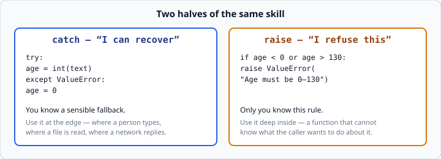

# Raising exceptions

*Week 3 · Day 2 · about 15 minutes*

> By the end of this you can refuse bad input from inside your own functions, with a
> message that tells the caller what to do about it.

---

## Read the official documentation first

| Page | What it gives you |
|---|---|
| [**Raising Exceptions**](https://docs.python.org/3.14/tutorial/errors.html#raising-exceptions) | The `raise` statement |
| [**`ValueError`**](https://docs.python.org/3.14/library/exceptions.html#ValueError) | The one you will raise nine times out of ten |
| [**Exception Chaining**](https://docs.python.org/3.14/tutorial/errors.html#exception-chaining) | `raise ... from ...`, and why tracebacks show two errors |
| [**Built-in Exceptions**](https://docs.python.org/3.14/library/exceptions.html) | Choosing the right one |

---

## Catching is half of it

Yesterday's half was recovering. Today's half is **refusing**.



```python
def parse_age(text):
    """Return the age as a whole number, or raise ValueError."""
    age = int(text)                     # raises ValueError itself if text is junk
    if age < 0 or age > 130:
        raise ValueError("Age must be between 0 and 130")
    return age
```

`int("abc")` already raises `ValueError` — Python does that part for you. But
`int("200")` works perfectly well. **200 is a fine number and a terrible age.**

Only your function knows that. So your function is what has to say so.

That is the whole idea. Python can check *types*. Only you can check *meaning*.

---

## Why raise instead of returning `None`?

A reasonable question. Why not:

```python
def parse_age(text):
    age = int(text)
    if age < 0 or age > 130:
        return None          # "didn't work"
    return age
```

Because the caller can ignore `None` and will:

```python
age = parse_age(user_input)
print(f"You are {age} years old")     # "You are None years old"
```

Nothing crashed. Nothing warned anyone. The bad value flowed straight through into the
output, and the bug surfaces days later somewhere else entirely.

An exception **cannot be ignored**. Either the caller handles it deliberately, or the
program stops. Both of those are better than a silent `None`.

This is the same lesson as `except:` versus `except KeyError:`, from the other
direction: **failing loudly beats working wrongly.**

---

## Put a real message in it

```python
raise ValueError("Age must be between 0 and 130")     # good
raise ValueError("bad input")                          # useless
raise ValueError()                                     # worse
```

The message is shown to whoever hits the error — sometimes a user, sometimes you at 2am
in six months. Write it for them.

A good message answers three things:

1. **What** was wrong — "Age must be between 0 and 130"
2. **Which value** caused it, when that helps — `f"Age must be 0–130, got {age}"`
3. **What to do** — usually implied by the first two

Compare:

```
ValueError: bad input
ValueError: Age must be between 0 and 130, got 200
```

The second one costs you fifteen extra characters and saves somebody twenty minutes.

---

## Turning Python's error into yours

`int("abc")` raises `ValueError: invalid literal for int() with base 10: 'abc'`. That is
accurate, and it is meaningless to a person filling in a form.

Catch it and re-raise your own:

```python
def parse_age(text):
    """Return the age as a whole number, or raise ValueError with a readable message."""
    try:
        age = int(text)
    except ValueError:
        raise ValueError("Age must be a whole number")

    if age < 0 or age > 130:
        raise ValueError("Age must be between 0 and 130")

    return age
```

Now both failure modes produce a message a human can act on:

```python
parse_age("abc")     # ValueError: Age must be a whole number
parse_age("200")     # ValueError: Age must be between 0 and 130
parse_age("30")      # 30
```

This shape — *catch the low-level error, raise a meaningful one* — is called
**translating** an exception, and you will do it at every boundary of every system you
ever build.

### `raise ... from ...`

When you re-raise inside an `except`, Python shows both errors in the traceback:

```
ValueError: invalid literal for int() with base 10: 'abc'

During handling of the above exception, another exception occurred:
...
ValueError: Age must be a whole number
```

That is helpful while debugging and noisy in production. You can make the link explicit:

```python
except ValueError as error:
    raise ValueError("Age must be a whole number") from error
```

Or suppress the original entirely with `from None`. Neither is required this week —
know that the double traceback is normal and not a mistake you made.

---

## Choosing which exception to raise

| Situation | Raise |
|---|---|
| Right type, wrong value — a negative price, an age of 200 | `ValueError` |
| Wrong type entirely — someone passed a list where you need a number | `TypeError` |
| A required config key is missing | `KeyError` |
| Something is not implemented yet | `NotImplementedError` |

**`ValueError` covers most of what you will write this week.** Reach for it by default,
and only pick another when it genuinely describes the situation better.

Python also lets you define your own exception types. That is week 4 material and it is
behind this week's fence. The built-in ones are enough, and reaching for a custom
exception too early is a common way to make a small program feel like a large one.

---

## Where to raise, and where to catch

A rule that will serve you for years:

> **Raise deep. Catch shallow.**

**Raise** inside the small function that spots the problem. `parse_age` knows the rule;
it does not know whether the caller wants to print a message, retry, or give up. So it
raises and lets them decide.

**Catch** near the top, where you know what to do about it:

```python
while True:
    try:
        age = parse_age(input("Age: "))
    except ValueError as error:
        print(f"{error}. Try again.")
    else:
        break

print(f"Thanks, you are {age}.")
```
```
Age: abc
Age must be a whole number. Try again.
Age: 200
Age must be between 0 and 130. Try again.
Age: 30
Thanks, you are 30.
```

Look at what that gives you. `parse_age` contains all the rules and no user interface.
The loop contains all the user interface and none of the rules. Each can be changed
without touching the other, and `parse_age` can be tested without typing anything.

That separation is the actual point of today, and it is what week 4's tests will
reward.

---

## Check yourself

```python
def set_price(amount):
    if amount < 0:
        raise ValueError("Price cannot be negative")
    return amount

# a
print(set_price(10))

# b
print(set_price(-5))

# c
try:
    print(set_price(-5))
except ValueError as error:
    print(f"Rejected: {error}")

# d
print("still running")
```

<details>
<summary>Answers</summary>

- **a** — `10`.
- **b** — the program stops with `ValueError: Price cannot be negative` and a traceback.
  Nothing after it runs.
- **c** — `Rejected: Price cannot be negative`, and the program continues.
- **d** — runs only if **b** was removed or wrapped. An uncaught exception ends the
  program.

The difference between **b** and **c** is the whole relationship between raising and
catching: the function refuses, and the caller decides what that means.
</details>

---

## What you can now do

- [ ] Raise a `ValueError` from your own function
- [ ] Explain why raising beats returning `None`
- [ ] Write an error message that names the rule and the offending value
- [ ] Translate Python's low-level error into a readable one
- [ ] Recognise the "during handling of the above exception" double traceback
- [ ] Choose between `ValueError`, `TypeError` and `KeyError`
- [ ] Apply "raise deep, catch shallow", and say why it separates rules from interface

**Next:** [Reading and writing files](../day-3/reading-and-writing-files.md) — making
data survive the program ending.
