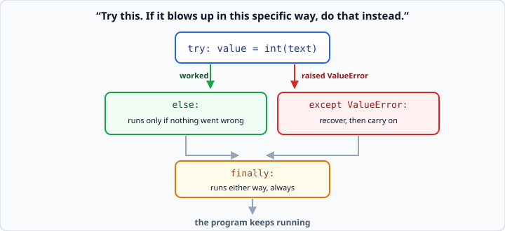
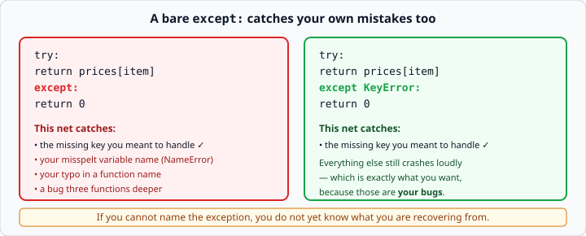

# `try` / `except`

*Week 3 · Day 2 · about 25 minutes*

> By the end of this you can stop a program crashing on bad input — and you will know
> why catching *everything* is worse than catching nothing.

---

## Read the official documentation first

| Page | What it gives you |
|---|---|
| [**Errors and Exceptions**](https://docs.python.org/3.14/tutorial/errors.html) | The whole tutorial chapter. Read it properly today |
| [**Handling Exceptions**](https://docs.python.org/3.14/tutorial/errors.html#handling-exceptions) | `try` / `except` in detail |
| [**Defining Clean-up Actions**](https://docs.python.org/3.14/tutorial/errors.html#defining-clean-up-actions) | `finally` |
| [**Built-in Exceptions**](https://docs.python.org/3.14/library/exceptions.html) | The list of every exception type |

---

## An error is now a tool

In week 1 an error meant you had written something wrong. From today it is also a
**tool** — something you catch when you can recover, and something you throw when you
cannot.

```python
try:
    age = int(input("Age: "))
except ValueError:
    age = 0
```

*Try this. If it blows up with a `ValueError`, do that instead.* The program keeps
running either way.



Without the `try`, `int("banana")` ends your program. With it, you get a sensible
fallback and the user gets to carry on.

### Where this belongs

Use `try` at the **edges** of your program — the places where something outside your
control arrives:

- a person typing at a prompt
- a file that might not exist (tomorrow)
- a web request that might fail (week 5)
- text that is supposed to be JSON (tomorrow)

Do **not** wrap your own arithmetic in a `try`. If `total = price * qty` can fail, the
bug is upstream, and hiding it makes it harder to find.

---

## Catch the specific one

```python
except ValueError:          # good — you know what you are recovering from
except:                     # bad  — catches everything, including your own typos
except Exception:           # nearly as bad
```



A bare `except:` swallows every error in the block, including the `NameError` from a
misspelt variable. Your program then does the wrong thing **silently**, which is far
worse than crashing.

Think of it as the size of the net. `except KeyError:` catches the one fish you meant
to catch. `except:` catches the fish, the seaweed, your own foot, and the boat.

**Name the exception you expect. If you cannot name it, you do not yet know what you
are recovering from.**

You will meet code online full of bare `except:`. It is one of the clearest signals that
the person writing it did not know what could go wrong. There is a test in today's
exercises that fails you for one.

### Catching more than one

```python
except (ValueError, TypeError):
    ...
```

A tuple of the ones you expect. Still specific, still deliberate.

Or handle them differently:

```python
try:
    value = int(text)
except ValueError:
    print("That is not a number")
except TypeError:
    print("I need text, not that")
```

Python tries each `except` in order and runs the first one that matches.

---

## The error object

```python
try:
    amount = float(text)
except ValueError as error:
    print(f"Could not read that: {error}")
```
```
Could not read that: could not convert string to float: 'abc'
```

`as error` gives you the exception itself, and printing it tells you what Python
actually objected to — including the offending value, which is usually the thing you
want to know.

This is enormously useful while debugging. When a `try` block starts swallowing
something unexpected, add `as error` and print it before you do anything else.

---

## `else` and `finally`

```python
try:
    value = int(text)
except ValueError:
    print("Not a number")
else:
    print(f"Got {value}")     # runs only if NOTHING went wrong
finally:
    print("Done")             # runs either way, always
```

**`else`** lets you keep the `try` block down to the single line that might fail. That
matters more than it sounds:

```python
# the try block is doing too much
try:
    value = int(text)
    result = value * 2
    print(f"Result: {result}")
except ValueError:
    print("Not a number")

# now it is obvious what is being guarded
try:
    value = int(text)
except ValueError:
    print("Not a number")
else:
    result = value * 2
    print(f"Result: {result}")
```

In the first version, a `ValueError` raised by anything in those three lines lands in
the same handler. In the second, only the conversion is guarded.

**`finally`** is for cleanup that must happen whatever occurred — closing a file,
releasing a connection. Tomorrow you meet `with`, which does this for files
automatically, so `finally` will be rarer than you think.

---

## Retrying until it works

This is the pattern behind today's `ask.py`:

```python
while True:
    text = input("Age: ")
    try:
        age = int(text)
    except ValueError:
        print("That is not a number. Try again.")
        continue
    break

print(f"Thanks, you are {age}.")
```

`while True` plus `break` from week 2, `try`/`except` from today. `continue` sends you
back to the top of the loop after the failure.

You can also write it with `else`, which some people find clearer:

```python
while True:
    try:
        age = int(input("Age: "))
    except ValueError:
        print("That is not a number. Try again.")
    else:
        break
```

Either is fine. Write whichever one you can explain.

---

## Which exception is which

| Exception | Raised when |
|---|---|
| `ValueError` | Right type, wrong value — `int("abc")`, a negative price |
| `TypeError` | Wrong type entirely — `"5" + 5`, calling `None` |
| `KeyError` | A dict key that is not there |
| `IndexError` | A list position that is not there |
| `ZeroDivisionError` | Dividing by zero |
| `FileNotFoundError` | Opening a file that does not exist (tomorrow) |

`ValueError` is the one you will meet — and raise — most often.

Look them up on the
[Built-in Exceptions](https://docs.python.org/3.14/library/exceptions.html) page rather
than guessing. It takes ten seconds and you will remember it.

---

## Tracebacks now have layers

Your functions call other functions, so a traceback has several frames:

```
Traceback (most recent call last):
  File "app.py", line 12, in <module>
    show_report(records)
  File "app.py", line 8, in show_report
    total = add_all(records)
  File "app.py", line 4, in add_all
    return sum(r["amount"] for r in records)
KeyError: 'amount'
```

Still read it bottom-up: the **last line** is what went wrong, and the frame just above
is where. But now ask a second question:

> **Which of these frames is the actual bug?**

The bottom frame is where the error *surfaced*. The bug is often one frame **up** — in
whoever passed in the bad value. Here, `add_all` is innocent; it was handed records
without an `"amount"` key, and the real bug is wherever those records were built.

Reading a traceback as a **chain of blame** rather than a single line is the skill that
separates a week-3 student from a week-1 one.

This also tells you where to put your `try`. Guarding `add_all` would hide the symptom
and leave the cause in place. Guard the thing that built the records instead.

---

## Check yourself

```python
def get_price(prices, item):
    try:
        return prices[item]
    except:
        return 0

prices = {"apple": 1.50}
print(get_price(prices, "pear"))
print(get_price(prices, "aple"))
print(get_prices(prices, "apple"))
```

The first two return `0` and look fine. Now change the bare `except:` to
`except KeyError:` and run it again.

<details>
<summary>Answers</summary>

With the bare `except:`, lines 1 and 2 print `0` and line 3 raises
`NameError: name 'get_prices' is not defined` — a typo in the function *name*, which is
outside the `try`, so it still surfaces.

The real lesson is subtler. Suppose the typo had been *inside* the function:

```python
try:
    return prices[itme]        # typo in the variable
except:
    return 0
```

With a bare `except:`, that `NameError` is caught and the function cheerfully returns
`0` for **every** lookup, forever, with no error. Your prices are all zero and nothing
tells you.

With `except KeyError:`, the `NameError` is not caught, the program crashes, and you fix
it in thirty seconds.

**Crashing loudly beats working wrongly.**
</details>

---

## What you can now do

- [ ] Write `try` / `except` and keep the program running through bad input
- [ ] Name the specific exception you expect, and say why a bare `except:` is worse
- [ ] Catch several exception types, together or separately
- [ ] Use `as error` to see what Python actually objected to
- [ ] Use `else` to keep the `try` block to the line that can fail
- [ ] Retry in a loop until the input is valid
- [ ] Name the six common exception types and what triggers each
- [ ] Read a multi-frame traceback and decide which frame holds the real bug

**Next:** [Raising exceptions](raising-exceptions.md) — refusing bad input yourself.
