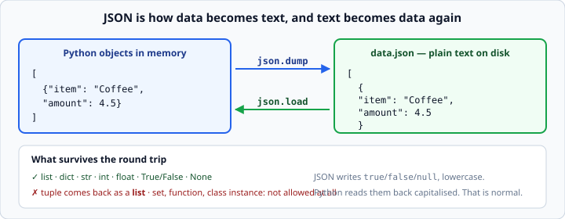

# JSON in Python

*Week 3 · Day 3 · about 15 minutes*

> By the end of this you can save a list of dicts to disk and load it back — and handle
> the day the file comes back damaged.

---

## Read the official documentation first

| Page | What it gives you |
|---|---|
| [**`json` — JSON encoder and decoder**](https://docs.python.org/3.14/library/json.html) | The whole module |
| [**`json.dump()` / `json.load()`**](https://docs.python.org/3.14/library/json.html#json.dump) | File in, file out |
| [**`json.JSONDecodeError`**](https://docs.python.org/3.14/library/json.html#json.JSONDecodeError) | The error a damaged file raises |
| [**Conversion table**](https://docs.python.org/3.14/library/json.html#py-to-json-table) | Exactly which Python types survive |

The conversion table is the page to bookmark. It is a fifteen-row table that answers
every "why did my data change?" question you will have this week.

---

## Why JSON

A list of dicts cannot go into a text file as-is. You could invent your own format —
commas here, pipes there — and then you would have to write the code that reads it back,
and get the edge cases right, and document it for whoever comes next.

JSON is that job, already done, and understood by every language and every system.

```python
import json

expenses = [{"item": "Coffee", "amount": 4.5}]

with open("data.json", "w") as f:
    json.dump(expenses, f, indent=2)        # data  -> file

with open("data.json") as f:
    expenses = json.load(f)                 # file  -> data
```



That is the whole API you need. Two functions.

**`indent=2`** makes the file readable by a human, which you will want the first time
something is wrong with it. Without it everything lands on one enormous line. The cost
is a slightly bigger file; take the trade.

### The four names

This confuses people, so get it straight once:

| Function | Direction | Works with |
|---|---|---|
| `json.dump(data, f)` | Python → file | a file object |
| `json.load(f)` | file → Python | a file object |
| `json.dumps(data)` | Python → **string** | no file involved |
| `json.loads(text)` | **string** → Python | no file involved |

The `s` means "string". You will use `dumps`/`loads` constantly from week 5, when JSON
arrives over the network rather than from a disk.

---

## What survives the round trip

JSON handles lists, dicts, strings, numbers, `True`/`False` and `None`. That is all.

```python
json.dumps({"a": 1, "b": [1, 2], "c": None, "d": True})
# '{"a": 1, "b": [1, 2], "c": null, "d": true}'
```

Note `null` and `true` — JSON's spelling, lowercase. Python converts back to `None` and
`True` on the way in. That is normal and not something you need to handle.

### The two surprises

**Tuples become lists.**

```python
data = {"point": (3, 7)}
text = json.dumps(data)
back = json.loads(text)
print(back["point"])        # [3, 7]   <- a list, not a tuple
```

Nothing errors. The type just quietly changes. If your code later does
`x, y = data["point"]`, it still works — but if it uses the point as a dict key, it
now fails, because a list cannot be a key.

**Dict keys become strings.**

```python
json.loads(json.dumps({1: "a"}))        # {'1': 'a'}
```

Your integer key came back as text. JSON has no concept of a non-string key.

**Sets, functions and class instances are not allowed at all:**

```python
json.dumps({1, 2, 3})
# TypeError: Object of type set is not JSON serializable
```

The fix is to convert first — `sorted(my_set)` gives you a list, which JSON is happy
with, and sorting keeps the file stable between runs.

---

## Two ways a saved file betrays you

```python
def load_data(path, default):
    """Return the saved data, or `default` if there is nothing usable."""
    try:
        with open(path, encoding="utf-8") as f:
            return json.load(f)
    except FileNotFoundError:
        return default              # first run — completely normal
    except json.JSONDecodeError:
        return default              # the file exists but is damaged
```

The first case you already know. **The second is the interesting one.**

A file gets damaged when it is half-written and the power goes out, or when somebody
opens it in an editor and leaves a trailing comma, or when a previous version of your
own program crashed mid-`dump`.

A program that handles the missing file but not the corrupt one works perfectly until
the day it does not — and then it crashes on startup, every time, and the user cannot
even get in to fix it.

Handle both. It is one extra `except` line.

> **Note the specificity.** `json.JSONDecodeError` is a subclass of `ValueError`, so
> `except ValueError:` would also catch it — along with anything else. Name the one you
> mean.

### Silently returning the default is a choice

Returning `default` on a damaged file means the user's data is gone and nothing said so.
For a cache that is right. For an expense tracker it is not.

A better shape for real data:

```python
except json.JSONDecodeError:
    print(f"Warning: {path} is damaged and was not loaded.")
    return default
```

Now the user knows. Think about which one your milestone project needs, because your
instructor may well ask you on Friday.

---

## Writing safely

```python
def save_data(path, data):
    """Write `data` to `path` as indented JSON."""
    with open(path, "w", encoding="utf-8") as f:
        json.dump(data, f, indent=2)
```

Remember what `"w"` does: the file is emptied the moment it opens. If `json.dump` then
raises — because your data contains a set, say — you are left with an empty file and the
old data is gone.

The professional fix is to write to a temporary file and rename it over the original
once the write succeeded. That is beyond this week's fence, but it is worth knowing the
problem exists, and it is a good thing to mention on Friday.

For now, the practical defence is: **do not put un-serialisable things in the data you
are about to save.** Convert sets to sorted lists, and tuples to lists, before you dump.

---

## `sort_keys` for stable files

```python
json.dump(data, f, indent=2, sort_keys=True)
```

Without it, dict key order in the file follows insertion order, which can vary. With it,
the file is byte-for-byte identical whenever the data is the same.

That matters the moment the file goes into git: a stable file produces a diff showing
only what actually changed, instead of a reshuffle. Get in the habit now — it costs one
argument.

---

## Check yourself

```python
import json

# a
print(json.dumps({"ok": True, "x": None}))

# b
print(json.loads('{"n": 1}')["n"] + 1)

# c
data = json.loads(json.dumps({"p": (1, 2)}))
print(type(data["p"]))

# d
print(json.dumps({1, 2}))
```

<details>
<summary>Answers</summary>

```
{"ok": true, "x": null}
2
<class 'list'>
TypeError: Object of type set is not JSON serializable
```

**c** is the one to remember: the tuple went in and a list came out, with no error and
no warning. When data changes shape after a save-and-load cycle, this is almost always
why.
</details>

---

## What you can now do

- [ ] Save a list of dicts with `json.dump` and load it with `json.load`
- [ ] Explain the difference between `dump`/`load` and `dumps`/`loads`
- [ ] Use `indent=2` and say what it buys you
- [ ] List which Python types survive a round trip and which change
- [ ] Explain why a tuple comes back as a list
- [ ] Handle both `FileNotFoundError` and `json.JSONDecodeError`
- [ ] Say what `"w"` risks if the dump then fails
- [ ] Use `sort_keys=True` for files that go into git

**Next:** [List comprehensions](../day-4/list-comprehensions.md) — a loop on one line,
now that you have written forty loops.
