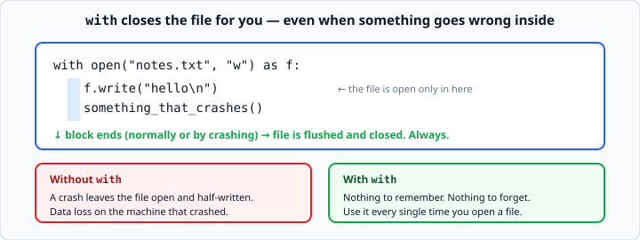
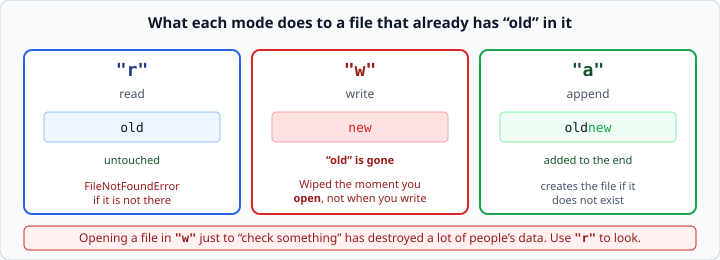

# Reading and writing files

*Week 3 · Day 3 · about 25 minutes*

> By the end of this your programs survive being closed.

---

## Read the official documentation first

| Page | What it gives you |
|---|---|
| [**Reading and Writing Files**](https://docs.python.org/3.14/tutorial/inputoutput.html#reading-and-writing-files) | The core tutorial |
| [**`open()`**](https://docs.python.org/3.14/library/functions.html#open) | Every mode, and the encoding argument |
| [**`FileNotFoundError`**](https://docs.python.org/3.14/library/exceptions.html#FileNotFoundError) | The error you must handle |
| [**`pathlib`**](https://docs.python.org/3.14/library/pathlib.html) | The modern way to build paths (optional this week) |

---

## Everything so far forgets

Every program you have written so far loses everything the moment it exits. Today that
changes, and with it your programs stop being exercises and start being tools.

```python
with open("notes.txt", "w") as f:
    f.write("hello\n")

with open("notes.txt", "r") as f:
    contents = f.read()

print(contents)         # hello
```

---

## `with` matters



`with` closes the file when the block ends — **even if something goes wrong inside it.**

Without `with`, a crash leaves the file open and half-written. Data that Python was
holding in a buffer never reaches the disk, and you get data loss that only shows up
on the machine that crashed.

```python
# do this, every time
with open("notes.txt", "w") as f:
    f.write("hello\n")

# not this
f = open("notes.txt", "w")
f.write("hello\n")
f.close()               # skipped entirely if the line above raises
```

There is no situation this week where the second form is better. Use `with` always.

The `as f` names the open file. `f` is the conventional name, and for a short block it
is fine — this is the one place a one-letter name is idiomatic.

---

## The three modes



| Mode | Does |
|---|---|
| `"r"` | read — raises `FileNotFoundError` if it is not there |
| `"w"` | write — **creates it, or wipes it and starts over** |
| `"a"` | append — adds to the end, keeps what was there |

`"r"` is the default, so `open(path)` and `open(path, "r")` are the same.

> **`"w"` deletes everything in the file the instant you open it.** Not when you write —
> when you *open*. Opening a file in `"w"` to "check something" has destroyed a lot of
> people's data, including some of it very recently and very professionally.
>
> If you only want to look, use `"r"`.

---

## Reading it back

```python
with open("notes.txt") as f:
    whole_thing = f.read()          # one big string, newlines and all

with open("notes.txt") as f:
    lines = f.readlines()           # ['hello\n', 'there\n']

with open("notes.txt") as f:
    for line in f:                  # one line at a time — best for big files
        print(line.rstrip("\n"))
```

Three ways, and the choice matters:

- **`.read()`** — simple, but loads the whole file into memory. Fine for a config file,
  bad for a 2 GB log.
- **`.readlines()`** — a list of lines, all in memory at once.
- **looping the file directly** — one line at a time, constant memory. This is the one
  to reach for by default.

### The newline that trips everyone

`.readlines()` and the loop both keep the `\n` on the end of every line.

```python
lines = ["hello\n", "there\n"]
print(lines[0] == "hello")          # False!
```

That comparison failing is a genuinely common bug. Strip it:

```python
line = line.rstrip("\n")            # removes a trailing newline
line = line.strip()                 # removes whitespace from both ends
```

`.strip()` is usually what you want when reading data a human typed or edited — it also
removes stray spaces and tabs.

---

## Writing

```python
with open("report.txt", "w") as f:
    f.write("Total: 42\n")
    f.write("Done\n")
```

**`.write()` does not add a newline.** Unlike `print()`, which adds one for you. Forget
it and your whole file is one long line.

To write many lines from a list:

```python
lines = ["Ana", "Ben", "Cara"]
with open("names.txt", "w") as f:
    for name in lines:
        f.write(name + "\n")
```

You can also point `print()` at a file, which handles the newline for you:

```python
with open("names.txt", "w") as f:
    for name in lines:
        print(name, file=f)
```

Both are common. The second is often tidier when you are formatting output that you
would otherwise have printed to the screen.

---

## Missing files are not bugs

```python
try:
    with open(path) as f:
        contents = f.read()
except FileNotFoundError:
    contents = ""
```

A file not being there is **not an error in your program**. It is Tuesday's first day,
or a fresh install, or the user has not saved anything yet. Handle it and move on.

This is exactly yesterday's lesson applied: catch the specific exception, at the edge,
where you know what to do about it.

Note the `try` wraps the `with`, not the other way round. The failure happens at
`open()`, so that is what needs guarding.

### Checking first is worse

```python
import os
if os.path.exists(path):        # DON'T rely on this
    with open(path) as f:
        ...
```

Between the check and the open, the file can disappear — another program deletes it,
the drive unmounts. The window is tiny and real, and it has a name: a
**time-of-check-to-time-of-use** race.

The Python convention is "easier to ask forgiveness than permission": just try it, and
handle the failure. `try`/`except` is not a fallback for when you cannot check — it is
the better tool.

---

## Where does the file go?

`open("notes.txt")` looks in the **current working directory** — where you ran
`python3` from, not where the `.py` file lives. Those are often different, and the
resulting `FileNotFoundError` is confusing.

```python
import os
print(os.getcwd())          # tells you where Python is actually looking
```

For this week, run your scripts from the project root and use simple relative names.
When it becomes a problem, `pathlib` is the answer:

```python
from pathlib import Path
path = Path(__file__).parent / "notes.txt"      # next to THIS file, always
```

Not required this week. Worth knowing it exists.

---

## Encoding

```python
with open("notes.txt", encoding="utf-8") as f:
```

Text files are bytes, and an *encoding* says which bytes mean which characters. UTF-8
is the answer in essentially every modern context.

Python 3.14 defaults to UTF-8 in most situations, but the default has historically
depended on the operating system — which is how a program works on your Mac and
produces `UnicodeDecodeError` on a colleague's Windows machine.

**Get in the habit of passing `encoding="utf-8"` explicitly.** It costs nothing and
removes a whole category of "works on my machine".

---

## Check yourself

```python
# a
with open("out.txt", "w") as f:
    f.write("one")
    f.write("two")
# what does out.txt contain?

# b
with open("out.txt") as f:
    line = f.read()
print(line == "onetwo")

# c
with open("out.txt", "w") as f:
    pass
# what does out.txt contain now?
```

<details>
<summary>Answers</summary>

- **a** — `onetwo`, on a single line. `.write()` adds no newline.
- **b** — `True`.
- **c** — nothing. It is empty. Opening in `"w"` truncated it, and `pass` wrote nothing.
  This is the mode `"w"` warning made concrete: the file was emptied by the `open`, not
  by anything you wrote.
</details>

---

## What you can now do

- [ ] Read and write a file using `with open(...)`
- [ ] Say what `with` protects you from
- [ ] Choose between `"r"`, `"w"` and `"a"`, and explain what `"w"` destroys and when
- [ ] Read a file three ways and pick the right one for the size
- [ ] Strip the trailing newline, and say why comparisons fail without it
- [ ] Remember that `.write()` adds no newline
- [ ] Handle `FileNotFoundError` instead of checking with `os.path.exists`
- [ ] Pass `encoding="utf-8"` and say why

**Next:** [JSON in Python](json-in-python.md) — saving something that is not just text.
