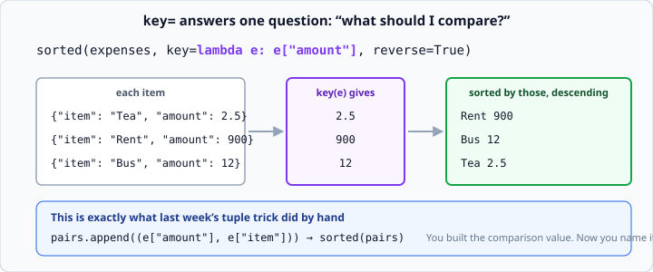

# `lambda` and `sorted(key=)`

*Week 3 · Day 4 · about 15 minutes*

> By the end of this you can sort records by any field in one line — and explain exactly
> what `key=` is doing, because you already did it by hand.

---

## Read the official documentation first

| Page | What it gives you |
|---|---|
| [**Sorting Techniques — HOW TO**](https://docs.python.org/3.14/howto/sorting.html) | The whole guide. Read it properly now — the fence is down |
| [**`sorted()`**](https://docs.python.org/3.14/library/functions.html#sorted) | The `key` and `reverse` arguments |
| [**Lambda Expressions**](https://docs.python.org/3.14/tutorial/controlflow.html#lambda-expressions) | What `lambda` is |
| [**`max()` / `min()`**](https://docs.python.org/3.14/library/functions.html#max) | They take `key=` too |

---

## The fence comes down

Last week you sorted records by building `(value, name)` tuples, because this was behind
the fence:

```python
sorted(expenses, key=lambda e: e["amount"], reverse=True)
```

It is open now. And because you did the tuple version by hand, this is not an
incantation — you already know exactly what work it is doing.

---

## What `key=` actually does

`sorted()` needs to compare items. When the items are numbers or strings, that is
obvious. When they are dicts, it has no idea what to compare — so you tell it.

**`key=` takes a function. `sorted` calls that function on every item, and sorts by
whatever it hands back.**



The original items come out in the result. `key` only decides the *order*, never the
contents.

You can prove it to yourself with a named function first — no `lambda` involved:

```python
def get_amount(expense):
    return expense["amount"]

sorted(expenses, key=get_amount, reverse=True)
```

Note there are **no brackets** after `get_amount`. You are handing `sorted` the function
itself, not calling it. `key=get_amount()` would call it with no arguments and fail.

That distinction — a function versus the result of calling it — is worth getting solid
now. It comes back constantly from week 7 onwards, when you start handing tools to
agents.

---

## `lambda`

A `lambda` is a tiny function written inline, with no name.

```python
lambda e: e["amount"]
```

Read it as: *"given `e`, hand back `e["amount"]`."*

| Part | Meaning |
|---|---|
| `lambda` | "here comes a small function" |
| `e` | its parameter |
| `:` | the separator |
| `e["amount"]` | what it returns — automatically, no `return` keyword |

It is exactly equivalent to `get_amount` above. The only differences are that it has no
name and it must fit in one expression.

```python
sorted(expenses, key=lambda e: e["amount"], reverse=True)
```

### When to use a `lambda` and when not to

**Use a `lambda`** when the function is trivial, used once, and reads better inline than
three lines away.

**Use a named function** when:

- the logic is more than a simple lookup
- you use the same key in several places
- the name would explain something (`by_amount_descending` says more than `lambda e: ...`)

Never assign a lambda to a name:

```python
get_amount = lambda e: e["amount"]      # don't
def get_amount(e): return e["amount"]   # do
```

They do the same thing, but the second gives the function a real name in tracebacks and
lets you add a docstring. [PEP 8 says the same](https://peps.python.org/pep-0008/#programming-recommendations).

---

## Sorting by several fields

`key` can return a **tuple**, and tuples compare item by item — the rule you learned in
week 2.

```python
sorted(students, key=lambda s: (s["grade"], s["name"]))
```

Sort by grade; break ties by name. Exactly the tuple trick, now written where anyone can
see what it does.

And here is the fix to last week's tie-breaking problem:

```python
sorted(students, key=lambda s: (-s["score"], s["name"]))
```

Score **descending** via the minus sign, name **ascending**. `reverse=True` could not do
this, because it reverses everything including the tie-breaker.

If you were asked about that on Friday, this is the answer. Note it only works for
numbers — you cannot negate a string.

---

## `key=` is everywhere

Once you know it, you start seeing it:

```python
max(expenses, key=lambda e: e["amount"])        # the biggest expense, whole record
min(students, key=lambda s: s["score"])         # the lowest scorer
sorted(words, key=len)                          # by length
sorted(words, key=str.lower)                    # case-insensitive
sorted(records, key=lambda r: r["date"])        # by date
```

Two of those pass a function without a lambda at all — `len` and `str.lower` are already
functions that take one argument and return something comparable. When a built-in does
the job, use it.

`max(..., key=...)` is worth dwelling on. It gives you the **whole record**, not just
the value:

```python
biggest = max(expenses, key=lambda e: e["amount"])
print(biggest["item"])          # Rent
```

Without `key`, you would have to sort the whole list and take the first item — more code
and more work for the same answer.

---

## Do not throw the tuple trick away

```python
# with key=
top = sorted(records, key=lambda r: r["amount"], reverse=True)[:3]

# with tuples
pairs = [(r["amount"], r["item"]) for r in records]
top = sorted(pairs, reverse=True)[:3]
```

Both are fine. The first keeps whole records, which is usually what you want. The second
is sometimes clearer when you only need two fields and are about to print them.

The point of doing it by hand for a week was never that `key=` is bad. It was so that
today you know what it costs and what it is for, rather than reaching for it as magic.

---

## Stability

Python's sort is **stable**: items that compare equal keep their original order.

```python
records = [{"n": "Ana", "g": "B"}, {"n": "Ben", "g": "A"}, {"n": "Cara", "g": "B"}]
print([r["n"] for r in sorted(records, key=lambda r: r["g"])])
# ['Ben', 'Ana', 'Cara']       Ana still before Cara
```

This is guaranteed, not an accident, and it lets you sort by two fields with two passes:
sort by the secondary field first, then by the primary. The tuple version is usually
clearer, but the guarantee is useful to know — and it is a common interview question.

---

## Check yourself

```python
people = [
    {"name": "Ana", "age": 30},
    {"name": "Ben", "age": 25},
    {"name": "Cara", "age": 30},
]

# a
print([p["name"] for p in sorted(people, key=lambda p: p["age"])])

# b
print(max(people, key=lambda p: p["age"])["name"])

# c
print([p["name"] for p in sorted(people, key=lambda p: (-p["age"], p["name"]))])

# d
print(sorted(people, key=len))
```

<details>
<summary>Answers</summary>

```
['Ben', 'Ana', 'Cara']
Ana
['Ana', 'Cara', 'Ben']
```

- **a** — by age ascending. Ana and Cara tie at 30 and keep their original order
  (stability).
- **b** — `max` returns the whole dict; Ana is the first of the two 30s.
- **c** — age descending, name ascending as the tie-break. Exactly what `reverse=True`
  could not do.
- **d** — `TypeError: object of type 'dict' has no len()`… actually no: `len({...})` is
  the number of keys, which is 2 for all three. So it runs, sorts by nothing useful, and
  returns them unchanged. **A key function that returns the same value for everything is
  a silent no-op** — worth recognising, because it is a real bug when you pick the wrong
  field.
</details>

---

## What you can now do

- [ ] Explain what `key=` does in one sentence
- [ ] Pass a named function to `key=` without calling it
- [ ] Read and write a `lambda`, and say what its parts are
- [ ] Decide between a `lambda` and a named function
- [ ] Sort by two fields with a tuple key, including one descending
- [ ] Use `key=` with `max()` and `min()` to get the whole record
- [ ] Say what sort stability guarantees

**Next:** the week 3 milestone — a two-file expense tracker with JSON persistence.
Everything from this week lands in it at once.
