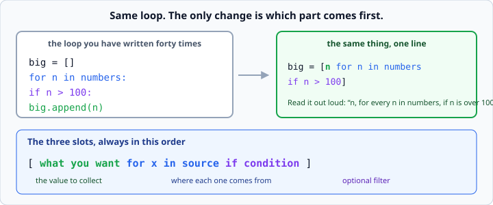

# List comprehensions

*Week 3 · Day 4 · about 20 minutes*

> By the end of this you can write a loop on one line when it earns it — and you know
> when it does not.

---

## Read the official documentation first

| Page | What it gives you |
|---|---|
| [**List Comprehensions**](https://docs.python.org/3.14/tutorial/datastructures.html#list-comprehensions) | The core tutorial |
| [**Nested List Comprehensions**](https://docs.python.org/3.14/tutorial/datastructures.html#nested-list-comprehensions) | Two loops in one — read it, then avoid it |
| [**Dictionary comprehensions**](https://docs.python.org/3.14/tutorial/datastructures.html#dictionaries) | Same idea, curly braces |
| [**Displays for lists, sets and dictionaries**](https://docs.python.org/3.14/reference/expressions.html#displays-for-lists-sets-and-dictionaries) | The formal grammar |

---

## Why this comes last

A comprehension is a loop, compressed. Meet it before you can write the loop and it is a
magic spell you copy without understanding. Meet it after forty loops and it is a
shortcut you have earned.

You have written the forty loops. Here is the shortcut.

---

## The shape

```python
doubled = []
for n in numbers:
    doubled.append(n * 2)
```

becomes

```python
doubled = [n * 2 for n in numbers]
```

Read it left to right: *"`n * 2`, for every `n` in `numbers`."*

The thing you want comes **first**; the loop that produces it comes second. That
inversion is the only hard part, and it stops being hard within a day.



---

## With a filter

```python
big = []
for n in numbers:
    if n > 100:
        big.append(n)
```

becomes

```python
big = [n for n in numbers if n > 100]
```

The `if` goes on the end. *"`n`, for every `n` in `numbers`, if `n` is over 100."*

Say it out loud in that order and the syntax stops needing to be memorised.

### Filtering and transforming together

```python
labels = [f"${n:.2f}" for n in prices if n > 10]
```

*"A price label, for every price, if the price is over 10."* Both slots at once, and
still readable.

---

## The ones you will use for the rest of your life

Pulling a field out of records:

```python
names     = [record["name"] for record in records]
totals    = [r["units"] * r["price"] for r in records]
expensive = [r for r in records if r["price"] > 10]
```

That first one especially. Turning a list of dicts into a list of one field is something
you will do several times a day for your whole career, and this is how it is written.

Note the third: the thing collected is the whole record `r`, unchanged. A comprehension
with no transformation is a pure filter, and that is a perfectly good use of one.

---

## Dict comprehensions

Same idea, curly braces, and a `key: value` pair at the front:

```python
prices = {item["name"]: item["price"] for item in items}
```
```
{'Tea': 2.5, 'Coffee': 4.5}
```

This is the standard way to turn a list of records into a lookup table — which you
then use with `.get()`, and your program stops doing a linear search every time it needs
one item.

Set comprehensions exist too, with the same braces and no colon:

```python
categories = {r["category"] for r in records}      # each one once
```

---

## Scope

The loop variable is local to the comprehension:

```python
squares = [n * n for n in range(5)]
print(n)        # NameError: name 'n' is not defined
```

Unlike a normal `for` loop, where `n` survives afterwards. This is a small, real
advantage: comprehensions do not leak names into the surrounding code.

---

## When *not* to use one

A comprehension that needs a scroll bar is worse than the loop it replaced.

```python
# don't
result = [transform(x) for sub in matrix for x in sub if check(x) and x.valid and len(x.name) > 3]
```

**The test is simple: can you read it in one go, out loud?** If not, it should be a loop.

Specific cases where the loop wins:

- **Two levels of nesting.** `for sub in matrix for x in sub` reads backwards compared
  to nested `for` statements, and nobody finds it obvious.
- **A body doing more than one thing.** If you would need a semicolon, you need a loop.
- **Anything with a `try`.** You cannot put one in a comprehension at all.
- **When you want the intermediate values** for debugging. A loop lets you drop a
  `print()` in the middle; a comprehension does not.

There is no prize for one-liners. There is a real cost to code your team cannot read at
a glance, and "my team" includes you in three weeks.

### The `if/else` version reads differently

```python
labels = [("high" if n > 100 else "low") for n in numbers]
```

Note where the `if` sits. With **no** `else` it is a filter and goes at the **end**. With
an `else` it is a choice of value and goes at the **front**, before the `for`.

That asymmetry catches everybody once. Two different jobs, two different positions.

---

## Performance, briefly

Comprehensions are somewhat faster than the equivalent `.append()` loop, because Python
does not look up `.append` on every round.

**This is not why you use them.** You use them because a one-line comprehension is
easier to read than a four-line loop, when it is genuinely one line. Choosing a
comprehension for speed on a list of ten items is optimising the wrong thing.

If a list is big enough for that difference to matter, the right question is whether you
need the list at all — which is generators, and that is week 7.

---

## Check yourself

```python
numbers = [1, 5, 12, 20]

# a
print([n * 2 for n in numbers])

# b
print([n for n in numbers if n > 10])

# c
print([n * 2 for n in numbers if n > 10])

# d
records = [{"name": "Ana", "score": 90}, {"name": "Ben", "score": 60}]
print([r["name"] for r in records if r["score"] >= 70])

# e
print({r["name"]: r["score"] for r in records})
```

<details>
<summary>Answers</summary>

```
[2, 10, 24, 40]
[12, 20]
[24, 40]
['Ana']
{'Ana': 90, 'Ben': 60}
```

In **c**, the filter runs first and the doubling only applies to what survives. The
order in the code (value first, filter last) is the opposite of the order of execution
(filter first, value last) — which is worth knowing, and worth not worrying about.
</details>

---

## What you can now do

- [ ] Turn an `.append()` loop into a list comprehension
- [ ] Add an `if` filter, and say where it goes
- [ ] Pull one field out of a list of records
- [ ] Write a dict comprehension to build a lookup table
- [ ] Say why the loop variable does not leak
- [ ] Name three cases where a plain loop is the better choice
- [ ] Explain why `if` sits at the front with an `else` and at the back without one

**Next:** [`lambda` and `sorted(key=)`](lambda-and-sorted-key.md) — the fence from week
2 finally comes down.
