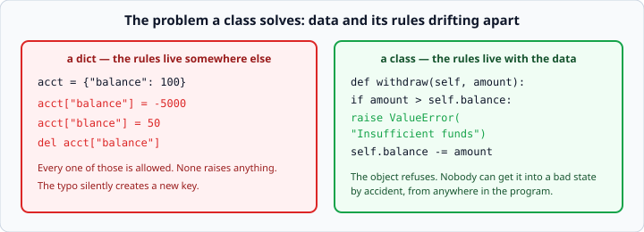
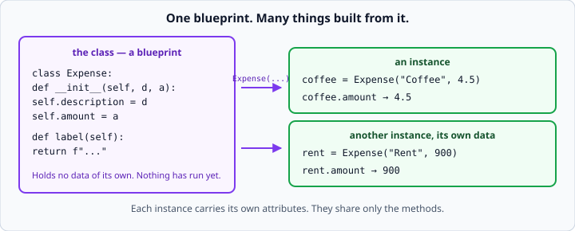
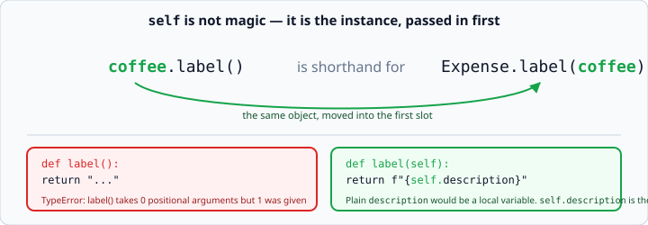

# Python classes and `__init__`

*Week 4 · Day 1 · about 30 minutes*

> By the end of this you can bundle data together with the behaviour that acts on it —
> and you can say when that is the wrong thing to do.

---

## Read the official documentation first

| Page | What it gives you |
|---|---|
| [**Classes**](https://docs.python.org/3.14/tutorial/classes.html) | The whole tutorial chapter |
| [**Class Objects**](https://docs.python.org/3.14/tutorial/classes.html#class-objects) | Where `__init__` is introduced |
| [**Instance Objects**](https://docs.python.org/3.14/tutorial/classes.html#instance-objects) | Attributes |
| [**Method Objects**](https://docs.python.org/3.14/tutorial/classes.html#method-objects) | What `self` really is |
| [**PEP 8 — Class names**](https://peps.python.org/pep-0008/#class-names) | `CapWords`, not `snake_case` |

---

## The problem classes solve

Last week an expense was a dict, and the functions that worked on it lived somewhere
else.

```python
expense = {"description": "Coffee", "amount": 4.5}
print(format_expense(expense))
```

Nothing stops someone building a dict with a missing key, or handing `format_expense` a
dict of something else entirely. The data and the rules about it have drifted apart.



A class keeps them together:

```python
class Expense:
    def __init__(self, description, amount):
        self.description = description
        self.amount = amount

    def label(self):
        return f"{self.description}: ${self.amount:.2f}"
```

```python
coffee = Expense("Coffee", 4.5)
print(coffee.amount)        # 4.5
print(coffee.label())       # Coffee: $4.50
```

Now there is exactly one way to make an `Expense`, and it always has both fields.

---

## The vocabulary



| Term | What it is |
|---|---|
| `class Expense:` | the **class** — a blueprint. Holds no data itself |
| `Expense("Coffee", 4.5)` | calling it makes an **instance** |
| `__init__` | runs automatically when the instance is made. Set your attributes here |
| `self` | the instance the method was called on |
| `self.amount` | an **attribute**, belonging to this one instance |
| `def label(self)` | a **method** — a function that lives on the class |

Class names use `CapWords`: `Expense`, `BankAccount`, `Ledger`. Methods and attributes
stay `snake_case`. Following this is not fussiness — it lets any Python reader tell at a
glance which is which.

### `__init__` is not a constructor, quite

It runs *after* Python has created the instance, and its job is to set it up. It always
takes `self` first, and it must not `return` anything.

```python
def __init__(self, description, amount):
    self.description = description      # store what we were given
    self.amount = amount
```

Those two lines look like boilerplate, and they are. Their purpose is to move a value
from a parameter (which vanishes when `__init__` ends) onto the instance (which
survives).

You can give defaults, exactly as with any function:

```python
def __init__(self, owner, balance=0):
    self.owner = owner
    self.balance = balance
```

And you can validate right there — which is one of the best reasons to have a class at
all:

```python
def __init__(self, description, amount):
    if amount < 0:
        raise ValueError("Amount cannot be negative")
    self.description = description
    self.amount = amount
```

Now a negative `Expense` cannot exist anywhere in your program. Not "should not" —
cannot.

---

## `self` is not magic

`coffee.label()` is Python's shorthand for `Expense.label(coffee)`.



The instance is passed in as the first argument, and by convention that parameter is
called `self`. That is the whole story. There is nothing else to it.

Two rules follow, and they cover most first-day errors:

**1. Every method takes `self` first.**

```python
def label():                # missing self
    return "..."
```
```
TypeError: label() takes 0 positional arguments but 1 was given
```

Confusing until you know that `coffee` was the one argument. Now it reads clearly.

**2. Inside a method, reach for your own data through `self`.**

```python
def label(self):
    return f"{description}"         # NameError — that's a local name
    return f"{self.description}"    # correct
```

`self` could legally be called anything. It is called `self` in every Python codebase
on earth, so call it `self`.

---

## Methods that change the instance

```python
class BankAccount:
    def __init__(self, owner, balance=0):
        self.owner = owner
        self.balance = balance

    def deposit(self, amount):
        self.balance += amount
```

`deposit` returns nothing — it changes the object.

That is the one honest exception to week 3's *"take values in, hand new ones back"*:
**a method may change its own instance, because that is what the object is for.**

Changing anything else is still a bug. A method that reaches into another object and
edits its attributes is the beginning of a codebase nobody can reason about.

### Methods that refuse

```python
def withdraw(self, amount):
    if amount > self.balance:
        raise ValueError("Insufficient funds")
    self.balance -= amount
```

**An object that can enforce its own rules is most of why classes exist.** A dict cannot
stop you setting a negative balance. This can, and the rule lives in exactly one place.

Notice this is week 3's "raise deep, catch shallow" again. `withdraw` knows the rule; it
has no idea whether the caller wants to print a message or retry.

---

## Attributes are not declared

Python has no list of allowed attributes. You can add one at any time:

```python
coffee = Expense("Coffee", 4.5)
coffee.category = "food"        # perfectly legal
```

This is flexible and it is a trap: a typo creates a new attribute rather than failing.

```python
coffee.amonut = 5.0             # no error. The real amount is unchanged.
```

**So set every attribute in `__init__`, even the ones that start empty:**

```python
def __init__(self):
    self.expenses = []          # not added later, somewhere else
```

Then reading `__init__` tells you everything the object holds, and anyone can see the
full shape in one place.

---

## The question to keep asking

> **Does this need to be a class?**

A class earns its place when **state and behaviour travel together**. A `BankAccount`
has a balance, and depositing changes it — those two must not drift apart.

A class is the wrong answer when you have **a function wearing a costume**:

```python
class Calculator:                       # this should not exist
    def add_tax(self, amount):
        return amount * 1.08
```

No state. One method. Nothing protected. That is a function, and wrapping it in a class
adds a word to every call site and buys nothing.

The test: **if you deleted the class and made the methods plain functions, what would
you lose?** If the answer is "nothing", make them functions.

You will write one of these this week and be asked to defend it on Friday. Knowing the
question now is most of the answer.

---

## Check yourself

```python
class Counter:
    def __init__(self):
        self.count = 0

    def increment(self):
        self.count += 1

    def broken(self):
        count += 1

a = Counter()
b = Counter()
a.increment()
a.increment()

# 1. What is a.count? What is b.count?
# 2. What happens on a.broken()?
# 3. What does Counter.increment(a) do?
```

<details>
<summary>Answers</summary>

1. `a.count` is `2`, `b.count` is `0`. Each instance has its own attributes.
2. `UnboundLocalError` — `count` with no `self.` is a local variable that was never
   given a value. Exactly the week 3 scope rule, in a new place.
3. The same as `a.increment()`. That *is* what `a.increment()` becomes.
</details>

---

## What you can now do

- [ ] Write a class with `__init__` and methods
- [ ] Use the vocabulary: class, instance, attribute, method
- [ ] Explain what `self` is without saying "magic"
- [ ] Diagnose "takes 0 positional arguments but 1 was given"
- [ ] Say why a method changing its own instance is allowed
- [ ] Validate in `__init__` so a bad object cannot exist
- [ ] Set every attribute in `__init__`, and say what a typo costs otherwise
- [ ] Answer "does this need to be a class?" with a reason

**Next:** [`self` and instance attributes](self-and-instance-attributes.md) — the
class-versus-instance trap that catches everyone.
