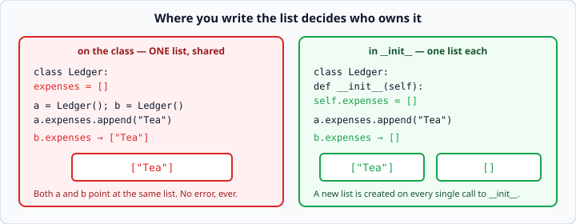

# `self` and instance attributes

*Week 4 · Day 1 · about 15 minutes*

> By the end of this you know exactly where an attribute lives, and you will not fall
> into the shared-list trap that catches every beginner once.

---

## Read the official documentation first

| Page | What it gives you |
|---|---|
| [**Class and Instance Variables**](https://docs.python.org/3.14/tutorial/classes.html#class-and-instance-variables) | **The key page** — read the whole section, including the warning box |
| [**Method Objects**](https://docs.python.org/3.14/tutorial/classes.html#method-objects) | Why `self` is passed automatically |
| [**Private Variables**](https://docs.python.org/3.14/tutorial/classes.html#private-variables) | The `_leading_underscore` convention |
| [**`isinstance()`**](https://docs.python.org/3.14/library/functions.html#isinstance) | Checking what something is |

The Class and Instance Variables page has a highlighted warning about mutable class
attributes. That warning is the whole second half of this article.

---

## Two places an attribute can live

```python
class Dog:
    species = "Canis familiaris"     # a CLASS attribute — one, shared

    def __init__(self, name):
        self.name = name             # an INSTANCE attribute — one each
```

```python
a = Dog("Rex")
b = Dog("Bo")

print(a.name, b.name)           # Rex Bo          — different
print(a.species, b.species)     # same, same      — one shared value
```

**Instance attributes** are created inside `__init__` with `self.`. Every instance gets
its own.

**Class attributes** sit directly in the class body. There is exactly one, shared by
every instance.

Use a class attribute for a genuine constant — a tax rate, a maximum, a species name.
Use an instance attribute for everything else, which in practice is nearly everything.

---

## The trap

Here is the one that catches everybody exactly once.

```python
class Ledger:
    expenses = []                    # WRONG

    def add(self, expense):
        self.expenses.append(expense)
```

```python
a = Ledger()
b = Ledger()
a.add("Tea")
print(b.expenses)               # ['Tea']  <- b has Tea in it!
```



There is only **one** list, created once when the class was defined. Both `a` and `b`
point at it. `a.add(...)` modifies the shared list, and `b` sees the change.

No error. No warning. Just two ledgers that are secretly the same ledger.

### Why the earlier example was fine

`species = "Canis familiaris"` is also shared — but a string cannot be modified, so
nothing can go wrong. The only way to change it is to assign a new one, which creates an
instance attribute anyway (see below).

**The problem is only with mutable class attributes** — lists, dicts and sets. This is
the same mutability rule from week 3, showing up in a new place.

### The fix

```python
class Ledger:
    def __init__(self):
        self.expenses = []           # a NEW list, every time

    def add(self, expense):
        self.expenses.append(expense)
```

`__init__` runs once per instance, so each gets a fresh list.

**The rule: never put a list, dict or set directly in the class body. Create it in
`__init__`.** It is the same reason you never write `def f(items=[])`.

---

## Assignment creates an instance attribute

One more piece, and then the whole model is complete.

```python
class Dog:
    species = "Canis familiaris"

a = Dog()
b = Dog()

a.species = "Something else"     # this does NOT change the class attribute

print(a.species)        # Something else   <- a now has its own
print(b.species)        # Canis familiaris <- unchanged
print(Dog.species)      # Canis familiaris <- unchanged
```

Assigning through an instance **creates a new instance attribute that shadows the class
one**. It never modifies the class attribute.

That is exactly why `self.expenses = []` in `__init__` fixes the trap, and why
`self.expenses.append(...)` does not: `.append()` mutates the shared object, `=` makes a
new private one.

**Look for the `=`.** If you assign, you get your own. If you call a mutating method,
you change what everyone sees.

### How Python looks an attribute up

When you write `a.species`, Python checks:

1. the instance's own attributes — found? use it
2. the class's attributes — found? use it
3. otherwise `AttributeError`

That single rule explains everything above, and it is a good thing to be able to recite
on Friday.

---

## Attributes you did not mean to create

Because attributes are never declared, a typo makes a new one instead of failing:

```python
coffee = Expense("Coffee", 4.5)
coffee.amonut = 5.0             # no error
print(coffee.amount)            # 4.5 — the real one is untouched
```

Two defences:

**Set everything in `__init__`.** Then `__init__` is the complete list of what the
object holds, and a reader can see the whole shape in one place.

**Check with `hasattr()` when you genuinely do not know:**

```python
if hasattr(record, "amount"):
    ...
```

Reach for that rarely. If you frequently do not know whether an object has a field, the
objects are probably not the type you think they are.

---

## The underscore convention

```python
class BankAccount:
    def __init__(self, balance):
        self._balance = balance      # "internal — please don't touch"
```

A leading underscore means *"this is internal to the class; do not use it from
outside"*.

**Python does not enforce this.** `account._balance` works fine. It is a message
between programmers, and Python's whole approach to privacy is that a clear message is
enough.

Use it for attributes that other code has no business reading. Do not sprinkle it on
everything — an `Expense` with `_description` and `_amount` is just noise, because those
are exactly what the outside world wants.

---

## `isinstance()`

```python
print(isinstance(coffee, Expense))      # True
print(isinstance(4.5, float))           # True
print(isinstance("a", (int, str)))      # True — a tuple means "any of these"
```

You need this tomorrow, for `__eq__`. Prefer it to `type(x) == Expense`, which is
stricter in ways that cause problems later.

---

## Check yourself

```python
class Basket:
    items = []
    def add(self, item):
        self.items.append(item)

a = Basket()
b = Basket()
a.add("apple")

# 1. What is b.items?
# 2. Now b.items = ["pear"]. What is a.items?
# 3. Rewrite Basket correctly.
```

<details>
<summary>Answers</summary>

1. `['apple']`. One shared list.
2. `['apple']`. The assignment gave `b` its own private list; `a` still points at the
   original shared one. You now have a class where one instance is independent and the
   other is not — which is exactly as confusing to debug as it sounds.
3. ```python
   class Basket:
       def __init__(self):
           self.items = []

       def add(self, item):
           self.items.append(item)
   ```
</details>

---

## What you can now do

- [ ] Tell a class attribute from an instance attribute by where it is written
- [ ] Explain why a mutable class attribute is shared, and what breaks
- [ ] State the rule: create lists and dicts in `__init__`, never in the class body
- [ ] Say what assigning through an instance actually does
- [ ] Recite Python's attribute lookup order
- [ ] Use `hasattr()` and the leading-underscore convention
- [ ] Use `isinstance()`

**Next:** [`__repr__` and `__eq__`](../day-2/repr-and-eq.md) — making your objects
behave like Python's own.
