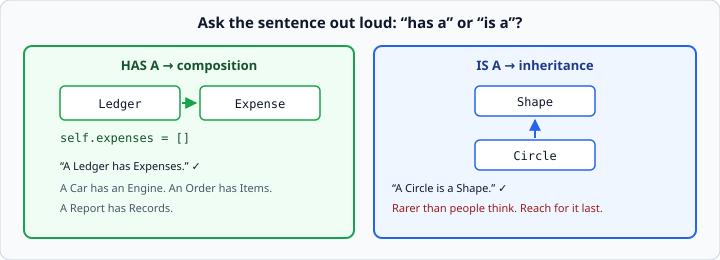

# Composition

*Week 4 · Day 2 · about 15 minutes*

> By the end of this you can build one class out of others, and you can say why that is
> almost always better than inheritance.

---

## Read the official documentation first

| Page | What it gives you |
|---|---|
| [**Classes**](https://docs.python.org/3.14/tutorial/classes.html) | The chapter — note how little space inheritance gets |
| [**Inheritance**](https://docs.python.org/3.14/tutorial/classes.html#inheritance) | What you are choosing *not* to use, and why |
| [**`sum()`**](https://docs.python.org/3.14/library/functions.html#sum) | Totalling across contained objects |
| [**`isinstance()`**](https://docs.python.org/3.14/library/functions.html#isinstance) | Guarding what goes in |

---

## An object can hold other objects

An attribute can be anything — including another instance of your own class, or a list
of them.

```python
class Expense:
    def __init__(self, description, amount):
        self.description = description
        self.amount = amount

    def __repr__(self):
        return f"Expense({self.description!r}, {self.amount})"


class Ledger:
    def __init__(self):
        self.expenses = []

    def add(self, expense):
        self.expenses.append(expense)

    def total(self):
        return sum(e.amount for e in self.expenses)
```

```python
ledger = Ledger()
ledger.add(Expense("Coffee", 4.5))
ledger.add(Expense("Rent", 900))
print(ledger.total())       # 904.5
```

This is **composition**: a `Ledger` *has* `Expense`s.

---

## "Has a" versus "is a"



Say the relationship out loud:

- "A Ledger **has** Expenses" → composition. Store them in an attribute.
- "A Circle **is a** Shape" → inheritance. `class Circle(Shape):`

Almost everything you build is the first kind. A Car has an Engine. An Order has Items.
A Report has Records. An Agent has Tools — which is week 7, and it is composition too.

Week 4's fence keeps inheritance to a single level on purpose. Not because inheritance
is bad, but because beginners reach for it constantly where composition is the right
answer, and the resulting code is much harder to change.

**The practical difference:** with composition you can swap the inner object for
something else. With inheritance you are welded to the parent's design forever.

---

## Each class minds its own business

Look again at `total()`:

```python
def total(self):
    return sum(e.amount for e in self.expenses)
```

`Ledger` does not know how an `Expense` stores its amount. It just asks — `e.amount`.

So you can change `Expense` freely: validate in `__init__`, add a currency, store cents
internally. As long as `.amount` still answers, `Ledger` is untouched.

That independence is the whole prize:

- **You can test each class alone.** Tomorrow you will, and it is much easier than
  testing a tangle.
- **A bug stays in one class.** When the total is wrong, either `Expense` is reporting a
  bad amount or `Ledger` is adding them up wrong. Two places to look, not one big one.
- **You can replace either side.** Swap `Expense` for something that reads from a
  database, and `Ledger` never finds out.

The opposite — `Ledger` reaching in to do `e.__dict__["amount"]` or knowing that
expenses are stored in pence — is called **coupling**, and it is the reason
long-lived codebases become impossible to change.

---

## Delegation

A contained object's methods are available through the container:

```python
class Ledger:
    def biggest(self):
        if not self.expenses:
            return None
        return max(self.expenses, key=lambda e: e.amount)

    def labels(self):
        return [e.label() for e in self.expenses]
```

`Ledger` does not reimplement `label()` — it asks each `Expense` to do its own. That is
**delegation**, and it is what composition is for.

Note the guard clause on `biggest`. `max()` on an empty list raises `ValueError`, and an
empty ledger is a completely normal state. Week 3's habits still apply.

---

## Deciding what goes in the container

```python
def add(self, expense):
    if not isinstance(expense, Expense):
        raise TypeError("Ledger.add expects an Expense")
    self.expenses.append(expense)
```

Worth it? Sometimes. It turns a confusing failure later — `AttributeError: 'dict'
object has no attribute 'amount'`, three method calls away — into a clear one right at
the point of the mistake.

Python culture leans towards *not* type-checking everywhere. The judgement is: check at
the **boundary** where things enter your object, not on every internal call.

---

## Making the container feel built-in

The dunder methods from the first half of today are what make a composed object pleasant
to use:

```python
class Ledger:
    def __len__(self):
        return len(self.expenses)

    def __repr__(self):
        return f"Ledger({len(self.expenses)} expenses, total {self.total():.2f})"
```

```python
print(len(ledger))          # 2
print(ledger)               # Ledger(2 expenses, total 904.50)
if not ledger:
    print("empty")
```

Three lines of code and your object behaves like something from the standard library.
This is the pay-off for yesterday's material and today's first article arriving together.

---

## Does this need to be a class?

The week's question, applied to what you are about to build.

**`Ledger` earns its place.** It holds state (the list), enforces rules (what can be
added), and offers behaviour that depends on that state (`total`, `biggest`). The list
and the rules about it travel together.

**This does not:**

```python
class ReportPrinter:
    def print_report(self, ledger):
        for e in ledger.expenses:
            print(e.label())
```

No state. One method. It is a function with extra steps:

```python
def print_report(ledger):
    for e in ledger.expenses:
        print(e.label())
```

**The test: if you deleted the class and made the methods plain functions, what would
you lose?** If the answer is "nothing", make them functions.

You will write one class this week that fails this test, and you will be asked to defend
it on Friday. The right answer is not to pretend it passes — it is to notice, say so,
and explain what you would change.

---

## Check yourself

For each pair, say whether it is "has a" or "is a", and how you would code it.

1. `Playlist` and `Song`
2. `Square` and `Rectangle`
3. `Order` and `Customer`
4. `Engine` and `Car`

<details>
<summary>Answers</summary>

1. **has a.** A Playlist has Songs. `self.songs = []`.
2. **is a** — mathematically. A Square is a Rectangle, so `class Square(Rectangle)`.
   Famously this causes trouble the moment the Rectangle can be resized: setting the
   width of a Square must also set the height, which breaks what callers expect from a
   Rectangle. A real example of why "is a" alone is not enough to justify inheritance.
3. **has a.** An Order has a Customer. `self.customer = customer` — a single object, not
   a list. Composition does not have to mean a collection.
4. **has a.** A Car has an Engine. This is the textbook example of choosing composition,
   because you can then swap in an electric one.
</details>

---

## What you can now do

- [ ] Store one object, or a list of them, as an attribute of another
- [ ] Say the "has a" / "is a" sentence and pick the right structure
- [ ] Explain why `Ledger` not knowing how `Expense` works is the point
- [ ] Delegate a method call to a contained object
- [ ] Guard what enters your container with `isinstance`, at the boundary
- [ ] Add `__len__` and `__repr__` to a container class
- [ ] Answer "does this need to be a class?" honestly, including when it does not

**Next:** [Writing tests with pytest](../day-3/writing-tests-with-pytest.md) — the
skill that turns "it works" into "I can prove it".
