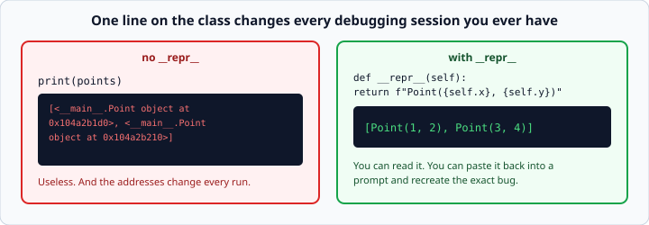
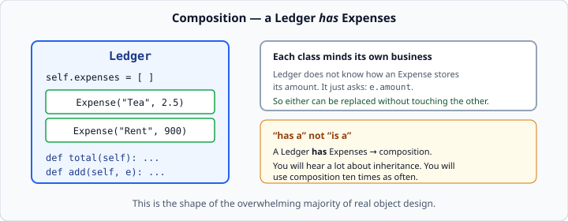

# `__repr__` and `__eq__`

*Week 4 · Day 2 · about 20 minutes*

> By the end of this your objects print usefully and compare sensibly — which is most
> of what makes a class pleasant to work with.

---

## Read the official documentation first

| Page | What it gives you |
|---|---|
| [**Special method names**](https://docs.python.org/3.14/reference/datamodel.html#special-method-names) | The full list of dunder methods |
| [**`object.__repr__`**](https://docs.python.org/3.14/reference/datamodel.html#object.__repr__) | The exact contract, including "looks like code" |
| [**`object.__eq__`**](https://docs.python.org/3.14/reference/datamodel.html#object.__eq__) | Comparison, and `NotImplemented` |
| [**`repr()`**](https://docs.python.org/3.14/library/functions.html#repr) | The built-in that calls it |

Methods with double underscores at both ends are called **dunder** methods (*double
underscore*). You never call them directly — Python calls them for you when you use the
matching syntax. `len(x)` calls `x.__len__()`, `a == b` calls `a.__eq__(b)`.

---

## `__repr__` — how your object looks

By default, printing an object is useless:

```python
print(Point(3, 4))          # <__main__.Point object at 0x104a2b1d0>
```



That memory address will waste hours of your life. Fix it once, on the class:

```python
class Point:
    def __init__(self, x, y):
        self.x = x
        self.y = y

    def __repr__(self):
        return f"Point({self.x}, {self.y})"
```

```python
print(Point(3, 4))          # Point(3, 4)
print([Point(1, 2)])        # [Point(1, 2)]     <- works inside containers too
```

That last line is the real payoff. Printing a list of objects is how you debug, and
without `__repr__` you get a wall of hex addresses.

### The convention

**`__repr__` should look like the code that would recreate the object.**

```python
return f"Point({self.x}, {self.y})"     # right
return f"A point at {self.x}, {self.y}" # wrong
return "Point(3, 4)"                    # wrong — hard-coded
```

Every Python programmer expects this, and it means you can paste the output straight
back into a prompt to reproduce a bug. When the values are strings, use `!r` so the
quotes appear:

```python
def __repr__(self):
    return f"Expense({self.description!r}, {self.amount})"
```
```
Expense('Coffee', 4.5)
```

`!r` calls `repr()` on the value rather than `str()` — so a string comes out with its
quotes, and the output really is valid Python.

**Write `__repr__` on every class you make.** It costs one line and it is the single
highest-return habit of this week.

### `__str__`, briefly

`__str__` is what `print()` and f-strings use; `__repr__` is what the interactive
prompt, containers, and `repr()` use.

If you define only `__repr__`, Python uses it for both. **So define `__repr__` and stop
there.** Only add `__str__` when you want a separate friendly version for end users:

```python
def __repr__(self):
    return f"Expense({self.description!r}, {self.amount})"   # for developers

def __str__(self):
    return f"{self.description}: ${self.amount:.2f}"          # for users
```

Defining only `__str__` is the common beginner mistake: your object looks fine when
printed alone and reverts to hex inside a list.

---

## `__eq__` — how your object compares

```python
Point(3, 4) == Point(3, 4)      # False by default!
```

By default, two objects are equal only if they are **the same object in memory**. For a
`Point`, that is almost never what you want.

```python
def __eq__(self, other):
    return self.x == other.x and self.y == other.y
```

```python
Point(3, 4) == Point(3, 4)      # True
Point(3, 4) in [Point(3, 4)]    # True — `in` uses __eq__ too
```

That second line matters more than it looks. `in`, `.remove()`, `.index()`, and
`assert x == y` in your tests all go through `__eq__`. Define it and they all start
working the way you expect.

### Handle other types properly

`other` might not be a `Point` at all:

```python
Point(3, 4) == "hello"      # AttributeError: 'str' object has no attribute 'x'
```

Comparison should never raise. Fix it:

```python
def __eq__(self, other):
    if not isinstance(other, Point):
        return NotImplemented
    return self.x == other.x and self.y == other.y
```

**`NotImplemented` is Python's way of saying "I do not know how to compare these".**
Python then tries the other object's `__eq__`, and if that also declines, falls back to
`False`.

Returning `False` yourself looks identical today and does the wrong thing later — it
stops the other type from ever getting a chance to say the two *are* equal. Return
`NotImplemented`; it is one word and it is correct.

> Note: `NotImplemented` (a value you return) is not `NotImplementedError` (an exception
> you raise). Different things, similar names, and Python will not warn you.

### Defining `__eq__` breaks hashing

```python
class Point:
    def __eq__(self, other): ...

{Point(1, 2)}       # TypeError: unhashable type: 'Point'
```

Once you define `__eq__`, Python removes the default `__hash__`, so your objects can no
longer go in a set or be used as dict keys. This is deliberate: things that are equal
must hash the same, and Python cannot guess how.

You do not need the fix this week. If you hit it, know that it is `__hash__`, and that
it is the reason `@dataclass(frozen=True)` exists — which is week 5 material.

---

## `__len__`

```python
def __len__(self):
    return len(self.expenses)
```

Now `len(ledger)` works.

Add it whenever "how many?" is an obvious question about your object — and **never** as
a way of returning something that is not a count. `__len__` must return a non-negative
integer; Python enforces that.

One side effect worth knowing: an object with `__len__` is **falsy when its length is
zero**.

```python
if not ledger:
    print("Nothing recorded yet")
```

That reads beautifully and is exactly the truthiness rule from week 1. It is also a trap
if you did not intend it: an empty `Ledger` is now falsy, so `if ledger:` no longer
means "the ledger exists".

---

## Composition — objects made of objects

```python
class Expense:
    def __init__(self, description, amount):
        self.description = description
        self.amount = amount

    def __repr__(self):
        return f"Expense({self.description!r}, {self.amount})"


class Ledger:
    def __init__(self):
        self.expenses = []

    def add(self, expense):
        self.expenses.append(expense)

    def total(self):
        return sum(e.amount for e in self.expenses)

    def __len__(self):
        return len(self.expenses)

    def __repr__(self):
        return f"Ledger({len(self.expenses)} expenses, total {self.total():.2f})"
```



A `Ledger` **has** `Expense`s. That is **composition**, and it is how the overwhelming
majority of real object design works.

You will hear a lot about inheritance. You will use composition ten times as often, and
week 4's fence deliberately keeps inheritance to one level so you build the habit.

### Why it works

`Ledger.total()` does not know how an `Expense` stores its amount. It just asks:
`e.amount`.

Each class minds its own business. Change how `Expense` works internally — validate in
`__init__`, store cents instead of pounds — and `Ledger` does not care, as long as
`.amount` still answers.

That independence is the entire prize. It is why you can test `Expense` on its own
tomorrow, and why a bug in one class stays in one class.

### Note `self.expenses = []` is in `__init__`

Not in the class body. Yesterday's trap, and it is exactly this kind of class where it
bites.

---

## Check yourself

```python
class Money:
    def __init__(self, amount):
        self.amount = amount

a = Money(5)
b = Money(5)

# 1. print(a) — what appears?
# 2. print(a == b) — what appears?
# 3. print([a]) — what appears?
# 4. Add __repr__ and __eq__. Now answer 1–3 again.
# 5. print({a}) — what happens after step 4?
```

<details>
<summary>Answers</summary>

1. `<__main__.Money object at 0x...>`
2. `False` — different objects in memory.
3. `[<__main__.Money object at 0x...>]`
4. `Money(5)`, `True`, `[Money(5)]`.
5. `TypeError: unhashable type: 'Money'` — defining `__eq__` removed the default
   `__hash__`.

If **5** surprised you, re-read the hashing section. It is a genuinely common surprise
and a good Friday answer.
</details>

---

## What you can now do

- [ ] Write `__repr__` so it looks like the code that recreates the object
- [ ] Use `!r` inside an f-string and say what it does
- [ ] Explain why defining only `__str__` is a mistake
- [ ] Write `__eq__` with an `isinstance` guard returning `NotImplemented`
- [ ] Say why `NotImplemented` beats returning `False`
- [ ] Explain why defining `__eq__` makes an object unhashable
- [ ] Add `__len__`, and know it makes an empty object falsy
- [ ] Build one class out of another and say why that is composition

**Next:** [Writing tests with pytest](../day-3/writing-tests-with-pytest.md) — proving
it works.
