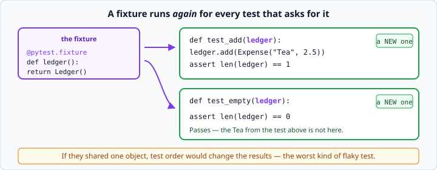

# pytest fixtures and `parametrize`

*Week 4 · Day 3 · about 15 minutes*

> By the end of this you can write a suite that covers many cases without becoming a
> wall of copy-paste.

---

## Read the official documentation first

| Page | What it gives you |
|---|---|
| [**How to use fixtures**](https://docs.pytest.org/en/stable/how-to/fixtures.html) | The whole fixture system |
| [**Parametrizing tests**](https://docs.pytest.org/en/stable/how-to/parametrize.html) | `@pytest.mark.parametrize` |
| [**Built-in fixtures**](https://docs.pytest.org/en/stable/reference/fixtures.html#built-in-fixtures) | `tmp_path`, `capsys`, `monkeypatch` |
| [**`conftest.py`**](https://docs.pytest.org/en/stable/reference/fixtures.html#conftest-py-sharing-fixtures-across-multiple-files) | Sharing fixtures between files |

---

## The problem both tools solve

A first test suite always looks like this:

```python
def test_area_1():
    ledger = Ledger()
    ledger.add(Expense("Tea", 2.5))
    assert ledger.total() == 2.5

def test_area_2():
    ledger = Ledger()
    ledger.add(Expense("Rent", 900))
    assert ledger.total() == 900
```

Two lines of setup, copied. By test twelve it is twenty-four copied lines, and changing
how a `Ledger` is built means editing all of them.

**`parametrize`** removes repetition in the *data*. **Fixtures** remove repetition in
the *setup*.

---

## `parametrize`

```python
@pytest.mark.parametrize("side,expected", [
    (1, 1),
    (3, 9),
    (10, 100),
])
def test_square_area(side, expected):
    assert Square(side).area() == expected
```

The first argument is a comma-separated string of parameter names. The second is a list
of tuples, one per case, matching those names in order.

pytest runs the function once per tuple and reports each separately:

```
test_shapes.py::test_square_area[1-1] PASSED
test_shapes.py::test_square_area[3-9] PASSED
test_shapes.py::test_square_area[10-100] FAILED
```

**That separate reporting is the point.** A loop inside one test stops at the first bad
value and tells you nothing about the rest.

### Labelling the cases

When the values do not explain themselves, name them with `pytest.param`:

```python
@pytest.mark.parametrize("score,expected", [
    pytest.param(89, "B", id="just_below_A"),
    pytest.param(90, "A", id="exactly_A"),
    pytest.param(0,  "F", id="zero"),
])
def test_letter_grade(score, expected):
    assert letter_grade(score) == expected
```

Now the failure reads `test_letter_grade[exactly_A] FAILED`, which needs no
investigation at all.

### What `parametrize` is for

**Boundaries.** This is the natural home of week 1's off-by-one lesson: 89 and 90, 0 and
1, empty and one-item.

**Not** for unrelated behaviours. If your cases need different assertions, they are
different tests. Squeezing them into one `parametrize` with an `if` inside produces
something worse than the copy-paste it replaced.

---

## Fixtures

```python
@pytest.fixture
def ledger():
    return Ledger()

def test_add(ledger):
    ledger.add(Expense("Tea", 2.5))
    assert len(ledger) == 1

def test_empty(ledger):
    assert len(ledger) == 0
```

Decorate a function with `@pytest.fixture`, then ask for it **by putting its name in the
test's arguments**. pytest matches them by name and calls the fixture for you.



### Freshness is the whole point

The fixture function runs **again** for every test that asks. `test_empty` gets a
brand-new `Ledger`, not the one `test_add` put Tea into.

If they shared a single object, test order would change the results — and a suite that
passes alone and fails in a full run is the most demoralising kind of bug there is.

This is the same lesson as yesterday's mutable class attribute: shared mutable state
causes action at a distance. Fixtures are how tests avoid it.

### Fixtures can use fixtures

```python
@pytest.fixture
def expense():
    return Expense("Tea", 2.5)

@pytest.fixture
def ledger(expense):
    lodger = Ledger()
    lodger.add(expense)
    return lodger

def test_total(ledger):
    assert ledger.total() == 2.5
```

pytest resolves the chain for you. Build small fixtures and compose them — the same
instinct as composition in your classes.

### Setup and teardown with `yield`

```python
@pytest.fixture
def temp_file(tmp_path):
    path = tmp_path / "data.json"
    path.write_text("[]")
    yield path                      # the test runs here
    print("cleaning up")            # runs after the test, pass or fail
```

Everything before `yield` is setup; the test receives the yielded value; everything after
runs afterwards, **even if the test failed**.

Same idea as `with` from week 3: guaranteed cleanup.

---

## The built-in fixtures worth knowing

You get these without writing anything.

### `tmp_path` — a fresh empty directory

```python
def test_save_and_load(tmp_path):
    path = tmp_path / "data.json"
    save_data(path, [{"item": "Tea"}])
    assert load_data(path, []) == [{"item": "Tea"}]
```

This is how you test week 3's file code without touching real files. A new directory per
test, cleaned up afterwards.

`tmp_path` is a `pathlib.Path`, which is why `/` builds a path — and it is a good reason
to make your file functions accept a path rather than hard-coding one.

### `capsys` — capture what was printed

```python
def test_report_prints_header(capsys):
    print_report(ledger)
    output = capsys.readouterr().out
    assert "TOTAL" in output
```

For testing functions that print. Necessary sometimes — but if you find yourself using
it a lot, your functions are printing when they should be **returning**. That is week
3's `return` versus `print` lesson, and it is exactly what makes code testable.

### `monkeypatch` — temporarily replace something

```python
def test_uses_default_when_env_missing(monkeypatch):
    monkeypatch.delenv("API_KEY", raising=False)
    assert get_key() == "default"
```

Changes are undone automatically after the test. You will need this in week 5 for
environment variables, and week 6 for pretending to call an API.

---

## `conftest.py`

Put a fixture in a file called `conftest.py` and every test file in that directory —
and below it — can use it, with no import.

```python
# conftest.py
import pytest

@pytest.fixture
def ledger():
    return Ledger()
```

This is how the fixtures for this whole course are shared. Look at the `conftest.py` at
the root of this repository — it is real, working code that you can now read.

---

## Combining them

```python
@pytest.mark.parametrize("amount,expected_total", [
    (2.5, 2.5),
    (900, 900),
    (0, 0),
])
def test_ledger_total(ledger, amount, expected_total):
    ledger.add(Expense("Item", amount))
    assert ledger.total() == pytest.approx(expected_total)
```

Fixture and parameters together. The fixture argument and the parametrized arguments sit
side by side; pytest works out which is which.

Three tests, one fresh `Ledger` each, no repetition. That is what a mature suite looks
like.

---

## Check yourself

```python
@pytest.fixture
def numbers():
    return [1, 2, 3]

def test_append(numbers):
    numbers.append(4)
    assert len(numbers) == 4

def test_original(numbers):
    assert len(numbers) == 3
```

1. Does `test_original` pass? Why?
2. What would change if `numbers` were a plain module-level list instead?
3. Why does `parametrize` beat a `for` loop inside one test?

<details>
<summary>Answers</summary>

1. **Yes.** The fixture runs again and builds a fresh `[1, 2, 3]`.
2. `test_original` would fail — but only when run **after** `test_append`. Run alone it
   passes. Order-dependent failures are the hardest tests to debug, and this is how you
   create them.
3. A loop stops at the first failure, so you learn about one bad value and nothing about
   the rest. `parametrize` runs every case and names each one in the output.
</details>

---

## What you can now do

- [ ] Use `@pytest.mark.parametrize` to run one test over many values
- [ ] Label cases with `pytest.param(..., id=...)`
- [ ] Say when `parametrize` is the wrong tool
- [ ] Write a fixture and request it by argument name
- [ ] Explain why fixture freshness prevents order-dependent tests
- [ ] Compose fixtures, and use `yield` for teardown
- [ ] Use `tmp_path`, `capsys` and `monkeypatch`
- [ ] Share fixtures with `conftest.py`

**Next:** [Python type hints](../day-4/type-hints.md) — making your code say what it
expects.
