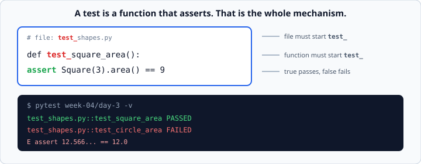
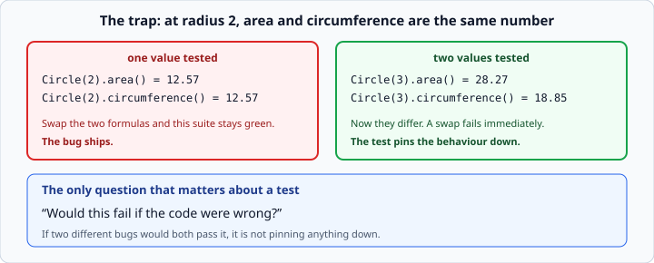

# Writing tests with pytest

*Week 4 · Day 3 · about 30 minutes*

> By the end of this you can write a test suite — and tell whether it is any good.

---

## Read the official documentation first

| Page | What it gives you |
|---|---|
| [**pytest — Get Started**](https://docs.pytest.org/en/stable/getting-started.html) | Installing and the first test |
| [**How to write and report assertions**](https://docs.pytest.org/en/stable/how-to/assert.html) | `assert`, and `pytest.raises` |
| [**Conventions for test discovery**](https://docs.pytest.org/en/stable/explanation/goodpractices.html#conventions-for-python-test-discovery) | Why the names must start with `test_` |
| [**`unittest` (Python stdlib)**](https://docs.python.org/3.14/library/unittest.html) | The built-in alternative — worth knowing it exists |
| [**`assert` statement**](https://docs.python.org/3.14/reference/simple_stmts.html#the-assert-statement) | The Python statement pytest builds on |

> pytest is a third-party library, so its documentation lives at **docs.pytest.org**
> rather than docs.python.org. Python ships its own testing framework, `unittest`, and
> the standard library page above is worth a skim — but pytest is what industry uses and
> what this course grades with.

---

## Today is the highest-value day of the course

Every Wednesday so far, tests were something that happened *to* you. Today you write
them — and then your suite is run against **deliberately broken code** to see whether it
notices.

*"How do you know your tests are any good?"* is a question most junior candidates cannot
answer at all. By tonight you will be able to.

---

## A test is a function that asserts

```python
from shapes import Square

def test_square_area():
    assert Square(3).area() == 9
```



Three conventions, and pytest finds your tests by them:

- the **file** is named `test_something.py`
- the **functions** are named `test_something`
- **`assert`** is the whole mechanism: true passes, false fails

```bash
pytest week-04/day-3 -v
```

That is it. No class to inherit from, no `self`, no setup ceremony. This minimalism is
why pytest won.

### The failure output

```
E       assert 12.566370614359172 == 12.0
```

pytest rewrites your `assert` so the failure message shows **both actual values**. That
is worth more than it sounds — most testing frameworks make you write
`assertEqual(a, b, "message")` to get the same information.

### Naming tests

```python
def test_area()                                   # weak
def test_square_area_is_side_squared()            # good
def test_negative_radius_is_rejected()            # good
```

The name is the failure message you will read at 5pm on a Friday. `test_area FAILED`
tells you nothing; `test_negative_radius_is_rejected FAILED` tells you exactly what
broke.

---

## Testing that something raises

```python
import pytest

def test_negative_radius_is_rejected():
    with pytest.raises(ValueError):
        Circle(-1)
```

The test **passes** when the code inside raises `ValueError`. If it does not raise —
because someone removed your validation — the test fails.

Check the message too:

```python
with pytest.raises(ValueError, match="must be positive"):
    Circle(-1)
```

`match` is a regular expression searched against the message. A plain substring works
fine for now.

**Test the failure path.** Your `raise ValueError(...)` from week 3 is code, and it is
the *least* exercised code you have — nobody types bad input while developing. It is
exactly where bugs survive.

---

## Structure: arrange, act, assert

```python
def test_ledger_total():
    ledger = Ledger()                       # arrange — set the world up
    ledger.add(Expense("Coffee", 4.5))

    result = ledger.total()                 # act — do the one thing

    assert result == 4.5                    # assert — check the one outcome
```

Three phases, in that order, with blank lines between them. Once you see it you will see
it in every well-written test suite in the world.

**One behaviour per test.** A test with six asserts stops at the first failure and hides
the other five. If you need six, that is six tests — or one `parametrize`.

---

## `parametrize` — the same test, many values

```python
@pytest.mark.parametrize("side,expected", [
    (1, 1),
    (3, 9),
    (10, 100),
])
def test_square_area(side, expected):
    assert Square(side).area() == expected
```

Three tests from one function, and **each failure is reported separately** so you know
exactly which value broke. Compare with a loop inside a single test, which stops at the
first bad value and tells you nothing about the rest.

This is the tool for **boundaries**:

```python
@pytest.mark.parametrize("score,expected", [
    (89, "B"),
    (90, "A"),          # the exact boundary
    (100, "A"),
    (0, "F"),
])
def test_letter_grade(score, expected):
    assert letter_grade(score) == expected
```

Week 1's off-by-one lesson, now automated.

---

## Fixtures — shared setup

```python
@pytest.fixture
def shapes():
    return [Circle(1), Square(2), Circle(3)]

def test_total_area(shapes):
    assert total_area(shapes) == pytest.approx(45.4)
```

Ask for the fixture by putting its **name in the test's arguments**. pytest matches them
up automatically.

The important property: **each test gets a fresh one**. The fixture function runs again
for every test that asks, so one test cannot contaminate the next by mutating shared
data. That is a real class of bug in hand-rolled setup code.

`tmp_path` is a built-in fixture giving you a fresh empty directory — exactly what you
need for testing week 3's file code without touching real files:

```python
def test_save_and_load(tmp_path):
    path = tmp_path / "data.json"
    save_data(path, [{"item": "Tea"}])
    assert load_data(path, []) == [{"item": "Tea"}]
```

---

## Comparing floats

```python
assert Circle(1).area() == 3.141592653589793      # fragile
assert Circle(1).area() == pytest.approx(3.14159, abs=1e-5)   # right
```

Week 1's `0.1 + 0.2` lesson. Never compare floats with `==`; use `pytest.approx`.

---

## What makes a test good

Most beginner suites are long and useless because every test checks the same easy path.
Four questions to ask of each test you write:

| Question | Why |
|---|---|
| **Would this fail if the code were wrong?** | The only question that really matters |
| **Am I testing a boundary?** | Bugs live at 0, 1, empty, the last item, the exact limit |
| **Am I testing the failure path?** | The error case is code too, and it is less exercised |
| **Would two different bugs both pass this?** | Then the test is not pinning anything down |

### The trap in today's exercise

`Circle(2).area()` is `12.57`. `Circle(2).circumference()` is **also** `12.57`.



So a suite that only ever tests radius 2 cannot tell area and circumference apart. If
someone swapped the two formulas, that suite would go green and the bug would ship.

Test radius 3 and they are 28.27 and 18.85 — obviously different, and a swap fails
immediately.

**Test more than one value.** Today you find out the hard way whether you did.

### The idea behind it has a name

Running your tests against deliberately broken code is called **mutation testing**. The
question it answers — "if I break the code, do the tests notice?" — is the only real
measure of a suite.

It is a much better measure than **coverage**, which only counts which lines ran. A test
that calls every line and asserts nothing has 100% coverage and catches nothing.

Being able to say that sentence in an interview puts you ahead of most juniors, and it
is true rather than clever.

---

## Check yourself

Here is a test suite for a `split_bill(total, people)` function. What is wrong with it?

```python
def test_split_bill():
    assert split_bill(100, 4) == 25
    assert split_bill(50, 2) == 25
    assert split_bill(10, 0.4) == 25
```

<details>
<summary>Answers</summary>

- **Three asserts in one test.** The first failure hides the other two. Should be a
  `parametrize`.
- **Every case expects 25.** A function that ignores its arguments and returns `25`
  passes the whole suite. This is the "would two different bugs both pass?" question
  failing badly.
- **No boundary tested.** What about `people = 1`? `people = 0` — does it raise, or
  divide by zero?
- **No failure path.** If `split_bill` is supposed to reject zero people, nothing checks
  it.
- **Floats compared with `==`.** `split_bill(100, 3)` is where that bites.
- **The name says nothing.** `test_split_bill FAILED` — which part?

Six problems in three lines. That is typical of a first suite, and spotting them is
exactly today's skill.
</details>

---

## What you can now do

- [ ] Write a test file pytest will discover, and run it
- [ ] Use `assert` and read pytest's failure output
- [ ] Name a test so its failure explains itself
- [ ] Test the failure path with `pytest.raises`, including the message
- [ ] Structure a test as arrange, act, assert, with one behaviour each
- [ ] Compare floats with `pytest.approx`
- [ ] Ask the four questions of every test you write
- [ ] Explain why coverage is a weaker measure than mutation testing

**Next:** [pytest fixtures and `parametrize`](pytest-fixtures-and-parametrize.md) — the
two tools that stop a suite becoming a wall of copy-paste.
