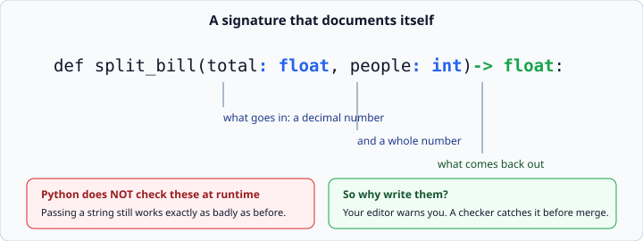
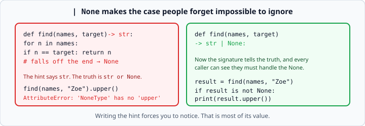

# Python type hints

*Week 4 · Day 4 · about 20 minutes*

> By the end of this your code says what it expects — and you know exactly how much
> Python does about it (nothing).

---

## Read the official documentation first

| Page | What it gives you |
|---|---|
| [**`typing` — Support for type hints**](https://docs.python.org/3.14/library/typing.html) | The module |
| [**Annotations Best Practices**](https://docs.python.org/3.14/howto/annotations.html) | The official HOW-TO |
| [**Function annotations — Tutorial**](https://docs.python.org/3.14/tutorial/controlflow.html#function-annotations) | The short introduction |
| [**PEP 484 — Type Hints**](https://peps.python.org/pep-0484/) | The original proposal, if you want the reasoning |

---

## The syntax

```python
def split_bill(total: float, people: int) -> float:
    return round(total / people, 2)
```



`: float` says what goes in. `-> float` says what comes back.

**Python ignores them completely at runtime.** Nothing is checked. This runs happily and
fails exactly as badly as it would have without the hints:

```python
split_bill("100", "4")      # TypeError, at the division, as usual
```

---

## So why write them?

Three real reasons, in increasing order of importance.

**1. Your editor becomes useful.** Type `total.` after a `float` hint and you get the
methods of a float. Pass a `str` where an `int` is expected and it is underlined before
you run anything. That feedback loop is worth the typing on its own.

**2. They are documentation that cannot go stale.** A docstring saying "takes a list of
prices" drifts out of date silently. A signature sits next to the code and is read every
time.

**3. On a real team, a tool checks them.** `mypy` or `pyright` runs in CI and catches a
whole class of bug before merge. This is why type hints exist in serious codebases, and
it is why "have you used type hints?" is a normal interview question.

You are not running a checker this week. Write them anyway — the habit is what gets
graded, and week 5's pydantic makes them *do* something.

---

## The ones you need

```python
name: str
count: int
price: float
active: bool
items: list
lookup: dict
nothing: None
```

Being more specific about what is inside a container is better, and modern Python lets
you use the built-in names directly:

```python
prices: list[float]                 # a list of floats
lookup: dict[str, int]              # str keys, int values
pairs: list[tuple[str, int]]        # a list of (name, score) pairs
```

You may see `List[float]` with a capital L, imported from `typing`, in older code. That
spelling is deprecated. Use the lowercase built-ins.

### Methods, and `self`

```python
class Task:
    def __init__(self, title: str, done: bool = False) -> None:
        self.title = title
        self.done = done

    def complete(self) -> None:
        self.done = True

    def summary(self) -> str:
        mark = "x" if self.done else " "
        return f"[{mark}] {self.title}"
```

Two rules:

- **`self` never gets a hint.** Python knows what it is.
- **`__init__` returns `None`.** It sets things up; it does not hand anything back.
  Writing `-> None` on it is the convention.

A function with no `return` also gets `-> None`. That is not pedantry — it tells the
reader "do not assign the result of this", which is exactly week 3's lesson.

---

## `None` is the interesting one

```python
def find_first(names: list[str], letter: str) -> str | None:
    for name in names:
        if name.startswith(letter):
            return name
    return None
```



`str | None` means *"a `str`, or `None`"*. In older code you will see
`Optional[str]`, imported from `typing` — the same thing, and still perfectly valid:

```python
from typing import Optional

def find_first(names: list[str], letter: str) -> Optional[str]:
    ...
```

**The value is that writing it forces you to notice.** A function that searches for
something can fail to find it. That is the case people forget to handle, and it produces
the `AttributeError: 'NoneType' object has no attribute ...` that you have already met
twice in this course.

Once the signature says `-> str | None`, every caller can see they must check:

```python
result = find_first(names, "Z")
if result is not None:
    print(result.upper())
```

Note `is not None`, not `!= None` and not `if result:`. An empty string is falsy but is
a perfectly good result — `if result:` would wrongly treat it as a failure. **Compare to
`None` with `is`.**

---

## Where hints earn their keep

**On every function boundary.** The signature is the contract; that is where a reader
looks.

**Not on every local variable.** This is noise:

```python
total: float = 0.0          # unnecessary
total = 0.0                 # obvious already
```

Annotate a local only when the type is genuinely unclear — usually an empty container
whose contents are not yet visible:

```python
records: list[dict] = []
```

**Not on `self`. Not on `*args`** (not yet — that is week 5 material).

---

## What hints do not do

They do not validate. They do not convert. They do not make your code faster.

```python
def add_tax(amount: float) -> float:
    return amount * 1.08

add_tax("100")              # TypeError at the multiply, not at the call
```

If you want the value actually checked, you still have to check it:

```python
def add_tax(amount: float) -> float:
    if not isinstance(amount, (int, float)):
        raise TypeError("amount must be a number")
    return amount * 1.08
```

That is week 3's "raise deep" habit, and hints do not replace it.

> **Next week this changes.** pydantic reads the same annotations and *does* enforce
> them — validating and converting incoming data automatically. Everything you write
> today is the groundwork for that, which is why it appears in week 4 rather than being
> skipped.

---

## Check yourself

Add hints to these.

```python
# a
def average(scores):
    return sum(scores) / len(scores)

# b
def get_user(users, name):
    return users.get(name)

# c
class Counter:
    def __init__(self):
        self.count = 0
    def bump(self):
        self.count += 1
```

<details>
<summary>Answers</summary>

```python
# a
def average(scores: list[float]) -> float:
    return sum(scores) / len(scores)

# b
def get_user(users: dict[str, str], name: str) -> str | None:
    return users.get(name)

# c
class Counter:
    def __init__(self) -> None:
        self.count = 0

    def bump(self) -> None:
        self.count += 1
```

**b** is the one to get right. `.get()` returns `None` when the key is missing — that is
its entire purpose — so the hint must say `| None`. Writing `-> str` there would be a
lie, and it is exactly the lie that produces a `NoneType` error two files away.

Worth noticing about **a**: an empty list gives `ZeroDivisionError`. The hint says
nothing about that, because hints describe types, not values. Type hints are not a
substitute for a guard clause.
</details>

---

## What you can now do

- [ ] Annotate parameters and return values
- [ ] State exactly what Python does with hints at runtime
- [ ] Give three reasons to write them anyway
- [ ] Use `list[float]` and `dict[str, int]` rather than the deprecated capitalised forms
- [ ] Annotate methods, leave `self` alone, and use `-> None` on `__init__`
- [ ] Write `str | None` and say why noticing it matters
- [ ] Check with `is not None` rather than truthiness
- [ ] Say why hints do not replace validation

**Next:** [Writing a good README](writing-a-good-readme.md) — the document that decides
whether anyone looks at your code at all.
