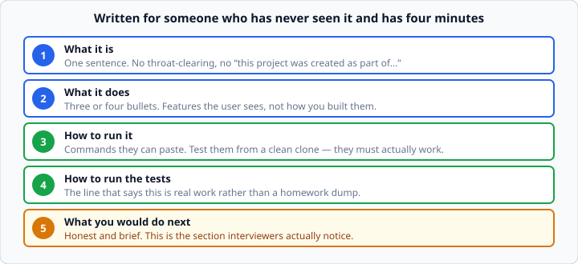

# Writing a good README

*Week 4 · Day 4 · about 15 minutes*

> By the end of this you can write the document that decides whether anyone looks at
> your code at all.

---

## Read these first

| Page | What it gives you |
|---|---|
| [**Documenting Python Code — HOW-TO**](https://docs.python.org/3.14/howto/index.html) | The official HOW-TO index; docstrings feed into your README |
| [**PEP 257 — Docstring Conventions**](https://peps.python.org/pep-0257/) | How to write the docstrings the README summarises |
| [**GitHub — About READMEs**](https://docs.github.com/en/repositories/managing-your-repositorys-settings-and-features/customizing-your-repository/about-readmes) | Where it renders and how |
| [**Markdown basics**](https://docs.github.com/en/get-started/writing-on-github/getting-started-with-writing-and-formatting-on-github/basic-writing-and-formatting-syntax) | The formatting you need |

> This one is not a Python language topic, so there is no docs.python.org page for it.
> The docstring PEP is the closest official standard, and it matters here because your
> docstrings are where the README's content comes from.

---

## Why this matters more than you think

Tomorrow you publish a repository. **The README is the only thing most people will ever
read.**

An interviewer opening your GitHub gives it thirty seconds. In that time they decide
whether this is a real project or a homework dump. A project without a README reads as
unfinished no matter how good the code is — and the reverse is also true: a clear README
makes a modest project look deliberate.

This is not a writing exercise. It is the cheapest possible improvement to how your work
is received.

---

## The five sections



In this order. Nothing else is required.

### 1. What it is — one sentence

```markdown
# Expense Tracker

A command-line expense tracker that saves to JSON and produces a monthly summary.
```

No throat-clearing. Not *"This project was created as part of a course to demonstrate…"*
— that tells the reader about you when they wanted to know about the software.

Say what it is, for whom, in one line. If you cannot, the project may not be clear in
your own head yet, and that is worth knowing before Friday.

### 2. What it does — three or four bullets

```markdown
## What it does

- Add, list and delete expenses from the command line
- Saves to `expenses.json`, so your data survives restarts
- Monthly summary with a per-category breakdown
- Rejects invalid amounts with a readable message
```

**Features the user sees, not implementation.** "Uses a `Ledger` class with composition"
is not a feature. "Rejects invalid amounts with a readable message" is.

That last bullet is doing quiet work: it tells a reader you thought about the failure
path, which is exactly what separates a student project from a professional one.

### 3. How to run it — commands they can paste

````markdown
## Running it

```bash
git clone https://github.com/you/expense-tracker.git
cd expense-tracker
python3 -m venv .venv
source .venv/bin/activate
pip install -r requirements.txt
python3 tracker.py
```
````

**Test these from a clean clone.** The single most common README failure is instructions
that only work on the author's machine, because they forget the step they did six weeks
ago.

Make a fresh folder, follow your own instructions literally, and fix what breaks. It
takes five minutes and it is the difference between a reader trying your project and a
reader closing the tab.

Show what it looks like:

````markdown
```
$ python3 tracker.py add "Coffee" 4.50
Added: Coffee $4.50

$ python3 tracker.py report
NAME          AMOUNT
--------------------
Coffee          4.50
Rent          900.00
--------------------
TOTAL         904.50
```
````

A sample run is worth three paragraphs of description, and it costs you a copy-paste.

### 4. How to run the tests

````markdown
## Tests

```bash
pytest -v
```

47 tests covering the ledger, the JSON layer, and the CLI argument parsing.
````

**This is the line that says the project is real.** Most student repositories have no
tests. Yours does, so say so, and say what they cover.

### 5. What you would do next

```markdown
## What I would do next

- Categories are free-text strings; they should be validated against a fixed list
- No way to edit an expense once added — only add and delete
- The JSON file is rewritten in full on every save, which will not scale past a few
  thousand entries
```

**This is the section interviewers notice**, and almost nobody writes it.

It demonstrates three things at once: you know the limitations of your own work, you can
judge what matters, and you are honest. All three are rarer and more valuable than a
longer feature list.

Be specific. "Add more features" says nothing. "The JSON file is rewritten in full on
every save" says you understand your own design and its cost.

Do **not** apologise. This is a list of known trade-offs, not a confession.

---

## Format

- **Headings** so it can be skimmed. Nobody reads a README top to bottom.
- **Code in fenced blocks**, with the language tagged (` ```bash `, ` ```python `) so it
  is highlighted.
- **Short lines and short paragraphs.** This is scanned, not read.
- **Working links.** A broken link on line 3 undermines everything below it.

Keep it under roughly 150 lines. Longer than that and it is documentation, which belongs
in a `docs/` folder.

---

## What not to include

**Your whole file structure.** A tree diagram of every file tells the reader nothing they
cannot see by looking.

**A tutorial on the language.** Assume the reader knows Python.

**A "Technologies used" badge wall.** One line — "Python 3.14, pytest" — does the job.
Twelve badges reads as decoration covering for thin content.

**An empty "Contributing" or "License" section** because a template had one. An empty
section is worse than no section.

---

## Docstrings and the README are the same job

The README describes the project. Docstrings describe each piece.

```python
def total(self) -> float:
    """Return the sum of all expense amounts, unrounded."""
```

Both answer *"what does this do, for someone who did not write it?"* — and both go stale
unless you update them with the code.

If you find the README hard to write, that is information. A project you cannot describe
in one sentence usually does not have one clear job yet. That is worth fixing in the
code, not in the prose.

---

## Check yourself

Here is a real-shaped bad README. Name four problems.

```markdown
# My Project

This is my project for week 4 of the course. I learned a lot about classes
and testing while making it. It uses OOP principles and has good code
structure with separation of concerns.

## Installation

Just run the file.

## Technologies

Python, JSON, pytest, Git, GitHub, VS Code, Markdown
```

<details>
<summary>Answers</summary>

1. **It never says what the project does.** Three sentences about the author's learning
   experience, nothing about the software.
2. **"Just run the file"** — which file? With what? Not pasteable, not testable.
3. **No test instructions**, despite listing pytest under technologies. The one genuinely
   impressive thing about the project is invisible.
4. **The technologies list is padding.** Git, GitHub, VS Code and Markdown are not
   technologies the project uses; they are things the author used to write it. This
   reads as filling space.
5. Bonus: **"uses OOP principles" and "separation of concerns"** are claims with no
   evidence. Show the structure or say nothing.
6. Bonus: **no "what I would do next"** — the cheapest way to look thoughtful, skipped.
</details>

---

## What you can now do

- [ ] Say what the project is in one sentence, without throat-clearing
- [ ] List features the user sees rather than implementation details
- [ ] Write run instructions that work from a clean clone, and verify them
- [ ] Include a sample run
- [ ] State how to run the tests and what they cover
- [ ] Write an honest, specific "what I would do next"
- [ ] Recognise padding — badge walls, file trees, empty sections
- [ ] Explain why a README you cannot write signals a project without a clear job

**Next:** the week 4 milestone — **Project 1**. Tested, documented, on GitHub. This is
the first thing you will put in front of an employer.
