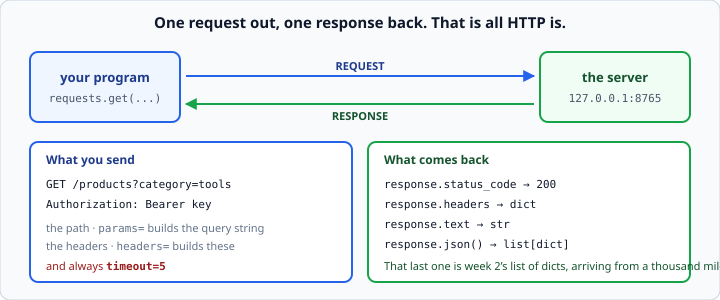
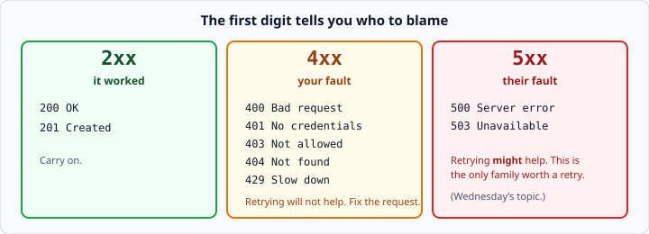
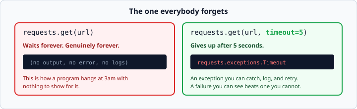

# How HTTP works

*Week 5 · Day 1 · about 25 minutes*

> By the end of this you can tell the difference between "it worked", "it politely
> refused", and "it fell over" — and you know who to blame for each.

---

## Read the official documentation first

| Page | What it gives you |
|---|---|
| [**MDN — An overview of HTTP**](https://developer.mozilla.org/en-US/docs/Web/HTTP/Overview) | The definitive plain-English explanation |
| [**MDN — HTTP response status codes**](https://developer.mozilla.org/en-US/docs/Web/HTTP/Status) | Every code, with what it means |
| [**MDN — HTTP request methods**](https://developer.mozilla.org/en-US/docs/Web/HTTP/Methods) | GET, POST and the rest |
| [**`http.HTTPStatus` (Python)**](https://docs.python.org/3.14/library/http.html#http.HTTPStatus) | Python's own named constants for the codes |
| [**`urllib.request` (Python)**](https://docs.python.org/3.14/library/urllib.request.html) | What the standard library offers, before `requests` |

> HTTP is a web standard rather than a Python feature, so the authority here is MDN, not
> docs.python.org. The two Python pages are worth knowing exist: `http.HTTPStatus` gives
> you `HTTPStatus.NOT_FOUND` instead of a bare `404`, and `urllib.request` is the
> built-in client that `requests` exists to improve on.

---

## Start the practice API

```bash
python3 week-05/server.py
```

Leave it running in one terminal and work in another. Then open
`http://127.0.0.1:8765/users` in a browser.

**Do that before writing any code.** That is exactly the same request your program will
make, and seeing the JSON appear in a browser first makes the whole thing far less
magical. The browser is an HTTP client; so is your script.

---

## The shape of it



```python
import requests

response = requests.get("http://127.0.0.1:8765/users", timeout=5)

print(response.status_code)     # 200
print(response.json())          # [{'id': 1, 'name': 'Ana Silva', ...}, ...]
```

You send a **request** — a method, a path, some headers. You get back a **response** — a
status code, some headers, and a body.

`.json()` parses the body into ordinary Python. Usually a list of dicts, which is week
2's material arriving from a thousand miles away. Everything you learned about nested
data applies unchanged.

### The parts of a URL

```
http://127.0.0.1:8765/products?category=tools
└─┬──┘ └───┬────┘ └┬─┘└───┬───┘ └──────┬─────┘
scheme    host    port   path      query string
```

- **scheme** — `http` or `https`. Always `https` in the real world; `http` is fine for
  a server on your own machine.
- **host** — where. `127.0.0.1` is "this computer", also spelled `localhost`.
- **port** — which program on that machine. Web servers usually use 80 or 443; the
  practice server uses 8765.
- **path** — which resource.
- **query string** — the options. You will build this with `params=`, never by hand.

### Methods

| Method | Means | You will use it |
|---|---|---|
| `GET` | fetch something. Changes nothing | this week, constantly |
| `POST` | create something | week 6, sending prompts |
| `PUT` / `PATCH` | update something | week 11 |
| `DELETE` | remove something | week 11 |

`GET` is **safe** — calling it ten times has the same effect as calling it once. That
property is what makes retries reasonable, and it is why Wednesday's backoff lesson
works.

---

## Status codes

The number tells you what happened, and the first digit tells you who to blame.



| Code | Means | Whose fault |
|---|---|---|
| **200** | OK | — |
| **201** | Created | — |
| **400** | Bad request | yours |
| **401** | Unauthorized — no or wrong credentials | yours |
| **403** | Forbidden — credentials fine, permission denied | yours |
| **404** | Not found | usually yours |
| **429** | Too many requests — slow down | yours |
| **500** | Server error | theirs |
| **503** | Service unavailable, try later | theirs |

**401 versus 403** is worth getting right: 401 means *"I do not know who you are"*, 403
means *"I know who you are and you may not"*. Different fixes entirely.

**4xx versus 5xx** decides whether retrying can possibly help. A 404 will be a 404
forever; a 503 might well succeed in two seconds. That single distinction is the whole
basis of Wednesday's retry logic.

---

## A 404 is not an exception

This is the thing to internalise today.

```python
response = requests.get(f"{base}/users/999", timeout=5)
print(response.status_code)     # 404
print(response.json())          # {'error': 'not found'}   <- not your data!
```

`requests` returns a perfectly good response object. **Nothing raises.** From Python's
point of view the request succeeded completely: you asked a question and got an answer.
The answer was "no".

If you call `.json()` and carry on, you are now processing an error body as though it
were data. That is how a report ends up with a row saying `{'error': 'not found'}` in
it.

**Checking the status is your job:**

```python
if response.status_code == 200:
    return response.json()
return None
```

There is a shortcut that raises for you:

```python
response.raise_for_status()     # raises requests.HTTPError for any 4xx or 5xx
```

Use `raise_for_status()` when a failure genuinely should stop everything. Use the
explicit check when "not found" is a normal answer you want to handle — looking up a
user who may not exist, for instance.

This is week 3's "raise deep, catch shallow" applied to somebody else's server.

---

## Query parameters

Do not build URLs by gluing strings together:

```python
url = f"{base}/products?category={category}"           # fragile
response = requests.get(f"{base}/products",
                        params={"category": category},
                        timeout=5)                     # correct
```

`params=` **escapes** anything awkward — spaces, ampersands, `#`, non-English characters
— that would otherwise quietly corrupt your URL.

Try it: a category of `"hand tools & saws"` breaks the first version completely and
works perfectly in the second.

You can see what was actually sent:

```python
print(response.url)     # http://.../products?category=hand+tools+%26+saws
```

`response.url` is a genuinely useful debugging tool. When an API returns nothing and you
are sure the parameters are right, print it and look.

---

## Headers

```python
response = requests.get(url,
                        headers={"Authorization": "Bearer some-key"},
                        timeout=5)
```

Headers carry metadata *about* the request rather than the request itself: who you are,
what format you want back, what client you are.

The practice API's `/secret` endpoint wants exactly that `Authorization` header and
returns **401** without it. Every commercial API you meet from week 6 onwards works the
same way.

Response headers come back as a dict-like object:

```python
print(response.headers["Content-Type"])     # application/json
```

---

## Timeouts — the one everybody forgets

```python
requests.get(url)                   # will wait forever. Genuinely forever.
requests.get(url, timeout=5)        # gives up after 5 seconds
```



**Always pass `timeout`.** `requests` has no default, which surprises people — a request
with no timeout is how a program hangs at three in the morning with nothing in the logs
and no traceback to look at.

When it runs out you get `requests.exceptions.Timeout`, which you can catch, log and
retry. **A failure you can see beats one you cannot.**

Try it on the practice API's `/slow` endpoint, which takes three seconds, with
`timeout=1`.

---

## Check yourself

Using the practice server, predict each before you run it.

```python
import requests
base = "http://127.0.0.1:8765"

# a
r = requests.get(f"{base}/users", timeout=5)
print(r.status_code, type(r.json()))

# b
r = requests.get(f"{base}/users/999", timeout=5)
print(r.status_code)
print(r.json())

# c
r = requests.get(f"{base}/secret", timeout=5)
print(r.status_code)

# d
r = requests.get(f"{base}/slow", timeout=1)
```

<details>
<summary>Answers</summary>

- **a** — `200 <class 'list'>`. A list of dicts.
- **b** — `404`, then an error body. **No exception.** This is the whole lesson.
- **c** — `401`. No `Authorization` header. Add
  `headers={"Authorization": "Bearer some-key"}` and it becomes 200.
- **d** — `requests.exceptions.Timeout` after one second. The server needed three.

If **b** printed an error body and you were expecting a crash, that surprise is today's
most valuable moment.
</details>

---

## What you can now do

- [ ] Name the parts of a URL
- [ ] Say what `GET` means and why it is safe to retry
- [ ] Read a status code and say whose fault it is
- [ ] Distinguish 401 from 403, and 4xx from 5xx
- [ ] Explain why a 404 does not raise, and check the status yourself
- [ ] Choose between `raise_for_status()` and an explicit check
- [ ] Pass query parameters with `params=` and say what it protects you from
- [ ] Send a header, and read one back
- [ ] Always pass `timeout=`, and say what happens without it

**Next:** [The `requests` library](the-requests-library.md) — the tool itself, and the
failures it can throw at you.
