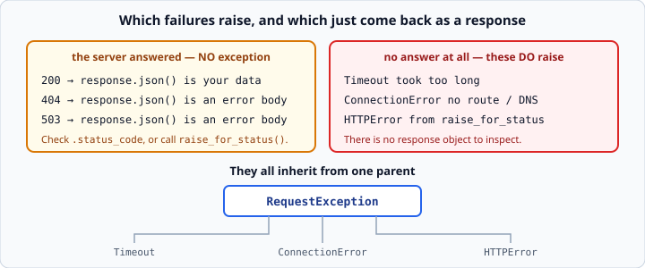

# The `requests` library

*Week 5 · Day 1 · about 20 minutes*

> By the end of this you can call an API and handle every way it can fail — including
> the ways that do not produce a response at all.

---

## Read the official documentation first

| Page | What it gives you |
|---|---|
| [**requests — Quickstart**](https://requests.readthedocs.io/en/latest/user/quickstart/) | The whole basic API |
| [**Errors and Exceptions**](https://requests.readthedocs.io/en/latest/user/quickstart/#errors-and-exceptions) | The exception family |
| [**Advanced Usage — Session Objects**](https://requests.readthedocs.io/en/latest/user/advanced/#session-objects) | Reusing a connection |
| [**`json` (Python)**](https://docs.python.org/3.14/library/json.html) | What `.json()` calls under the hood |

> `requests` is a third-party library, so its docs live at **requests.readthedocs.io**.
> Python's built-in `urllib.request` can do the same job, and `requests` exists because
> doing it with `urllib` is unpleasant. That is worth knowing, and it is a reasonable
> interview answer for "why not the standard library?".

---

## Installing

```bash
pip install requests
```

It is already in this course's `requirements.txt`, so if you followed `SETUP.md` you
have it. `pip install -r requirements.txt` inside your activated virtual environment
installs everything at once.

---

## The response object

```python
import requests

response = requests.get("http://127.0.0.1:8765/users", timeout=5)
```

Everything you need hangs off `response`:

| Attribute | Gives you |
|---|---|
| `.status_code` | the number — `200`, `404` |
| `.json()` | the body parsed into Python objects |
| `.text` | the body as a raw string |
| `.headers` | the response headers, dict-like |
| `.url` | the URL that was actually requested, after escaping |
| `.ok` | `True` for any status under 400 |
| `.elapsed` | how long it took |

### `.json()` versus `.text`

`.json()` parses. `.text` does not.

```python
print(response.text)        # '[{"id": 1, "name": "Ana Silva"}]'   <- a string
print(response.json())      # [{'id': 1, 'name': 'Ana Silva'}]     <- Python objects
```

**`.json()` raises if the body is not valid JSON.** That happens more than you would
think — a server returning an HTML error page, or a proxy returning a login form. So
this is a real failure mode:

```python
try:
    data = response.json()
except requests.exceptions.JSONDecodeError:
    print(f"Expected JSON, got: {response.text[:100]}")
```

Printing the first hundred characters of `.text` when parsing fails is the fastest
debugging move there is. Nine times out of ten the answer is right there in the HTML.

---

## The exception family



There are two completely different kinds of failure, and the distinction is the heart of
today.

**The server answered, badly.** A 404 or a 503 is a *successful* HTTP exchange from
Python's point of view. You get a response object. Nothing raises. Checking is your job.

**There was no answer at all.** The network was down, the host did not resolve, the
server took too long. There is no response object to inspect, so `requests` raises.

```python
from requests.exceptions import Timeout, ConnectionError, HTTPError, RequestException
```

| Exception | Raised when |
|---|---|
| `Timeout` | the server did not answer within your `timeout=` |
| `ConnectionError` | no route, DNS failure, connection refused |
| `HTTPError` | only from `raise_for_status()`, for a 4xx or 5xx |
| `JSONDecodeError` | the body was not valid JSON |
| `RequestException` | **the parent of all of them** |

Because they share a parent, you can catch broadly *and still be specific* — which is
the exception to week 3's rule, and a well-designed one:

```python
try:
    response = requests.get(url, timeout=5)
    response.raise_for_status()
    return response.json()
except Timeout:
    print("The server took too long")
    return None
except RequestException as error:
    print(f"Request failed: {error}")
    return None
```

`except RequestException` catches everything `requests` can throw and nothing else. Your
own `NameError` still surfaces. That is the important property — it is a *specific*
catch, it just happens to cover a family.

---

## A function worth writing once

Here is the shape you will use all week, and again in week 6:

```python
def fetch_json(url: str, params: dict | None = None) -> list | dict | None:
    """Return the parsed JSON body, or None if the request failed."""
    try:
        response = requests.get(url, params=params, timeout=5)
        response.raise_for_status()
        return response.json()
    except RequestException as error:
        print(f"Request to {url} failed: {error}")
        return None
```

Everything week 3 and 4 taught you is in there: a docstring, type hints, a specific
`except`, and a single clear return contract.

Whether `None` is the right failure signal depends on the caller — remember week 3's
argument that raising is usually better. A version that raises your own `ApiError` is
often the better design, and this week's fence allows exactly one custom exception
class so you can try it:

```python
class ApiError(Exception):
    """Raised when an API request cannot be completed."""
```

---

## Sessions

Every `requests.get()` opens a new connection. When you are making several calls to the
same host, that is wasteful:

```python
with requests.Session() as session:
    session.headers.update({"Authorization": "Bearer some-key"})
    users = session.get(f"{base}/users", timeout=5).json()
    orders = session.get(f"{base}/orders", timeout=5).json()
```

Two benefits:

1. **The connection is reused**, which is meaningfully faster over many calls.
2. **Headers set once apply to every request.** No repeating the auth header at each
   call site — and no forgetting it at one of them.

Note the `with`, which closes the session at the end. Same tool as week 3's files, same
guarantee.

Use a `Session` whenever you make more than two or three calls to one host. Friday's
milestone merges three endpoints, so use one there.

---

## Reading someone else's API documentation

From week 6 you will be reading real API docs constantly. Four things to find, in order:

1. **The base URL** — what every path hangs off.
2. **Authentication** — which header, what format. Almost always
   `Authorization: Bearer <key>`.
3. **The endpoint you want** — its path, its parameters, and an example response.
4. **Rate limits** — how many calls per minute before you get a 429.

Skip the rest until you need it. API documentation is a reference, not a tutorial, and
reading it front to back is a way of not starting.

---

## Check yourself

```python
import requests
from requests.exceptions import RequestException
base = "http://127.0.0.1:8765"

# a
r = requests.get(f"{base}/users/999", timeout=5)
print(r.ok, r.status_code)

# b
try:
    r = requests.get(f"{base}/users/999", timeout=5)
    r.raise_for_status()
except RequestException as e:
    print(f"caught: {type(e).__name__}")

# c
r = requests.get(f"{base}/products", params={"category": "hand tools & saws"}, timeout=5)
print(r.url)

# d
try:
    requests.get("http://not-a-real-host-xyz.invalid", timeout=5)
except RequestException as e:
    print(type(e).__name__)
```

<details>
<summary>Answers</summary>

- **a** — `False 404`. `.ok` is `False` for anything 400 or above, and still nothing
  raised.
- **b** — `caught: HTTPError`. `raise_for_status()` turned the 404 into an exception.
- **c** — the URL with the space and `&` escaped: `...?category=hand+tools+%26+saws`.
  Building that by hand with an f-string would have produced a broken request.
- **d** — `ConnectionError`. The host does not resolve, so there was never any HTTP
  exchange at all.

**a** and **b** are the same request. The only difference is whether you asked
`requests` to raise. That choice is yours to make, per call, and making it deliberately
is the skill.
</details>

---

## What you can now do

- [ ] Name the useful attributes of a response object
- [ ] Explain the difference between `.json()` and `.text`, and debug with `.text[:100]`
- [ ] Distinguish "the server answered badly" from "there was no answer"
- [ ] Name the four `requests` exceptions and their shared parent
- [ ] Catch `RequestException` and say why that is still a specific catch
- [ ] Write a reusable `fetch_json` with hints, a docstring and one clear contract
- [ ] Use a `Session` for repeated calls, and say what it buys you
- [ ] Find the four things that matter in an unfamiliar API's documentation

**Next:** [pydantic v2 basics](../day-2/pydantic-basics.md) — refusing to trust what
comes back.
