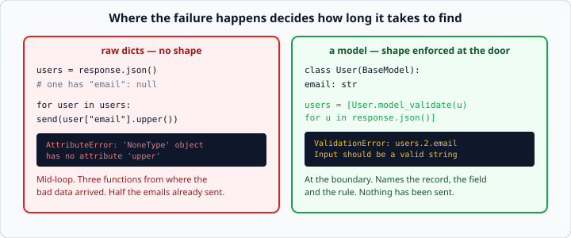
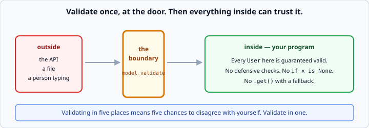

# pydantic v2 basics

*Week 5 · Day 2 · about 30 minutes*

> By the end of this you never touch API data until something has checked it is the
> shape you were promised.

---

## Read the official documentation first

| Page | What it gives you |
|---|---|
| [**pydantic — Models**](https://docs.pydantic.dev/latest/concepts/models/) | The core concept |
| [**Fields**](https://docs.pydantic.dev/latest/concepts/fields/) | `Field(...)` and constraints |
| [**Conversion Table**](https://docs.pydantic.dev/latest/concepts/conversion_table/) | Exactly what coerces to what |
| [**Error Handling**](https://docs.pydantic.dev/latest/errors/errors/) | Reading a `ValidationError` |
| [**`typing` (Python)**](https://docs.python.org/3.14/library/typing.html) | The annotation syntax pydantic reads |

> pydantic is a third-party library — docs at **docs.pydantic.dev**. Make sure you are
> reading the **v2** documentation; v1 was very widely used and the API changed
> significantly. If a tutorial says `.parse_obj()` or `@validator`, it is v1 and out of
> date.

---

## The problem

```python
users = requests.get(url, timeout=5).json()
for user in users:
    send_email(user["email"].upper())
```

This works. Until the day one user has `"email": null`:

```
AttributeError: 'NoneType' object has no attribute 'upper'
```

— in the middle of a loop, three functions from where the bad data came in, at whatever
hour the other team deployed. And by then you have already emailed half the list.



**Dicts have no shape.** Nothing in that code says what a user *is*, so nothing can
notice when one is wrong. You are trusting a stranger's server to keep a promise it
never actually made in writing.

---

## A model says what the shape is

```python
from pydantic import BaseModel

class User(BaseModel):
    id: int
    name: str
    email: str
    city: str
```

```python
user = User(id=1, name="Ana", email="ana@example.com", city="Lisbon")
print(user.name)        # Ana        <- attribute, not user["name"]
```

Those type hints stop being documentation and start being **enforced**. Same annotation
syntax as week 4, doing a completely different job — which is why week 4 taught it.

Notice the access is `user.name`, not `user["name"]`. A typo now fails loudly:

```python
user.nmae       # AttributeError: 'User' object has no attribute 'nmae'
user["nmae"]    # a dict would just raise KeyError at runtime, deeper in
```

Your editor autocompletes the field names too, which is a small daily pleasure.

---

## Building one from a response

```python
raw = requests.get(f"{base}/users/1", timeout=5).json()
user = User.model_validate(raw)
```

If the data is wrong, it raises `ValidationError` **immediately, at the boundary**,
naming the field and the problem — instead of a mystery `AttributeError` somewhere else
an hour later.

For a list:

```python
users = [User.model_validate(item) for item in raw_list]
```

Week 3's comprehension, doing real work.

### The error message

```python
from pydantic import ValidationError

try:
    user = User.model_validate({"id": 1, "name": "Ana", "city": "Lisbon"})
except ValidationError as error:
    print(error)
```
```
1 validation error for User
email
  Field required [type=missing, input_value={'id': 1, ...}, input_type=dict]
```

It names the model, the field, the rule and what it actually got. Compare that with
`AttributeError: 'NoneType' object has no attribute 'upper'` and you have the entire
argument for using pydantic.

For a list, the path includes the index — `users.2.email` — so you know *which* record
was bad.

---

## Conversion for free

```python
User(id="1", name="Ana", email="a@b.c", city="Lisbon")
print(user.id, type(user.id))       # 1 <class 'int'>
```

pydantic coerces where it is unambiguous, which handles the very common case of an API
sending numbers as strings.

**It will not invent data:**

```python
User(id="banana", ...)      # ValidationError: Input should be a valid integer
```

The exact rules are in the [Conversion Table](https://docs.pydantic.dev/latest/concepts/conversion_table/).
Worth a skim now; worth a proper read the first time a coercion surprises you.

> **This is what week 4's type hints could not do.** Python ignores annotations at
> runtime; pydantic reads them and acts. Same syntax, real teeth.

---

## Optional and defaults

```python
class Product(BaseModel):
    id: int
    name: str
    price: float
    category: str
    in_stock: bool = True               # a default makes the field optional
    description: str | None = None      # may be absent OR explicitly null
```

Three distinct cases, and the difference matters:

| Declaration | Means |
|---|---|
| `price: float` | **required**. Missing → `ValidationError` |
| `in_stock: bool = True` | optional. Missing → `True` |
| `description: str | None = None` | optional, and may legitimately be `null` |

**Anything without a default is required, and that is the useful default.** A required
field is a promise you get told about the moment it breaks. Making everything optional
gets you back to dicts with extra steps.

`str | None` versus `str = ""`: use `None` when "we do not know" is genuinely different
from "it is empty". For a description, it usually is.

---

## Constraints

```python
from pydantic import Field

class Product(BaseModel):
    name: str = Field(min_length=1)
    price: float = Field(gt=0)
    quantity: int = Field(ge=0, le=1000)
```

| Constraint | Means |
|---|---|
| `gt` / `ge` | greater than / greater or equal |
| `lt` / `le` | less than / less or equal |
| `min_length` / `max_length` | for strings and lists |

`price: float = Field(gt=0)` is a business rule written in the type system. A product
with a price of zero is now impossible to construct anywhere in your program — the same
argument as validating in `__init__` in week 4, with far less code.

`min_length=1` on a name catches the empty string, which passes a plain `str` check and
is almost never what you want.

You can add documentation too, which shows up in tooling and in week 11's API:

```python
price: float = Field(gt=0, description="Price in GBP, excluding tax")
```

---

## Nested models

```python
class Address(BaseModel):
    street: str
    city: str

class User(BaseModel):
    id: int
    name: str
    address: Address            # a model inside a model
    tags: list[str] = []
```

pydantic validates all the way down. Give it nested dicts and it builds nested objects:

```python
user = User.model_validate({
    "id": 1, "name": "Ana",
    "address": {"street": "Rua A", "city": "Lisbon"},
    "tags": ["staff"],
})
print(user.address.city)        # Lisbon
```

Week 2's nested data, with every level checked. `list[Product]` works the same way and is
exactly what you want for an endpoint returning a list.

---

## Back to plain data

```python
user.model_dump()               # {'id': 1, 'name': 'Ana', ...}
user.model_dump_json()          # '{"id":1,"name":"Ana",...}'
```

`model_dump()` gives you a dict — for saving with `json.dump` from week 3, or for
passing to something that wants plain data.

```python
user.model_dump(exclude={"email"})      # leave a field out
user.model_dump(exclude_none=True)      # drop fields that are None
```

The round trip `model_validate` → work → `model_dump` → `json.dump` is the standard
shape of a data pipeline, and you will build exactly that on Friday.

---

## Where validation belongs



**At the boundary, once.**

Validate the moment data enters your program — from an API, a file, a person — and
everything after that point can trust it completely. No defensive `if x is None`. No
`.get()` with a fallback. No wondering.

Validating in five places means five chances to disagree with yourself, and the day you
change a rule you will update four of them.

This is week 3's "raise deep, catch shallow" and week 4's "validate in `__init__`",
arriving as the same idea a third time. It is the idea the whole week is built on.

---

## Check yourself

```python
from pydantic import BaseModel, Field, ValidationError

class Item(BaseModel):
    id: int
    name: str = Field(min_length=1)
    price: float = Field(gt=0)
    tags: list[str] = []

# a
print(Item(id="7", name="Tea", price="2.50"))

# b
try:
    Item(id=1, name="", price=5)
except ValidationError as e:
    print(e.error_count())

# c
try:
    Item(id=1, name="Tea", price=0)
except ValidationError as e:
    print("rejected")

# d
print(Item(id=1, name="Tea", price=2.5).model_dump())
```

<details>
<summary>Answers</summary>

- **a** — `id=7 name='Tea' price=2.5 tags=[]`. Both strings coerced; `tags` defaulted.
- **b** — `1`. The empty name fails `min_length=1`.
- **c** — `rejected`. `gt=0` excludes zero. If you wanted zero allowed you would need
  `ge=0`, and choosing between them is the same boundary thinking as week 1.
- **d** — `{'id': 1, 'name': 'Tea', 'price': 2.5, 'tags': []}`.
</details>

---

## What you can now do

- [ ] Say why a dict of API data is a liability
- [ ] Define a `BaseModel` with typed fields
- [ ] Build one from raw data with `model_validate`, and read the `ValidationError`
- [ ] Explain what pydantic coerces and what it refuses
- [ ] Distinguish required, defaulted, and nullable fields
- [ ] Add constraints with `Field(gt=..., min_length=...)`
- [ ] Nest models, including `list[Model]`
- [ ] Convert back with `model_dump()`
- [ ] State where validation belongs, and why once

**Next:** [pydantic validators](pydantic-validators.md) — the rules only you can write.
