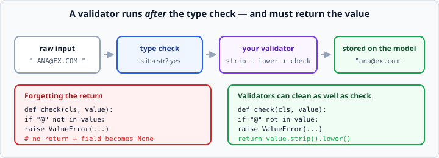

# pydantic validators

*Week 5 · Day 2 · about 15 minutes*

> By the end of this you can write the rules that only you know — and decide what to do
> when a record breaks them.

---

## Read the official documentation first

| Page | What it gives you |
|---|---|
| [**Validators**](https://docs.pydantic.dev/latest/concepts/validators/) | `field_validator` and `model_validator` |
| [**Field validators**](https://docs.pydantic.dev/latest/concepts/validators/#field-validators) | The one you need today |
| [**Error Handling**](https://docs.pydantic.dev/latest/errors/errors/) | Reading and using `ValidationError` |
| [**`classmethod` (Python)**](https://docs.python.org/3.14/library/functions.html#classmethod) | The decorator in the recipe below |

---

## Types and constraints do not cover everything

`Field(gt=0)` handles "greater than zero". But "an email must contain an `@`", "a
category must be one of these five", "a discount cannot exceed the price" — those are
rules only your domain knows.

```python
from pydantic import BaseModel, field_validator

class User(BaseModel):
    email: str

    @field_validator("email")
    @classmethod
    def email_must_have_an_at(cls, value: str) -> str:
        if "@" not in value:
            raise ValueError("email must contain @")
        return value
```

This is exactly week 3's `raise ValueError` — Python can check *types*, only you can
check *meaning* — now attached to the model so it runs automatically, every time, at
the boundary.

---

## The recipe

```python
@field_validator("email")        # which field
@classmethod                     # required in pydantic v2
def name_it_something(cls, value: str) -> str:
    ...
    return value                 # ALWAYS return
```

Four things, and three of them catch people out.

**1. Both decorators, in that order.** `@field_validator` on top, `@classmethod` below.
Miss `@classmethod` and pydantic v2 warns you.

**2. `cls`, not `self`.** It is a class method — it runs before any instance exists.

**3. Give it a descriptive name.** `email_must_have_an_at` reads well in a traceback.
The name is never called directly, so make it a sentence.

**4. Return the value. Always.**



Forgetting the `return` sets the field to `None`, silently. Your validation "passes" and
your data is destroyed. It is the single most common pydantic mistake, and it produces
exactly the `NoneType` errors you adopted pydantic to avoid.

---

## Validators can clean, not just check

Because you return the value, you can change it on the way through:

```python
@field_validator("email")
@classmethod
def normalise_email(cls, value: str) -> str:
    value = value.strip().lower()
    if "@" not in value:
        raise ValueError("email must contain @")
    return value
```

Now `"  ANA@Example.COM "` becomes `"ana@example.com"` before it is ever stored.

**This is worth more than the checking.** Cleaning at the boundary means the rest of
your program never has to wonder whether an email might have a trailing space — and the
comparison `user.email == "ana@example.com"` starts working reliably.

Other things worth normalising as data arrives: trimming whitespace from every string,
lowercasing identifiers, rounding money to two decimal places, converting a date string
to a real date.

---

## Checking against a list of allowed values

```python
ALLOWED_CATEGORIES = {"tools", "garden", "kitchen"}

class Product(BaseModel):
    category: str

    @field_validator("category")
    @classmethod
    def category_must_be_known(cls, value: str) -> str:
        value = value.strip().lower()
        if value not in ALLOWED_CATEGORIES:
            raise ValueError(f"category must be one of {sorted(ALLOWED_CATEGORIES)}")
        return value
```

Note the message names the allowed values. Week 3's rule about error messages: say what
was wrong **and** what would be right.

A set for `ALLOWED_CATEGORIES` because `in` on a set is fast, and `sorted()` in the
message so it reads the same every time.

---

## Validating across fields

Sometimes the rule involves two fields, and a `field_validator` cannot see both.

```python
from pydantic import model_validator

class Order(BaseModel):
    price: float
    discount: float

    @model_validator(mode="after")
    def discount_cannot_exceed_price(self):
        if self.discount > self.price:
            raise ValueError("discount cannot exceed price")
        return self
```

`mode="after"` runs once every field has been validated individually, so you get a real
object with `self` — and you return `self` rather than a value.

Reach for this only when the rule genuinely spans fields. A `field_validator` is simpler
and its errors point at one field.

---

## The `ValidationError`

```python
from pydantic import ValidationError

try:
    user = User.model_validate(raw)
except ValidationError as error:
    print(error)
```
```
1 validation error for User
email
  Value error, email must contain @ [type=value_error, input_value='ana.example.com', ...]
```

It names the field, your message, and the offending input.

For programmatic handling:

```python
except ValidationError as error:
    for problem in error.errors():
        print(problem["loc"], problem["msg"])
```

`.errors()` gives you a list of dicts — `loc` is the field path (a tuple, so nested
fields come out as `("address", "city")`), `msg` is the message. `error.error_count()`
tells you how many.

**All errors at once.** pydantic does not stop at the first failure; it collects
everything and reports it together. That is a real convenience when a record has three
problems, and it is why `error_count()` exists.

---

## Skip the bad ones, or fail the batch?

You have a list of a hundred users from an API, and three are invalid.

**Skip them:**

```python
def parse_users(raw_list: list[dict]) -> list[User]:
    """Return every valid User, ignoring records that fail validation."""
    users = []
    for raw in raw_list:
        try:
            users.append(User.model_validate(raw))
        except ValidationError:
            continue
    return users
```

**Or refuse the whole batch:**

```python
def parse_users(raw_list: list[dict]) -> list[User]:
    """Return every User, or raise if any record is invalid."""
    return [User.model_validate(raw) for raw in raw_list]
```

**This is a real decision and it has no universal answer.**

Skipping is right when ninety-seven good users are more useful than none — a dashboard,
a report, a search index.

Failing is right when partial data is dangerous — a bank transfer, a payroll run, a
stock reconciliation. Ninety-seven of a hundred payments is much worse than zero.

**Know which situation you are in, and say so in a comment or a docstring.** Your
instructor will ask you on Friday, and "I skipped them because the report is more useful
partial than absent" is a complete answer. "I copied it from somewhere" is not.

If you skip, **count and report**:

```python
except ValidationError:
    skipped += 1
    continue
...
if skipped:
    print(f"Warning: skipped {skipped} invalid records")
```

Silently dropping data is how a number in a report is wrong and nobody ever finds out.

---

## Check yourself

```python
from pydantic import BaseModel, field_validator, ValidationError

class Item(BaseModel):
    name: str

    @field_validator("name")
    @classmethod
    def clean(cls, value):
        value.strip()

print(Item(name="  Tea  ").name)
```

1. What does this print, and why?
2. Fix it.
3. Why does `email_must_have_an_at` need `@classmethod`?

<details>
<summary>Answers</summary>

1. It raises `ValidationError` — the validator returns `None` (no `return`), and `None`
   is not a `str`. Had the field been `str | None` it would have silently stored `None`
   instead, which is worse.

   Also note `value.strip()` on its own does nothing even with a return, because strings
   are immutable — week 2's lesson. You must use the result.

2. ```python
   @field_validator("name")
   @classmethod
   def clean(cls, value: str) -> str:
       return value.strip()
   ```

3. Because the validator runs while the model is being built — there is no instance yet,
   so there is no `self` to pass. It receives the class instead.
</details>

---

## What you can now do

- [ ] Write a `field_validator` with both decorators and `cls`
- [ ] Always return the value, and say what happens if you forget
- [ ] Use a validator to normalise data, not just reject it
- [ ] Check a value against a set of allowed options with a helpful message
- [ ] Use `model_validator(mode="after")` for cross-field rules
- [ ] Read a `ValidationError`, and use `.errors()` and `.error_count()`
- [ ] Choose between skipping bad records and failing the batch, and justify it
- [ ] Count and report anything you skip

**Next:** [Environment variables and `.env` files](../day-3/environment-variables.md) —
keeping secrets out of your code.
