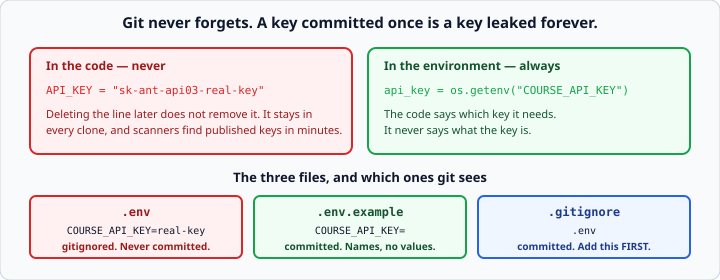

# Environment variables and `.env` files

*Week 5 · Day 3 · about 20 minutes*

> By the end of this your code keeps its keys out of git, and tells you clearly when a
> key is missing instead of failing five calls later.

---

## Read the official documentation first

| Page | What it gives you |
|---|---|
| [**`os.environ`**](https://docs.python.org/3.14/library/os.html#os.environ) | The environment as a dict |
| [**`os.getenv()`**](https://docs.python.org/3.14/library/os.html#os.getenv) | Reading with a default |
| [**`python-dotenv`**](https://saurabh-kumar.com/python-dotenv/) | Loading a `.env` file |
| [**The Twelve-Factor App — Config**](https://12factor.net/config) | Why config belongs in the environment |

> The twelve-factor page is three paragraphs and it is the reasoning behind everything
> below. Read it — it is quoted in interviews often enough that recognising the name is
> worth something on its own.

---

## Never put a key in your code

```python
API_KEY = "sk-ant-api03-real-key-here"      # now it is in git forever
```



**Git keeps history.** Deleting the line in a later commit does not remove it — it is
still in every clone, in every fork, in the reflog, and in the GitHub UI under "history".

Removing a committed secret properly means rewriting history and forcing everyone to
re-clone. And you still have to rotate the key, because automated scanners find
published keys within **minutes** of a push. That is not a scare story; it is a
well-documented, routine occurrence.

So: keys live in the **environment**.

```python
import os

api_key = os.environ["COURSE_API_KEY"]      # KeyError if missing
api_key = os.getenv("COURSE_API_KEY")       # None if missing
api_key = os.getenv("COURSE_API_KEY", "")   # "" if missing
```

Your code says *which* key it needs. It never says what the key is.

### Why this is more than security

The same code now runs everywhere without editing:

- your laptop points at `http://127.0.0.1:8765`
- a colleague's points at theirs
- production points at the real thing

**Config changes between environments; code does not.** That is the twelve-factor rule,
and it applies to base URLs, timeouts and feature switches as much as to secrets.

---

## Setting one by hand

```bash
export COURSE_API_KEY=course-key-123
python3 myscript.py
```

That lasts for the current terminal session only. On Windows PowerShell it is
`$env:COURSE_API_KEY = "course-key-123"`.

Typing it before every run gets old fast — hence `.env`.

---

## `.env` for local work

```
# .env
COURSE_API_KEY=course-key-123
API_BASE_URL=http://127.0.0.1:8765
REQUEST_TIMEOUT=5
```

```python
import os
from dotenv import load_dotenv

load_dotenv()                                   # reads .env into the environment
api_key = os.getenv("COURSE_API_KEY")
```

`load_dotenv()` goes **once, at the top of your program** — not in every module. It has
no effect on anything already set, so a real environment variable always wins over the
file. That is deliberate and correct: production sets real variables and has no `.env`
at all.

### The format

No quotes needed, no spaces around the `=`, one per line, `#` for comments.

```
GOOD=value with spaces is fine
BAD = this has spaces around the equals
```

### Everything comes back as a string

```python
timeout = os.getenv("REQUEST_TIMEOUT")          # "5" — a string
timeout = int(os.getenv("REQUEST_TIMEOUT", "5"))  # 5 — a number
```

Week 1's `input()` lesson, in a new costume. Convert at the point of reading, and give
the default as a string so the conversion is uniform.

---

## The three files

**`.env`** — real values. **In `.gitignore`. Always. First.** Before you put anything in
it.

**`.env.example`** — committed, with the *names* and no values:

```
COURSE_API_KEY=
API_BASE_URL=http://127.0.0.1:8765
REQUEST_TIMEOUT=5
```

So someone cloning your project knows what they need without you handing them your keys.
Non-secret defaults can have real values; secrets stay blank.

**`.gitignore`** — contains the line `.env`. It is already in this repository's.

Mention `.env.example` in your README's setup steps:

```bash
cp .env.example .env      # then fill in your key
```

That one line is what makes a project someone else can actually run, and it is exactly
the kind of detail week 4's README lesson was about.

---

## Fail loudly when a key is missing

```python
api_key = os.getenv("COURSE_API_KEY")
if not api_key:
    raise RuntimeError(
        "COURSE_API_KEY is not set. Copy .env.example to .env and fill it in."
    )
```

A missing key that turns into a 401 five function calls later wastes twenty minutes
every time it happens — and it happens to every new person who clones the repository.

**Check at startup and say what to do about it.** Week 3's rule on error messages: name
the problem *and* the fix.

Note `if not api_key` rather than `if api_key is None` — it catches the empty string
too, which is what you get from a `.env` line like `COURSE_API_KEY=` that someone forgot
to fill in. That is a much more common failure than the variable being absent.

### One place, checked once

```python
# config.py
import os
from dotenv import load_dotenv

load_dotenv()

def require(name: str) -> str:
    """Return the environment variable, or raise with a useful message."""
    value = os.getenv(name)
    if not value:
        raise RuntimeError(f"{name} is not set. Copy .env.example to .env.")
    return value

API_KEY  = require("COURSE_API_KEY")
BASE_URL = os.getenv("API_BASE_URL", "http://127.0.0.1:8765")
TIMEOUT  = int(os.getenv("REQUEST_TIMEOUT", "5"))
```

Then `from config import API_KEY, BASE_URL` everywhere else. One place that reads the
environment, one place that fails, one place to look when something is not set.

Note the split: `API_KEY` has no sensible default and must be present. `BASE_URL` and
`TIMEOUT` have defaults, so the project runs out of the box for anyone pointing at the
practice server.

> pydantic has a companion library, `pydantic-settings`, that does all of the above with
> a model. It is behind this week's fence deliberately — write it by hand once, then use
> the library knowing what it does.

---

## What counts as a secret

**Secret:** API keys, tokens, passwords, database URLs with credentials in them, signing
keys.

**Not secret but still config:** base URLs, timeouts, page sizes, feature switches, log
levels.

Both belong in the environment. Only the first group must never be committed anywhere.

If you are unsure, ask: *would I paste this into a public GitHub issue?* If no, it is a
secret.

---

## If you commit one anyway

You will, or someone on your team will. The order matters:

1. **Rotate the key immediately.** Revoke it at the provider and issue a new one. Do
   this *first* — the old key is compromised the moment it is pushed, regardless of what
   you do to the repository.
2. **Then** remove it from history if you need to.

The second step without the first is theatre. Being able to say that in an interview is
worth a surprising amount.

---

## Check yourself

```python
import os
from dotenv import load_dotenv
load_dotenv()

# .env contains:  TIMEOUT=5

# a
print(os.getenv("TIMEOUT") + 1)

# b
print(os.getenv("MISSING"))

# c
print(os.getenv("MISSING", "default"))

# d
print(os.environ["MISSING"])
```

<details>
<summary>Answers</summary>

- **a** — `TypeError: can only concatenate str (not "int") to str`. Environment
  variables are always strings. Wrap in `int()`.
- **b** — `None`.
- **c** — `default`.
- **d** — `KeyError: 'MISSING'`.

**b** versus **d** is the choice you make on every read: `getenv` for anything with a
sensible default, `environ[...]` (or your own `require()`) for anything that must be
present. Use the loud one for secrets.
</details>

---

## What you can now do

- [ ] Explain why a committed key is compromised even after you delete the line
- [ ] Read config with `os.getenv()` and `os.environ[...]`, and choose between them
- [ ] Use a `.env` file with `load_dotenv()`, called once at startup
- [ ] Convert environment values from strings
- [ ] Keep `.env` gitignored and ship a `.env.example`
- [ ] Fail at startup with a message that names the fix
- [ ] Put config in one module rather than scattering `getenv` calls
- [ ] Say what to do first if a key is ever committed

**Next:** [Retries and backoff](retries-and-backoff.md) — trying again, but only when it
can possibly help.
