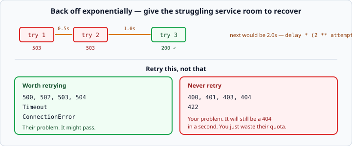

# Retries and backoff

*Week 5 · Day 3 · about 15 minutes*

> By the end of this your code gives up gracefully, and tries again only when trying
> again can possibly help.

---

## Read the official documentation first

| Page | What it gives you |
|---|---|
| [**`time.sleep()`**](https://docs.python.org/3.14/library/time.html#time.sleep) | Waiting between attempts |
| [**`random.uniform()`**](https://docs.python.org/3.14/library/random.html#random.uniform) | The jitter in the last section |
| [**requests — Errors and Exceptions**](https://requests.readthedocs.io/en/latest/user/quickstart/#errors-and-exceptions) | What you are catching |
| [**MDN — 503 Service Unavailable**](https://developer.mozilla.org/en-US/docs/Web/HTTP/Status/503) | The status this is all about |

---

## Why retry at all

Networks fail temporarily. A packet is lost, a server restarts, a load balancer moves
you. A single 503 usually means *"try again in a second"*, not *"give up"*.

The practice API has an endpoint for exactly this: `/flaky` returns **503 twice, then
succeeds**. A program that gives up on the first failure never sees the data that was
there all along.

---

## The loop

```python
import time
import requests

def fetch_with_retry(url, attempts=3, delay=0.5):
    """Return the response, retrying on server errors. None if all attempts fail."""
    for attempt in range(attempts):
        try:
            response = requests.get(url, timeout=5)
            if response.status_code < 500:
                return response          # 200 or 404 — both are real answers
        except requests.exceptions.RequestException:
            pass                         # network trouble, worth retrying

        if attempt < attempts - 1:
            time.sleep(delay * (2 ** attempt))      # 0.5, 1.0, 2.0
    return None
```

Two decisions in there are the whole lesson.

---

## Decision 1: retry 5xx, not 4xx



**A 500 is their problem and might pass. A 404 is your problem and will still be a 404
in a second.**

Retrying a 404 wastes your time and their capacity, and against a rate-limited
commercial API it burns quota you are paying for. Against an API that charges per call —
which is every LLM API from week 6 — it costs actual money for a result you already
know.

Notice how the code expresses it:

```python
if response.status_code < 500:
    return response
```

Anything under 500 is a **real answer**, even when it is a refusal. Hand it back and let
the caller decide. Only 5xx falls through to the retry.

### The exception

**429 Too Many Requests** is a 4xx that *is* worth retrying — it means "slow down", not
"never". A proper client checks for it and honours the `Retry-After` header:

```python
if response.status_code == 429:
    wait = int(response.headers.get("Retry-After", delay))
    time.sleep(wait)
    continue
```

You will need this in week 6.

---

## Decision 2: back off exponentially

```python
time.sleep(delay * (2 ** attempt))      # 0.5, 1.0, 2.0, 4.0 ...
```

`attempt` is 0, 1, 2 — so the wait doubles each time.

**Why doubling matters:** if a service is struggling, a thousand clients retrying
instantly is what turns a wobble into an outage. Everyone hammers the recovering server,
it falls over again, everyone retries again. That is a real failure mode with a real
name — a **thundering herd** — and backing off is how each client avoids being part of
it.

The first retry is quick, because most blips are brief. Later retries are patient,
because if two attempts have failed the problem is probably not momentary.

### Cap the total

```python
def fetch_with_retry(url, attempts=3, delay=0.5, max_delay=8.0):
    ...
    time.sleep(min(delay * (2 ** attempt), max_delay))
```

Without a cap, attempt 10 waits 256 seconds. Three or four attempts is right for an
interactive program; more only makes sense for background work.

**Retries multiply your worst case.** Three attempts with a 5-second timeout means a
user could wait 15 seconds plus the sleeps. Budget for it, and consider a shorter
timeout when you know you will retry.

---

## Only retry safe operations

`GET` is **idempotent** — asking twice has the same effect as asking once. That is why
retrying it is free.

`POST` usually is not. If a payment request times out, you genuinely do not know whether
it went through. Retrying might charge the customer twice.

**Retry reads freely. Think hard before retrying writes.** The professional answer is an
*idempotency key* — a unique token per operation that lets the server recognise a
duplicate — and it is a good thing to know the name of even though you will not build
one this week.

---

## Say what you are doing

```python
except requests.exceptions.RequestException as error:
    print(f"Attempt {attempt + 1}/{attempts} failed: {error}")
```

Silent retries make a program that is "just slow sometimes" and nobody knows why. One
line of logging turns that into a diagnosable fact.

Week 11 replaces the `print` with structured logging. The instinct — **make the retry
visible** — is the same.

---

## Jitter

One refinement worth knowing about.

If a thousand clients all fail at the same instant and all back off by exactly 0.5
seconds, they all retry at the same instant too. The herd is synchronised, just slower.

```python
import random
time.sleep(delay * (2 ** attempt) + random.uniform(0, 0.1))
```

A small random addition spreads them out. It is one line, it is standard practice in
every serious client, and mentioning it is the kind of detail that makes an interviewer
sit up.

---

## Do not write this in production

`tenacity`, `urllib3`'s `Retry`, and every cloud SDK have this built in, tested, with
jitter and caps and `Retry-After` handling.

**You are writing it by hand this week on purpose** — the same reason as the tuple trick
in week 2. When you configure `tenacity` later, you will know what each parameter does
because you have built the thing it replaces.

---

## Check yourself

```python
# Using the practice server's /flaky endpoint (503, 503, then 200):

# a
r = requests.get(f"{base}/flaky", timeout=5)
print(r.status_code)

# b
print(fetch_with_retry(f"{base}/flaky").status_code)

# c
print(fetch_with_retry(f"{base}/users/999").status_code)

# d — how long does this take, worst case?
fetch_with_retry(url, attempts=4, delay=1)
```

<details>
<summary>Answers</summary>

- **a** — `503`. One attempt, no retry.
- **b** — `200`. Two failures, then success on the third attempt.
- **c** — `404`, returned on the **first** attempt. It is under 500, so it is a real
  answer and there is no retry. If your implementation retried this, re-read decision 1.
- **d** — three sleeps of 1, 2 and 4 seconds = 7 seconds of waiting, plus up to four
  timeouts of 5 seconds = **27 seconds worst case**. Which is why you cap the delay and
  keep the attempt count low.

**d** is the one people never work out until a user complains.
</details>

---

## What you can now do

- [ ] Write a retry loop with a bounded number of attempts
- [ ] Retry 5xx and network errors, and never retry 4xx
- [ ] Explain why 429 is the exception, and use `Retry-After`
- [ ] Implement exponential backoff and say what a thundering herd is
- [ ] Cap the delay, and calculate your worst-case total wait
- [ ] Say why `GET` is safe to retry and `POST` usually is not
- [ ] Log each retry so slowness is diagnosable
- [ ] Explain jitter

**Next:** [Combining API data](../day-4/combining-api-data.md) — answering a question no
single endpoint answers.
