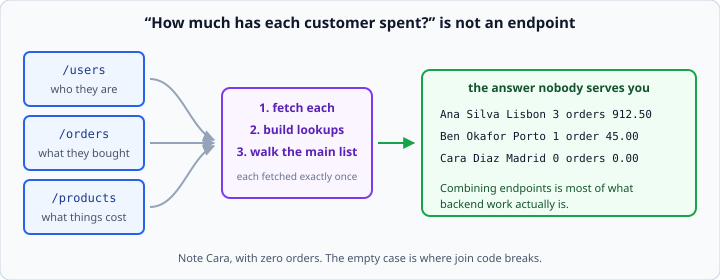
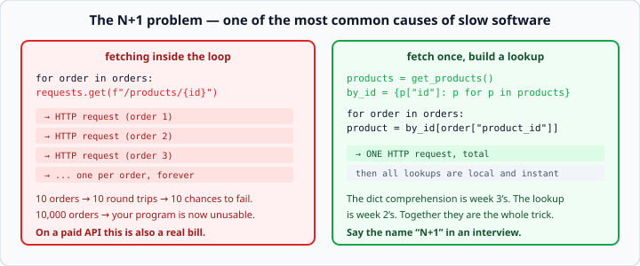

# Combining API data

*Week 5 · Day 4 · about 15 minutes*

> By the end of this you can answer a question that no single endpoint answers — without
> making a request per row.

---

## Read the official documentation first

| Page | What it gives you |
|---|---|
| [**Dictionaries**](https://docs.python.org/3.14/tutorial/datastructures.html#dictionaries) | The lookup that makes this work |
| [**Dict comprehensions**](https://docs.python.org/3.14/tutorial/datastructures.html#dictionaries) | Building the lookup in one line |
| [**`dict.get()`**](https://docs.python.org/3.14/library/stdtypes.html#dict.get) | Handling the ID that is not there |
| [**`sorted()`**](https://docs.python.org/3.14/library/functions.html#sorted) | Ranking the result |

Nothing new today. This is week 2's dicts and week 3's comprehensions, applied to data
arriving over a network.

---

## One question, three endpoints

*"How much has each customer spent?"* is not an endpoint. The data is spread across
three:

- `/users` — who they are
- `/orders?user_id=1` — what they bought
- `/products` — what those things cost



**Combining them is most of what backend work actually is.** The endpoints give you
nouns; the questions people ask are about relationships between nouns, and joining them
is your job.

---

## The pattern

1. **Fetch** the pieces — each one exactly once
2. **Build a lookup** so you can join them
3. **Walk the main list**, reaching into the lookup

```python
products = get_products(base_url)
by_id = {p["id"]: p for p in products}          # week 3's dict comprehension

total = 0
for order in orders:
    product = by_id[order["product_id"]]
    total += order["quantity"] * product["price"]
```

That `by_id` dict is the whole trick. It turns "search the product list for this ID"
into "look it up", which is both faster and clearer.

Without it you would search the list once per order — fine for four products, and
catastrophic for forty thousand.

---

## Fetch once, not in a loop

```python
for order in orders:                                    # BAD
    product = requests.get(f"{base}/products/{order['product_id']}",
                           timeout=5).json()
```



One HTTP request **per order**. Ten orders, ten round trips, ten chances to fail, ten
timeouts to wait through.

This has a name — the **N+1 problem** (one query for the list, then N more for the
details) — and it is one of the most common causes of slow software in the world. It is
also a normal interview question, so be able to say the name out loud.

The fix is always the same shape: **fetch the collection once, index it, then loop over
local data.**

```python
products = get_products(base_url)               # ONE request
by_id = {p["id"]: p for p in products}          # index it

for order in orders:
    product = by_id[order["product_id"]]        # instant, local
```

On a paid API — every LLM API from week 6 — N+1 is not just slow. It is a bill.

---

## Handling the ID that is not there

```python
product = by_id[order["product_id"]]        # KeyError if the product was deleted
```

Real data has dangling references. An order pointing at a product that no longer exists
is normal, not exotic.

```python
product = by_id.get(order["product_id"])
if product is None:
    print(f"Warning: order {order['id']} references unknown product")
    continue
```

Week 2's `.get()` earning its keep. And note the **warning** — silently skipping rows is
how a total comes out wrong and nobody ever finds out.

---

## Partial failure

Three calls means three chances to fail, and *"the whole report crashed because one
endpoint was down"* is rarely the right answer.

Decide, **per call**:

**Essential** — no users, no report. Fail loudly.

```python
users = fetch_users(base_url)
if users is None:
    raise ApiError("Cannot build report without users")
```

**Enrichment** — no product names? Show the IDs and carry on.

```python
products = fetch_products(base_url) or []
by_id = {p["id"]: p for p in products}
...
name = by_id.get(pid, {}).get("name", f"product #{pid}")
```

**Making that choice deliberately, rather than letting whichever exception escapes first
decide for you, is the difference between a service and a script.**

Write it down in the docstring. It is exactly the sort of thing your instructor will ask
you to defend on Friday, and "product names are enrichment — the totals are still
correct without them" is a complete answer.

---

## Building the summary

```python
def user_summary(base_url: str, user_id: int) -> dict:
    """Return name, city, order count and total spent for one user."""
    user = fetch_user(base_url, user_id)
    orders = fetch_orders(base_url, user_id)
    by_id = {p["id"]: p for p in fetch_products(base_url)}

    total = 0.0
    for order in orders:
        product = by_id.get(order["product_id"])
        if product is not None:
            total += order["quantity"] * product["price"]

    return {
        "name": user["name"],
        "city": user["city"],
        "order_count": len(orders),
        "total_spent": round(total, 2),
    }
```

Then rank them with week 3's `key=`:

```python
summaries = [user_summary(base_url, u["id"]) for u in users]
ranked = sorted(summaries, key=lambda s: s["total_spent"], reverse=True)
```

### But look at that N+1

`user_summary` fetches the product list **every time it is called**. Called once per
user, that is one product fetch per user — N+1 again, hiding inside a function that
looks innocent.

Fetch it once and pass it in:

```python
def user_summary(user: dict, orders: list, by_id: dict) -> dict:
    ...
```

Now the function does no I/O at all. It is pure calculation, it can be tested with
`assert user_summary(...) == {...}` and no server running, and the fetching lives in one
place where you can see how many calls there are.

**Separating "get the data" from "work out the answer" is the single most useful
structural habit in this week**, and it is week 3's `return` versus `print` lesson at a
larger scale.

---

## Test the empty cases

Join code breaks on absence, not on presence:

- a user with **zero orders** — is `total_spent` `0.0`, or a `ZeroDivisionError` in an
  average?
- an order for a **deleted product**
- an **empty product list** because the fetch failed
- a user in `/users` with **no matching orders at all**

The practice server has a user with no orders, and it is there on purpose. Every one of
these is a `parametrize` case.

---

## Check yourself

```python
users    = [{"id": 1, "name": "Ana"}, {"id": 2, "name": "Ben"}]
orders   = [{"id": 10, "user_id": 1, "product_id": 100, "quantity": 2}]
products = [{"id": 100, "name": "Tea", "price": 2.50}]
```

1. Build a lookup from product ID to product.
2. Work out Ana's total spend.
3. What is Ben's total spend, and what does your code do to produce it?
4. How many HTTP requests should the whole report take?

<details>
<summary>Answers</summary>

1. `by_id = {p["id"]: p for p in products}`
2. `2 * 2.50` = `5.00`
3. `0.0`. Ben has no orders, so the loop body never runs and the accumulator stays at
   its starting value — which is exactly why you initialise it to `0.0` before the loop.
   Week 2's accumulator placement, still earning its keep. If your code raises or returns
   `None` here, that is the bug.
4. **Three.** One for users, one for orders, one for products. Any more and you have an
   N+1 somewhere.
</details>

---

## What you can now do

- [ ] Join data from several endpoints with a lookup dict
- [ ] Explain the N+1 problem by name and fix it
- [ ] Handle a reference to a record that does not exist, and warn rather than skip
  silently
- [ ] Classify each call as essential or enrichment, and say why
- [ ] Separate fetching from calculating, so the calculation is testable
- [ ] List the empty cases that break join code

**Next:** the week 5 milestone — a report merging three endpoints. Then week 6, where the
API you call is a language model.
