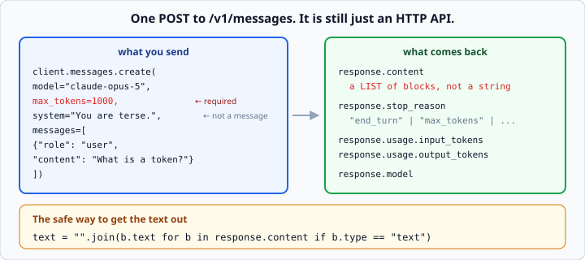
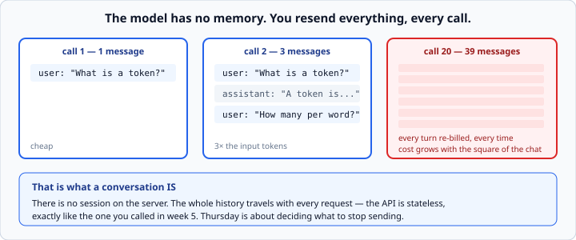

# The Anthropic Messages API

*Week 6 · Day 1 · about 25 minutes*

> By the end of this you can send a request to a model, get the text out of what comes
> back, and say what it cost.

---

## Read the official documentation first

| Page | What it gives you |
|---|---|
| [**Messages API reference**](https://docs.claude.com/en/api/messages) | Every request and response field |
| [**Get started**](https://docs.claude.com/en/docs/get-started) | Your first call, end to end |
| [**Models overview**](https://docs.claude.com/en/docs/about-claude/models/overview) | Which models exist, and their limits |
| [**Errors**](https://docs.claude.com/en/api/errors) | The status codes and exception types |
| [**anthropic-sdk-python**](https://github.com/anthropics/anthropic-sdk-python) | The library itself |

> The Anthropic API is not part of Python, so the authority here is
> **docs.claude.com**. Everything you learned in week 5 still applies underneath — this
> is an HTTP API with a Python SDK wrapped around it, and when something goes wrong you
> will be reading status codes again.

---

## The call

```python
import anthropic

client = anthropic.Anthropic()      # reads ANTHROPIC_API_KEY from the environment

response = client.messages.create(
    model="claude-opus-5",
    max_tokens=1000,
    messages=[{"role": "user", "content": "What is a token?"}],
)
```



| Field | Does |
|---|---|
| `model` | which model |
| `max_tokens` | **required** — the cap on the *reply* length |
| `messages` | the conversation so far, as a list of dicts |
| `system` | optional — the standing instruction (tomorrow's topic) |

Note the client takes no API key argument. It reads `ANTHROPIC_API_KEY` from the
environment — which is exactly the week 5 lesson, and the reason `.env` came first.

### `max_tokens` is a limit, not a target

Set it to 1000 and a one-word answer still costs you one word — you are billed for what
is produced, not what you allowed.

Set it too low and your reply gets **cut off mid-sentence**. You detect that by checking
`stop_reason`, below.

Sensible defaults: around `16000` for a normal non-streaming request, `256` for
classification. Do not lowball it to save money; a truncated answer you have to ask for
again costs more than the tokens you saved.

---

## Which model

| Model | ID | Context | Input $/1M | Output $/1M |
|---|---|---|---|---|
| Claude Opus 5 | `claude-opus-5` | 1M | $5.00 | $25.00 |
| Claude Sonnet 5 | `claude-sonnet-5` | 1M | $2.00 | $10.00 |
| Claude Haiku 4.5 | `claude-haiku-4-5` | 200K | $1.00 | $5.00 |

Use the exact ID strings — they are complete as written. Do **not** append a date suffix
like `claude-opus-5-20260101`; that is a pattern from older model names and it will fail.

Default to **Opus** while you are learning: the difference in output quality is larger
than the difference in price at the volumes you are working with. Reach for Sonnet on
high-volume production traffic and Haiku for simple, speed-critical classification.

You can also ask the API what exists:

```python
for model in client.models.list():
    print(model.id, model.display_name)
```

---

## Messages are a list of dicts

Week 2 again:

```python
messages = [
    {"role": "user", "content": "What is a token?"},
    {"role": "assistant", "content": "A token is a chunk of text..."},
    {"role": "user", "content": "How many in a word?"},
]
```

Two roles you need this week: `user` and `assistant`. The list must **start with
`user`**.

### The model has no memory



It does not remember the earlier turns. **You are resending them, every single call.**

There is no session on the server. The whole history travels with each request — the API
is stateless, exactly like the one you called in week 5.

Two consequences worth sitting with:

1. **That is what a conversation *is*.** Building one is just appending to a list.
2. **Cost grows with the square of the conversation.** Turn 20 resends 39 messages. This
   is why Thursday is about deciding what to stop sending.

---

## The response

```python
response.content            # a LIST of blocks, not a string
response.stop_reason        # "end_turn" | "max_tokens" | "stop_sequence" | ...
response.usage.input_tokens
response.usage.output_tokens
response.model
```

**`content` is a list** because a response can contain several blocks — text, thinking,
and from next week, tool calls.

Reaching straight for `content[0].text` works until the day it does not. The safe
extraction:

```python
text = "".join(block.type == "text" and block.text or "" for block in response.content)
```

or, more readably:

```python
text = "".join(block.text for block in response.content if block.type == "text")
```

**Always check `block.type` before touching `.text`.** A thinking block has no `.text`,
and a `tool_use` block has no `.text` — which is exactly the `AttributeError` that will
greet you in week 7 if you skip this habit now.

---

## `stop_reason` — the field everyone ignores

| Value | Means |
|---|---|
| `end_turn` | it finished naturally |
| `max_tokens` | **it was cut off.** Your answer is incomplete |
| `stop_sequence` | it hit one of your stop strings |
| `tool_use` | it wants to call a tool (week 7) |
| `refusal` | it declined on safety grounds |

**A truncated answer looks like a real answer.** It is a complete sentence, it is
plausible, and it is missing the end. If you are parsing JSON out of it, you get a
`JSONDecodeError` and go hunting in the wrong place entirely.

```python
if response.stop_reason == "max_tokens":
    raise ValueError("Response was truncated — raise max_tokens")
```

**Check `stop_reason` before you use a response.** This is week 5's "a 404 is not an
exception" wearing different clothes: the call succeeded, and the answer is still not
usable.

---

## Errors

```python
import anthropic

try:
    response = client.messages.create(...)
except anthropic.AuthenticationError:
    print("Invalid or missing API key")
except anthropic.RateLimitError as error:
    retry_after = int(error.response.headers.get("retry-after", "60"))
    print(f"Rate limited. Retry after {retry_after}s.")
except anthropic.APIStatusError as error:
    if error.status_code >= 500:
        print(f"Server error ({error.status_code}). Retry later.")
    else:
        print(f"API error: {error.message}")
except anthropic.APIConnectionError:
    print("Network problem")
```

The same 4xx-versus-5xx thinking from week 5, and the same rule: retry 5xx and 429,
never 4xx.

**The SDK already retries** 429 and 5xx with exponential backoff — two attempts by
default, configurable with `max_retries`. You wrote that loop by hand last week
precisely so you would recognise it here.

---

## Tokens and cost

```python
def cost(usage, input_per_million: float, output_per_million: float) -> float:
    """Return the dollar cost of one response."""
    return (
        usage.input_tokens / 1_000_000 * input_per_million
        + usage.output_tokens / 1_000_000 * output_per_million
    )
```

```python
print(f"${cost(response.usage, 5.00, 25.00):.6f}")
```

**Output costs five times input.** That ratio holds across the range, and it shapes how
you design: a long prompt producing a short answer is cheap; a short prompt producing a
long answer is not.

Log the cost of every call while you are learning. A counter that prints a running total
turns an abstraction into a number you can feel, and it is what Friday's milestone asks
for.

---

## The rule that makes this week testable

**Every function you write takes a `client` argument.**

```python
def summarise(client, text):        # yes
def summarise(text):                # no — where does the client come from?
```

Real model calls cost money, need a key, and answer differently every time. So the tests
hand your functions a stand-in from `fake_model.py` instead.

That is not a testing trick. Passing in the thing your code depends on, rather than
reaching for a global, is **dependency injection**. It is how every serious codebase
handles anything external, it is why your week 7 agent will be testable at all, and it
is a genuine interview topic.

It is also week 3's scope lesson — *a function should take what it needs as parameters*
— arriving with real consequences attached.

---

## Check yourself

```python
response = client.messages.create(
    model="claude-opus-5",
    max_tokens=10,
    messages=[{"role": "user", "content": "Explain HTTP in detail."}],
)
```

1. What is `type(response.content)`?
2. What will `response.stop_reason` almost certainly be?
3. Is the text in `response.content[0].text` usable?
4. Why does `messages=[{"role": "assistant", "content": "hi"}]` fail?

<details>
<summary>Answers</summary>

1. A `list`. Not a string, not a block.
2. `"max_tokens"` — ten tokens is roughly seven words, and "explain in detail" will not
   fit.
3. **No.** It is a fragment of a sentence that reads like a real answer. This is exactly
   why you check `stop_reason` first.
4. The conversation must start with a `user` message. The assistant only speaks in reply.
</details>

---

## What you can now do

- [ ] Make a call with `client.messages.create` and name the required fields
- [ ] Say what `max_tokens` limits, and what happens when it is too small
- [ ] Choose a model ID and quote its context window and price
- [ ] Build a `messages` list and explain why the model has no memory
- [ ] Extract text safely by checking `block.type`
- [ ] Check `stop_reason` before trusting a response
- [ ] Handle the SDK's exception types, and say which are worth retrying
- [ ] Work out the cost of a call from `usage`
- [ ] Explain dependency injection and why every function takes `client`

**Next:** [Tokens and context windows](tokens-and-context-windows.md) — the unit you are
billed in, and the wall you walk towards.
