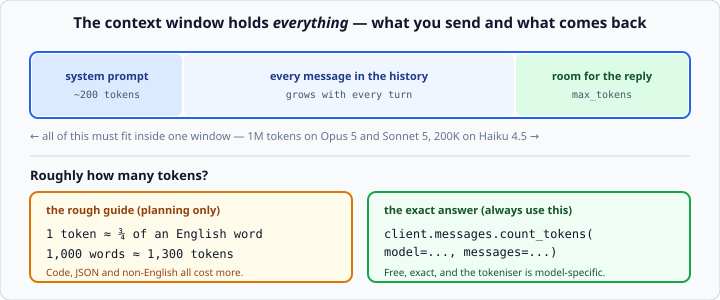

# Tokens and context windows

*Week 6 · Day 1 · about 15 minutes*

> By the end of this you know what you are billed in, how much you can send, and how to
> measure both exactly rather than guessing.

---

## Read the official documentation first

| Page | What it gives you |
|---|---|
| [**Context windows**](https://docs.claude.com/en/docs/build-with-claude/context-windows) | How the window is consumed |
| [**Token counting**](https://docs.claude.com/en/docs/build-with-claude/token-counting) | The `count_tokens` endpoint |
| [**Models overview**](https://docs.claude.com/en/docs/about-claude/models/overview) | Window and output limits per model |
| [**Pricing**](https://docs.claude.com/en/docs/about-claude/pricing) | Current rates |

---

## What a token is

A **token** is a chunk of text — usually a word, part of a word, or a punctuation mark.
The model does not see letters or words; it sees tokens.

```
"unbelievable"  ->  ["un", "bel", "iev", "able"]      4 tokens
"cat"           ->  ["cat"]                            1 token
"  "            ->  [" ", " "]                         whitespace counts too
```

**Rough guide: one token is about ¾ of an English word.** So 1,000 words is roughly
1,300 tokens.

That ratio is worse for:

- **code** — punctuation, indentation and identifiers fragment heavily
- **JSON** — every brace, quote and comma is a token
- **languages other than English** — often two to three times more tokens for the same
  meaning

Use the ¾ rule for planning. Never use it for anything that matters.

---

## Counting exactly

```python
count = client.messages.count_tokens(
    model="claude-opus-5",
    system="You are a helpful assistant.",
    messages=[{"role": "user", "content": long_text}],
)
print(count.input_tokens)
```

**This is free and exact.** Use it before sending anything large, and use it to decide
whether a conversation needs trimming.

> **Do not use `tiktoken`.** It is OpenAI's tokeniser and gives wrong numbers for Claude
> — different vendors use different tokenisers, and they are not interchangeable. Nor
> are they stable across model generations: the Opus 4.7 tokeniser differs from Opus
> 4.6's, so a count baselined on one model does not carry to another. `count_tokens` is
> the only correct answer.

---

## The context window

The **context window** is the maximum size of everything you send **plus** everything
that comes back.



| Model | Context window |
|---|---|
| Claude Opus 5 | 1M tokens |
| Claude Sonnet 5 | 1M tokens |
| Claude Haiku 4.5 | 200K tokens |

Everything competes for that space: the system prompt, every message in the history, and
the room left for the reply.

Exceed it and the call fails with a `400`. There is no graceful truncation — the API
does not decide for you which parts of your conversation to drop.

### The wall you walk towards

A long conversation grows with every turn. Each call resends the whole history, so the
input side of the window fills steadily while the space left for a reply shrinks.

That is why Thursday is about **trimming history**, and it is why the counter you build
today matters: you cannot decide what to drop until you can see how much you are
carrying.

---

## Output limits are separate

The context window is not the same as the **maximum output**. Claude Opus 5 and Sonnet 5
can produce up to 128K tokens in one response — but the SDK requires **streaming** for
values that large, because a non-streaming request would hit an HTTP timeout waiting.

```python
with client.messages.stream(
    model="claude-opus-5",
    max_tokens=64000,
    messages=[...],
) as stream:
    response = stream.get_final_message()
```

Streaming is Thursday's topic. For now: if you find yourself wanting a `max_tokens`
above about 16,000, you need to stream.

---

## Reading `usage`

```python
print(response.usage.input_tokens)      # what you sent
print(response.usage.output_tokens)     # what came back
```

Two numbers, billed at different rates. On Claude Opus 5 that is **$5 per million input
tokens and $25 per million output**.

**Output costs five times input.** That ratio shapes design decisions more than anything
else in this week:

- A 10,000-token document summarised to 100 words is cheap.
- A 50-token prompt producing a 5,000-word essay is not.
- A conversation that resends 40,000 tokens of history to get a 30-token answer is
  paying almost entirely for input it has already paid for nineteen times.

That last one is the case for **prompt caching**, which is behind this week's fence and
which you should know exists: identical prefixes can be cached and re-read at about a
tenth of the price. It is the single biggest cost lever in production LLM work.

---

## A cost counter worth writing

```python
PRICES = {
    "claude-opus-5":   (5.00, 25.00),
    "claude-sonnet-5": (2.00, 10.00),
    "claude-haiku-4-5": (1.00, 5.00),
}

def cost(response) -> float:
    """Return the dollar cost of one response."""
    input_rate, output_rate = PRICES[response.model]
    return (
        response.usage.input_tokens / 1_000_000 * input_rate
        + response.usage.output_tokens / 1_000_000 * output_rate
    )
```

Note it reads `response.model` rather than trusting what you asked for — the response
tells you what actually served the request, which is the honest number to bill against.

Print a running total while you work. Watching it climb during a twenty-turn
conversation teaches the squared-cost lesson far better than reading about it.

---

## Practical consequences

**Send less.** The cheapest token is one you did not send. Trim the document before
including it; do not paste an entire file when three paragraphs answer the question.

**Ask for less.** `max_tokens` caps the reply, but the real lever is the instruction:
*"in at most 40 words"* costs less than hoping.

**Choose the model per task.** Classification does not need Opus. Extraction from a
short string does not need Opus. Save the capable model for the work that rewards it.

**Measure before you optimise.** `count_tokens` and `usage` are both free. Guessing
where your tokens go is how people spend a week optimising a prompt that was 2% of the
bill.

---

## Check yourself

1. Roughly how many tokens is a 2,000-word document?
2. You have a 190,000-token document and Claude Haiku 4.5 with a 200K window. You set
   `max_tokens=16000`. What happens?
3. Which costs more: sending 10,000 tokens and receiving 100, or sending 100 and
   receiving 2,000? (Claude Opus 5 rates.)
4. Why can you not use `tiktoken` to count these?

<details>
<summary>Answers</summary>

1. About **2,600** tokens, using the ¾ rule. For anything that matters, call
   `count_tokens`.
2. It **fails**. 190,000 input + 16,000 requested output exceeds the 200K window. The
   window covers input *and* output together — a point people miss until it bites.
3. ```
   10,000 in  = $0.050   |    100 in   = $0.0005
      100 out = $0.0025  |  2,000 out  = $0.050
      total   = $0.0525  |     total   = $0.0505
   ```
   Almost identical — which is the point. **A hundred times fewer input tokens cost
   about the same as twenty times fewer output tokens**, because output is five times
   the price.
4. Different vendors use different tokenisers, and they are not interchangeable. Claude
   and GPT split the same string differently, so `tiktoken` gives you a number that is
   simply wrong here.
</details>

---

## What you can now do

- [ ] Explain what a token is and give the rough word ratio
- [ ] Say why code, JSON and non-English text cost more tokens
- [ ] Count exactly with `client.messages.count_tokens`
- [ ] Say why `tiktoken` is the wrong tool
- [ ] Define the context window and name what competes for it
- [ ] Distinguish the context window from the output limit
- [ ] Read `usage` and calculate cost from `response.model`
- [ ] Explain why output tokens dominate the bill

**Next:** [Prompt engineering fundamentals](../day-2/prompt-engineering.md) — making the
model answer in the shape you need.
