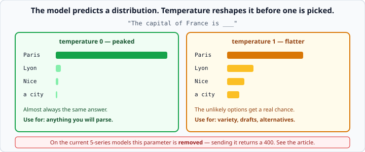

# Temperature and sampling

*Week 6 · Day 2 · about 15 minutes*

> By the end of this you understand how the model picks its next word, why the same
> prompt gives different answers, and what you can actually control on today's models.

---

## Read the official documentation first

| Page | What it gives you |
|---|---|
| [**Messages API reference**](https://docs.claude.com/en/api/messages) | `temperature`, `top_p`, `stop_sequences` — and which models accept them |
| [**Models overview**](https://docs.claude.com/en/docs/about-claude/models/overview) | Per-model parameter support |
| [**Extended thinking**](https://docs.claude.com/en/docs/build-with-claude/extended-thinking) | `effort`, which is what you tune now |
| [**Reduce hallucinations**](https://docs.claude.com/en/docs/test-and-evaluate/strengthen-guardrails/reduce-hallucinations) | Why "deterministic" is not the same as "correct" |

---

## Read this before you write any code

**On the current models — Claude Opus 5, Claude Sonnet 5 and the 4.7/4.8 family —
`temperature`, `top_p` and `top_k` have been removed. Sending any of them returns a
`400`.**

They still work on Claude Opus 4.6, Claude Sonnet 4.6, and older models. So:

- Plenty of tutorials, blog posts and course materials still show `temperature=0`. They
  are not wrong about the *concept*; they are out of date about the *parameter*.
- If you copy `temperature=0` into a call to `claude-opus-5`, your request fails.
- The lever that replaced it is **`output_config.effort`**, covered at the end.

Understanding sampling still matters — it is why a model gives different answers to the
same question, it is a standard interview question, and you will meet these parameters
in every other LLM API you touch. So learn the idea; check the docs before you type the
parameter.

---

## What the model actually does

A language model does not "know" an answer. At every step it produces a **probability
distribution over every possible next token**, and then one token is picked from it.

```
"The capital of France is ___"

Paris   0.94
Lyon    0.02
Nice    0.01
a       0.01
...
```

Then it appends the chosen token and does it again, thousands of times. That is the
entire mechanism.

**Sampling** is the rule for picking. If you always took the highest-probability token
you would get identical output every time — and, in practice, repetitive, flat text that
gets stuck in loops. Some randomness produces better writing.

---

## Temperature

Temperature reshapes the distribution before a token is drawn.



- **Low temperature (0)** — sharpens the peaks. The likely token becomes overwhelmingly
  likely. Output is consistent and predictable.
- **High temperature (1)** — flattens the curve. Unlikely tokens get a real chance.
  Output is more varied and more surprising, in both good and bad ways.

The rule of thumb was:

**Low for anything you will parse.** Classification, extraction, structured output —
you want the boring, most-likely answer, and you want it the same way each time so your
`json.loads` keeps working.

**Higher for anything you want variety in.** Brainstorming, drafting, generating
alternatives, anything where three different answers are more useful than the same one
three times.

### `temperature=0` was never a guarantee

Even at zero, output is **not** guaranteed identical between calls. Floating-point
arithmetic on parallel hardware is not perfectly reproducible, and the model behind an
ID is updated over time.

It is *much* more consistent, and that is all it ever promised. Anyone who told you
`temperature=0` means deterministic was overselling it — and if you are building
something whose correctness depends on identical output, the fix is validation, not a
parameter.

### Low temperature is not "more correct"

This is the misconception worth carrying away. Temperature controls **consistency**, not
**accuracy**. A confidently wrong answer at temperature 0 comes back wrong every single
time — arguably worse than one that varies, because it looks reliable.

If a model is hallucinating, the fix is better grounding: give it the source material,
tell it to say "I don't know", and check what comes back. Turning the temperature down
just makes it hallucinate the same thing consistently.

---

## `top_p`, briefly

`top_p` (nucleus sampling) takes a different route to the same goal: consider only the
most likely tokens whose probabilities add up to `p`, and ignore the rest.

`top_p=0.9` means "the smallest set of tokens covering 90% of the probability mass".

**Do not use it together with temperature.** Both narrow the same distribution; using
both makes the effect hard to reason about. Pick one — and on models that still accept
them, temperature is the more intuitive.

Like temperature, `top_p` is removed on the current models.

---

## `stop_sequences` — still supported everywhere

```python
response = client.messages.create(
    model="claude-opus-5",
    max_tokens=500,
    stop_sequences=["\n\n", "END"],
    messages=[...],
)
```

The model stops the moment it produces one of these strings, and `stop_reason` becomes
`"stop_sequence"`.

**The stop text itself is not included** in the reply — you get everything up to it.

Useful when you want exactly one line and nothing after it, which is the tidiest fix for
the "Let me know if you need anything else!" problem from the previous article.

Do check `stop_reason` afterwards. `"stop_sequence"` means your reply is complete as far
as you asked; `"max_tokens"` means it was cut off. Different things.

---

## What you tune instead: `effort`

On the current models, the parameter that trades cost against thoroughness is
`output_config.effort`:

```python
response = client.messages.create(
    model="claude-opus-5",
    max_tokens=16000,
    output_config={"effort": "low"},     # low | medium | high | xhigh | max
    messages=[...],
)
```

`high` is the default. Roughly:

- **`low`** — simple tasks, classification, high-volume routes, subagents. Fewer, more
  consolidated steps and less preamble.
- **`high`** — the default, and the sweet spot for most work.
- **`xhigh` / `max`** — hard reasoning and long agentic tasks, where correctness matters
  more than the token bill.

This is not the same knob as temperature. Temperature changed *how random* the next token
was; effort changes *how much thinking* the model does before answering. But for the
practical question — "how do I trade cost against quality on this route?" — effort is
where you now turn.

Measure before you raise it. A sample of real requests at `low`, `medium` and `high`
tells you more than any rule of thumb, and it is the same instinct as week 4's
"would this test fail if the code were wrong?".

---

## What this means for your code

**Design so that variation does not break you.** This is the real lesson, and it holds
regardless of which parameters exist:

- **Validate everything that comes back.** Tomorrow's article is entirely about this.
- **Do not write tests that assert on exact model output.** Assert on the shape — it is
  valid JSON, it has these keys, the score is between 0 and 10. This is why this week's
  exercises use a `FakeClient`.
- **Expect to handle the awkward case.** If one call in fifty comes back with a code
  fence around the JSON, your parser needs to cope, because you cannot make it never
  happen.

---

## Check yourself

1. Why does the same prompt give different answers?
2. Your classifier occasionally returns "Positive" instead of "positive". Is lowering
   the temperature the right fix?
3. You copy `temperature=0` from a blog post into a `claude-opus-5` call. What happens?
4. What is the difference between `stop_reason == "stop_sequence"` and
   `stop_reason == "max_tokens"`?

<details>
<summary>Answers</summary>

1. The model produces a probability distribution at each step and a token is **sampled**
   from it. Different draws, different text.
2. **No.** Lowering temperature narrows variation but does not pin the format — and on
   the current models the parameter does not exist. The fixes are: state the allowed
   values in the prompt, give few-shot examples that are consistently lowercase,
   normalise with `.lower()` when you parse, and validate with pydantic. Three of those
   four are in your control entirely.
3. A `400` error. The parameter is removed on that model.
4. `"stop_sequence"` — the model produced one of your stop strings and the reply is
   complete as you defined it. `"max_tokens"` — the reply was **cut off** and is
   incomplete. Only one of those is a problem.
</details>

---

## What you can now do

- [ ] Explain that a model samples from a distribution over next tokens
- [ ] Say what temperature does to that distribution
- [ ] State that low temperature means consistent, not correct
- [ ] Explain why `temperature=0` was never a determinism guarantee
- [ ] Say what `top_p` is and why not to combine it with temperature
- [ ] Know that these parameters are removed on current models and return a 400
- [ ] Use `stop_sequences`, and check `stop_reason` afterwards
- [ ] Use `output_config.effort` and pick a level for a given route
- [ ] Design code and tests that tolerate variation

**Next:** [Structured output from LLMs](../day-3/structured-output.md) — making the shape
guaranteed instead of hoped for.
