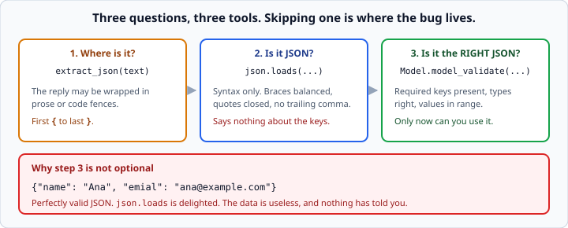
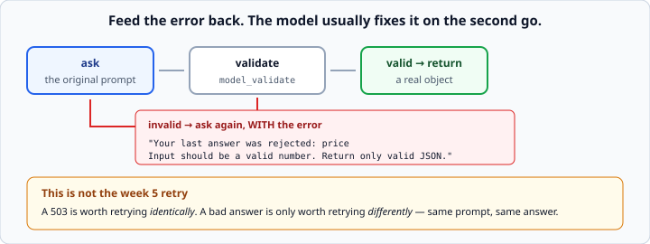

# Structured output from LLMs

*Week 6 · Day 3 · about 25 minutes*

> By the end of this you can ask a model for structured data and turn it into validated
> Python objects — including when it does not cooperate.

---

## Read the official documentation first

| Page | What it gives you |
|---|---|
| [**Structured outputs**](https://docs.claude.com/en/docs/build-with-claude/structured-outputs) | Constraining the response format at the API level |
| [**Increase output consistency**](https://docs.claude.com/en/docs/build-with-claude/prompt-engineering/increase-consistency) | The prompting side |
| [**pydantic — Models**](https://docs.pydantic.dev/latest/concepts/models/) | The validation layer |
| [**`json` (Python)**](https://docs.python.org/3.14/library/json.html) | `loads` and `JSONDecodeError` |

---

## This is the day models become useful to programs

A paragraph is for a human. **A validated object is something the next 200 lines of your
code can rely on.**

Everything you built in week 5 — pydantic models, validation at the boundary, deciding
what to do with a bad record — applies unchanged here. A model is just another
untrustworthy source. It is a *more* untrustworthy source than an API, because an API at
least has a schema it is trying to honour.

---

## Ask precisely

```python
system = """You extract contact details.

Return ONLY a JSON object with these keys:
  name    string
  email   string
  company string or null

No explanation. No code fences. No text before or after the JSON."""
```

Four things in there earn their place:

1. **Name the keys.** Not "the relevant fields".
2. **Name the types.** `string or null` tells it what to do when a company is absent —
   otherwise it invents one, or omits the key, or writes `"N/A"`.
3. **Say what "missing" looks like.** This is the single most common source of ragged
   output.
4. **Say *only* — twice, in different words.** It is the instruction most often ignored.

Give it an example of the exact output when the shape is at all fiddly. One example is
usually worth two more sentences of description.

---

## It will still wrap it

Even with that prompt, you will get:

````
Here's the extracted data:

```json
{"name": "Ana Silva", "email": "ana@example.com", "company": null}
```
````

So parse defensively.

```python
def extract_json(text: str) -> str | None:
    """Return the JSON object inside a reply that may be wrapped in prose."""
    start = text.find("{")
    end = text.rfind("}")
    if start == -1 or end == -1 or end < start:
        return None
    return text[start : end + 1]
```

First `{` to last `}`. Crude, and it handles the overwhelming majority of real replies —
including fenced ones, because the fence markers fall outside the braces.

For a JSON **array**, swap the braces for brackets, or search for whichever appears
first.

---

## Parse, then validate — two different questions

```python
raw = json.loads(extract_json(reply))     # is it JSON?
contact = Contact.model_validate(raw)     # is it the RIGHT JSON?
```



`json.loads` tells you the **syntax** is fine. `model_validate` tells you the keys you
need are present, the types are right, and the values are sane.

A model will happily return:

```json
{"name": "Ana", "emial": "ana@example.com"}
```

Perfectly valid JSON. `json.loads` is delighted. The data is useless, and nothing has
told you — until an `AttributeError` fires somewhere else entirely, which is exactly the
week 5 story.

**Week 5's rule, unchanged: validate at the boundary, once.**

```python
from pydantic import BaseModel, Field

class Contact(BaseModel):
    name: str = Field(min_length=1)
    email: str
    company: str | None = None
```

Constraints do real work here. A model asked for a score out of ten will occasionally
return 11, or `"eight"`. `Field(ge=0, le=10)` catches both.

---

## Retry with the error fed back

Unlike a network failure, a bad response is worth retrying **with a different prompt**.



```python
def extract(client, model, text, attempts: int = 3) -> Contact | None:
    """Return a validated Contact, retrying with the error fed back. None if it never works."""
    prompt = build_prompt(text)

    for _ in range(attempts):
        reply = call(client, model, prompt)
        try:
            return Contact.model_validate(json.loads(extract_json(reply)))
        except (json.JSONDecodeError, ValidationError, TypeError) as error:
            prompt = (
                f"{build_prompt(text)}\n\n"
                f"Your last answer was rejected: {error}\n"
                f"Return only valid JSON."
            )
    return None
```

**Feeding the error back is the whole trick.** A model told *"`price` — Input should be
a valid number, you sent `'twelve dollars'`"* usually fixes it on the second attempt.
pydantic's `ValidationError` messages are unusually good at this, because they name the
field, the rule and the offending value.

### This is not the week 5 retry

A 503 is worth retrying **identically** — the request was fine, the server was busy.

A bad answer retried identically gives you a bad answer again. It is only worth retrying
**differently**. Same loop shape, completely different reasoning, and being able to say
why is a good Friday answer.

---

## Ask for the boring answer

Anything you are going to parse wants the most-likely output, not the creative one.

Historically that meant `temperature=0`. On the current models that parameter is
removed, and the levers are:

- **the prompt** — precise keys, types and an example
- **`output_config={"effort": "low"}`** for simple extraction, which is cheaper and
  perfectly capable
- **structured outputs**, below, which make the shape a constraint rather than a request

---

## The proper answer: structured outputs

Everything above is a strong prompt plus hope. The API can do better — you can constrain
the response format so it *cannot* come back wrong.

```python
response = client.messages.create(
    model="claude-opus-5",
    max_tokens=1000,
    output_config={
        "format": {
            "type": "json_schema",
            "schema": Contact.model_json_schema(),
        }
    },
    messages=[{"role": "user", "content": text}],
)
```

`Contact.model_json_schema()` — pydantic generates the schema from your model, so the
model definition stays the single source of truth.

The SDK also offers `client.messages.parse()`, which validates the response against your
schema for you.

> This is behind week 6's fence, and deliberately so. You are writing the
> extract-parse-validate-retry loop by hand for the same reason you wrote the retry loop
> by hand in week 5: when you switch to the built-in version you will know exactly what
> it is doing and what it costs. **Do use structured outputs in your own projects from
> here on.**

Note that structured outputs constrain the *shape*. They do not make the *contents*
true. A schema-valid `{"email": "nobody@nowhere.invalid"}` is still a hallucination, and
your validators are still the thing standing between it and your database.

---

## The honest limits

Structured output is **not a guarantee.** It is a strong prompt, plus validation, plus a
retry — and it fails occasionally.

Design for that:

```python
contact = extract(client, model, text)
if contact is None:
    queue_for_human_review(text)        # not a crash, not silent bad data
```

Three acceptable outcomes: a valid object, an explicit `None` the caller handles, or a
queue for a human. **Never a crash, and never silently wrong data.**

Which of those you choose is the same decision as week 5's "skip the bad records or fail
the batch", and it depends the same way on what the data is for.

---

## Check yourself

```python
reply = 'Sure! Here you go:\n```json\n{"name": "Ana", "score": "9"}\n```\nHope that helps!'

class Result(BaseModel):
    name: str
    score: int
```

1. Does `json.loads(reply)` work?
2. Does `json.loads(extract_json(reply))` work?
3. Does `Result.model_validate(...)` accept `{"name": "Ana", "score": "9"}`?
4. What if the score had been `"nine"`?

<details>
<summary>Answers</summary>

1. **No.** `JSONDecodeError` — the reply starts with `Sure!`, which is not JSON.
2. **Yes.** `extract_json` finds the first `{` and last `}`, and the prose and fences
   fall outside them.
3. **Yes** — `score` is `9` as an integer. pydantic coerces `"9"` to `9` because the
   conversion is unambiguous. This is exactly the week 5 lesson, and it is why the
   pydantic layer absorbs a whole class of model sloppiness for free.
4. `ValidationError: Input should be a valid integer, unable to parse string as an
   integer`. Which is precisely the message you feed back into the retry.
</details>

---

## What you can now do

- [ ] Write a system prompt that names keys, types and the missing case
- [ ] Extract a JSON object from a reply wrapped in prose or code fences
- [ ] Explain the difference between parsing and validating, with an example
- [ ] Validate model output with pydantic, using constraints
- [ ] Retry with the validation error fed back into the prompt
- [ ] Say why that differs from a week 5 network retry
- [ ] Describe API-level structured outputs and what they do and do not guarantee
- [ ] Choose a failure behaviour that is neither a crash nor silent bad data

**Next:** [Streaming responses](../day-4/streaming-responses.md) — showing the answer as
it arrives.
