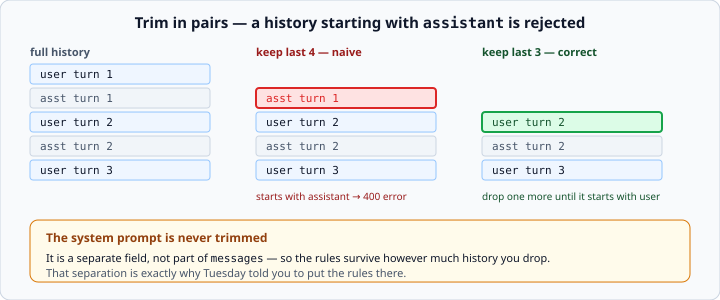

# Managing conversation context

*Week 6 · Day 4 · about 15 minutes*

> By the end of this you can hold a conversation that does not grow forever, and you can
> say what you chose to forget and why.

---

## Read the official documentation first

| Page | What it gives you |
|---|---|
| [**Context windows**](https://docs.claude.com/en/docs/build-with-claude/context-windows) | What fills the window and how fast |
| [**Token counting**](https://docs.claude.com/en/docs/build-with-claude/token-counting) | Measuring before you trim |
| [**Prompt caching**](https://docs.claude.com/en/docs/build-with-claude/prompt-caching) | The other half of the cost answer |
| [**Messages API reference**](https://docs.claude.com/en/api/messages) | The rules a `messages` list must satisfy |

---

## Conversations grow, and you pay for all of it

Every call resends the whole history. Turn 20 sends turns 1 through 19 again — so **cost
grows with the square of the conversation length**, not linearly.

| Turn | Messages sent | Cumulative input tokens (rough) |
|---|---|---|
| 1 | 1 | 100 |
| 5 | 9 | 2,500 |
| 20 | 39 | 40,000 |
| 50 | 99 | 250,000 |

Eventually you hit the context window and the call simply fails. There is no graceful
degradation — you get a `400`.

So you have to decide what to stop sending. **That decision is the whole of today**, and
it is a design decision, not a technical one.

---

## Three strategies

| Strategy | What it does | Costs you |
|---|---|---|
| **Truncate** | keep the last N turns | the beginning, silently |
| **Summarise** | replace old turns with a summary | an extra model call |
| **Sliding window + pinned system** | keep the system prompt and the last N turns | the middle |

**Truncation is the honest default** and the one you build today. It is simple, it is
predictable, and its failure mode is easy to explain: the model forgets what happened
early on.

**Summarising** is better when the beginning genuinely matters — "my name is Ana and I
am debugging a payment bug" is worth keeping when it was said forty turns ago. It costs
an extra call, and the summary can be wrong, which is a quiet way to corrupt a
conversation.

The **pinned system prompt** is not really a third option; it is a property of the API
you get for free, and it is why Tuesday told you to put the rules in `system`.

---

## Trim in pairs



A `messages` list must **start with a `user` turn**. Chop the last N messages naively
and you will sometimes leave an `assistant` message at the front, which is a `400`.

```python
def trim(messages: list[dict], max_turns: int) -> list[dict]:
    """Return at most `max_turns` messages, still starting with a user turn."""
    kept = messages[-max_turns:]
    while kept and kept[0]["role"] != "user":
        kept = kept[1:]
    return kept
```

Take the last N, then drop from the front until it starts with `user`. Two lines, and it
cannot produce an invalid history.

Note it returns a **new list** rather than mutating the one it was given — week 3's rule
about preferring a new value over modifying an argument, and here it matters: the caller
usually wants to keep the full history for display while sending only the trimmed one.

**The system prompt is never trimmed.** It is a separate field, so your rules survive
however much history you drop.

---

## Measuring before you trim

Trimming by message count is crude — one message might be a word and another might be a
pasted document.

The rough estimate:

```python
def estimate_tokens(messages: list[dict]) -> int:
    """Rough token estimate: one token per four characters, per message."""
    return sum(len(m["content"]) // 4 + 1 for m in messages)
```

Four characters per token is the usual approximation. It is good enough to decide *when*
to trim.

The exact answer, when it matters:

```python
count = client.messages.count_tokens(model=model, system=system, messages=messages)
if count.input_tokens > budget:
    messages = trim(messages, max_turns)
```

`count_tokens` is free. Use the estimate in a hot loop and the real call at the
threshold.

**Set a budget well below the window.** If the window is 200,000, trimming at 150,000
leaves room for the reply. Trimming at 199,000 does not, and you get a confusing error
about output space rather than input.

---

## A conversation class

```python
class Conversation:
    """A bounded chat history with cost tracking."""

    def __init__(self, system: str | None = None, max_turns: int = 10) -> None:
        self.system = system
        self.max_turns = max_turns
        self._messages: list[dict] = []
        self.input_tokens = 0
        self.output_tokens = 0

    def add_user(self, text: str) -> None:
        self._messages.append({"role": "user", "content": text})

    def add_assistant(self, text: str) -> None:
        self._messages.append({"role": "assistant", "content": text})

    @property
    def messages(self) -> list[dict]:
        return trim(self._messages, self.max_turns)

    def send(self, client, model: str, text: str) -> str:
        """Add the question, call the model, record the reply, and return it."""
        self.add_user(text)
        response = client.messages.create(
            model=model,
            max_tokens=1000,
            system=self.system,
            messages=self.messages,
        )
        reply = "".join(b.text for b in response.content if b.type == "text")
        self.add_assistant(reply)
        self.input_tokens += response.usage.input_tokens
        self.output_tokens += response.usage.output_tokens
        return reply

    def __len__(self) -> int:
        return len(self._messages)
```

Week 4's whole toolkit: `__init__`, a `@property` that computes rather than stores,
`__len__`, and a class that earns its place because state and behaviour genuinely travel
together.

Two design choices worth defending on Friday:

**`_messages` holds everything; `messages` returns the trimmed view.** You keep the full
history for display and logging, and send only what fits. Throwing the old turns away
entirely would be irreversible.

**`send` takes `client` as an argument.** The rule that makes this week testable —
dependency injection, so the tests can hand it a fake.

> `@property` is technically behind week 4's fence. If you would rather stay inside it,
> make it a plain method called `current_messages()`. The design point is the same.

---

## What you are actually choosing

A trimmed conversation **forgets things**, and the user is not told.

```
Turn 1:  "My name is Ana and I'm debugging a payment bug."
...
Turn 25: "What was my name again?"
         "I don't have that information."
```

That is not a bug in your code. It is the consequence of a decision you made, and the
question on Friday will be whether you made it deliberately.

Three things worth doing about it:

**Say so.** A one-line note when history is dropped — *"(earlier messages trimmed)"* —
is honest and cheap.

**Keep what matters in `system`.** If the user's name matters for the whole
conversation, it belongs in the standing instruction, not in turn 1 of a history you are
about to discard.

**Know the alternatives exist.** Summarisation, and the API's own **compaction** feature
which summarises server-side automatically. Both are beyond this week's fence. Knowing
the trade-off — an extra call and a lossy summary, versus silent forgetting — is what
matters now.

---

## The cost answer you are not yet allowed to use

**Prompt caching** cuts the cost of a long conversation by roughly ten times, by caching
the stable prefix so re-sent history is re-read at about a tenth of the price.

It is behind the fence this week because the point of today is understanding *why* a
conversation is expensive. Once you have felt that, caching is a configuration change.

Be able to say this on Friday: *"Trimming reduces how much I send. Caching reduces what
the re-sent part costs. They solve different halves of the same problem, and real
systems use both."*

---

## Check yourself

```python
messages = [
    {"role": "user", "content": "one"},
    {"role": "assistant", "content": "1"},
    {"role": "user", "content": "two"},
    {"role": "assistant", "content": "2"},
    {"role": "user", "content": "three"},
]
```

1. What does `trim(messages, 4)` return?
2. Why not simply `messages[-4:]`?
3. A conversation reaches 30 turns and the model stops remembering the topic. Is that a
   bug?

<details>
<summary>Answers</summary>

1. The last three: `user "two"`, `assistant "2"`, `user "three"`. Taking four would
   start with `assistant "1"`, so one more is dropped from the front.
2. It returns a history starting with an `assistant` turn, which the API rejects with a
   `400`. The failure is intermittent — it depends on whether your cut lands on an even
   or odd boundary — which makes it exactly the kind of bug that reaches production.
3. **No.** It is the strategy working as designed. It becomes a bug only if you did not
   choose it, did not tell the user, and cannot explain it.
</details>

---

## What you can now do

- [ ] Explain why conversation cost grows with the square of its length
- [ ] Name three strategies for bounding history and what each costs
- [ ] Write `trim` so the history always starts with a `user` turn
- [ ] Estimate tokens cheaply and count them exactly when it matters
- [ ] Set a budget below the window that leaves room for the reply
- [ ] Build a `Conversation` class that keeps the full history and sends a trimmed view
- [ ] Say what your trimming strategy forgets, and defend the choice
- [ ] Explain how caching and trimming solve different halves of the problem

**Next:** the week 6 milestone — a streaming assistant with memory and a cost counter.
Then week 7, the keystone: **build the agent**.
