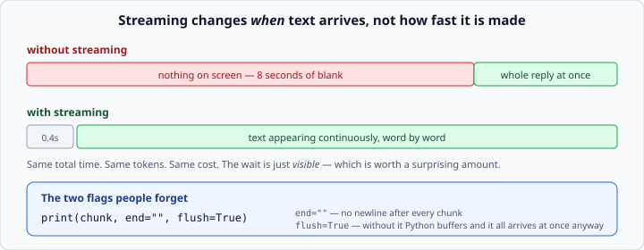

# Streaming responses

*Week 6 · Day 4 · about 20 minutes*

> By the end of this you can show an answer as it arrives, and still get the usage
> numbers afterwards.

---

## Read the official documentation first

| Page | What it gives you |
|---|---|
| [**Streaming Messages**](https://docs.claude.com/en/docs/build-with-claude/streaming) | The event types and the full protocol |
| [**Messages API reference**](https://docs.claude.com/en/api/messages) | The `stream` parameter |
| [**anthropic-sdk-python — streaming helpers**](https://github.com/anthropics/anthropic-sdk-python#streaming-responses) | `text_stream` and `get_final_message()` |
| [**`print()` (Python)**](https://docs.python.org/3.14/library/functions.html#print) | `end=` and `flush=` — week 1, still earning its keep |

---

## Why bother

Without streaming, nothing appears until the whole reply is finished. For a long answer
that is eight seconds of blank screen, and users read a blank screen as *broken*.



**Streaming changes when text arrives, not what it is.** It does not make anything
faster; the same tokens are generated at the same rate and cost exactly the same. It
makes the wait *visible*, which is worth a surprising amount.

There is also a hard requirement behind it: for large `max_tokens` — anything above
about 16,000 — the SDK **requires** streaming, because a non-streaming request would sit
there long enough to hit an HTTP timeout.

---

## The code

```python
with client.messages.stream(
    model="claude-opus-5",
    max_tokens=1000,
    messages=messages,
) as stream:
    for chunk in stream.text_stream:
        print(chunk, end="", flush=True)

    final = stream.get_final_message()

print()
print(f"Tokens: {final.usage.output_tokens}")
```

Three things to notice.

**`with`** — the same context manager from week 3's files. It closes the connection when
the block ends, even if something goes wrong inside. Streaming holds an open HTTP
connection; leaking one is a real problem.

**`end=""` and `flush=True`** — week 1's `print` arguments, doing genuine work at last.
`end=""` stops a newline after every chunk. `flush=True` forces the text to the terminal
immediately; without it Python buffers output and you get the whole thing at once
anyway, which defeats the entire point. **Forgetting `flush=True` is the single most
common streaming bug.**

**`get_final_message()`** — after the loop, this gives you the complete assembled
message, including `usage`. So you still get your token counts and your cost, and you
still append the assistant turn to your history.

If you only want the finished result and do not care about showing progress —
which is the case when you are streaming purely to avoid a timeout — skip the loop
entirely:

```python
with client.messages.stream(...) as stream:
    response = stream.get_final_message()
```

---

## What is actually arriving

`text_stream` is a convenience. Underneath, the API sends a sequence of typed events:

| Event | Means |
|---|---|
| `message_start` | the response is beginning; carries initial `usage` |
| `content_block_start` | a new block — text, thinking, or a tool call |
| `content_block_delta` | a piece of that block |
| `content_block_stop` | that block is finished |
| `message_delta` | updates to `stop_reason` and final `usage` |
| `message_stop` | done |

`text_stream` filters that down to the text pieces of text blocks. That is all you need
this week.

You need the raw events when you care about *which* block is arriving — showing thinking
separately from the answer, or reacting to a tool call as it streams in. That is week 7.

```python
with client.messages.stream(...) as stream:
    for event in stream:
        if event.type == "content_block_delta":
            ...
```

---

## Streaming does not remove your obligations

Everything from Monday still applies, and it is easy to forget when the text is
scrolling past nicely.

**Check `stop_reason`.**

```python
final = stream.get_final_message()
if final.stop_reason == "max_tokens":
    print("\n[truncated]")
```

A streamed answer that stops mid-sentence looks exactly like one that finished. The user
watched it appear, so it feels complete.

**Errors can arrive mid-stream.** The connection is open for the duration, so a network
failure can land after you have already printed half an answer. Wrap the whole block:

```python
try:
    with client.messages.stream(...) as stream:
        for chunk in stream.text_stream:
            print(chunk, end="", flush=True)
        final = stream.get_final_message()
except anthropic.APIConnectionError:
    print("\n[connection lost]")
```

Deciding what to do with the half-answer you already showed is a real design question.
Usually: keep it on screen, mark it incomplete, and do not store it as an assistant turn.

**Do not append a partial reply to your history.** If the stream failed, the assistant
turn never completed. Adding it teaches the model that half-sentences are acceptable
output, and it wastes tokens on every subsequent call.

---

## Collecting the text

```python
pieces = []
with client.messages.stream(...) as stream:
    for chunk in stream.text_stream:
        print(chunk, end="", flush=True)
        pieces.append(chunk)
    final = stream.get_final_message()

text = "".join(pieces)
```

Week 2's accumulator, still the right shape.

But note you rarely need it — `get_final_message()` already contains the assembled
content:

```python
text = "".join(b.text for b in final.content if b.type == "text")
```

Use the accumulator only when you need the text *before* the stream finishes.

---

## Async, briefly

```python
async with client.messages.stream(...) as stream:
    async for chunk in stream.text_stream:
        ...
```

An `AsyncAnthropic` client, `async with`, `async for`. Behind this week's fence, and it
is what a real web application uses — a synchronous stream blocks a whole worker for the
duration of the response, which does not scale past one user.

You meet `asyncio` properly in week 7. For now, know that the shape barely changes.

---

## When not to stream

**Anything you are going to parse.** If the output is JSON that gets validated and
stored, nobody is watching it arrive. Streaming adds complexity for no benefit.

**Batch work.** Same reason.

**Anywhere the partial answer is dangerous.** If half a response could be acted on
incorrectly, do not show it.

Stream when a **human is waiting and reading**. Otherwise, do not.

---

## Check yourself

```python
# a
with client.messages.stream(...) as stream:
    for chunk in stream.text_stream:
        print(chunk)

# b
with client.messages.stream(...) as stream:
    for chunk in stream.text_stream:
        print(chunk, end="")

# c
with client.messages.stream(...) as stream:
    for chunk in stream.text_stream:
        print(chunk, end="", flush=True)
    print(stream.get_final_message().usage.output_tokens)
```

1. What is wrong with **a**?
2. What is wrong with **b**?
3. Does **c** cost more than a non-streaming call?

<details>
<summary>Answers</summary>

1. Every chunk gets its own line. The answer comes out as a vertical column of
   fragments.
2. It looks right and behaves wrong. Python buffers stdout when it is not a terminal —
   and often even when it is — so the text arrives in large lumps or all at once. The
   streaming is happening; you just cannot see it.
3. **No.** Identical tokens, identical price. Streaming is a delivery mechanism, not a
   different way of generating.
</details>

---

## What you can now do

- [ ] Stream a response with `client.messages.stream` and a `with` block
- [ ] Print chunks with `end=""` and `flush=True`, and say what each does
- [ ] Get `usage` and `stop_reason` afterwards with `get_final_message()`
- [ ] Name the streaming event types and say when you would need them
- [ ] Handle an error that arrives mid-stream, and decide what to do with the partial
- [ ] Say why streaming is required for large `max_tokens`
- [ ] Say when not to stream

**Next:** [Managing conversation context](managing-conversation-context.md) — keeping a
conversation from growing forever.
