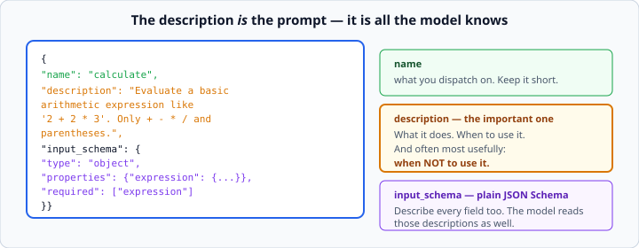
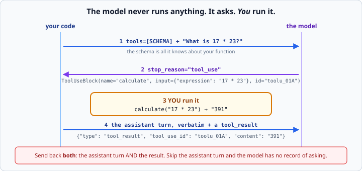

# Tool use / function calling

*Week 7 · Day 1 · about 30 minutes*

> By the end of this you can describe a function to a model, receive its request to call
> one, and run it.

---

## Read the official documentation first

| Page | What it gives you |
|---|---|
| [**Tool use overview**](https://docs.claude.com/en/docs/agents-and-tools/tool-use/overview) | The whole mechanism |
| [**How to implement tool use**](https://docs.claude.com/en/docs/agents-and-tools/tool-use/implement-tool-use) | Schemas, results, the loop |
| [**Messages API reference**](https://docs.claude.com/en/api/messages) | The `tools` parameter and `tool_use` blocks |
| [**JSON Schema — a specification**](https://json-schema.org/understanding-json-schema/) | The schema language itself |
| [**`json` (Python)**](https://docs.python.org/3.14/library/json.html) | Parsing tool inputs — always parse, never string-match |

---

## The one sentence that matters this week

**The model never runs anything.**

It produces JSON describing a call it would like made. Running it is entirely your job.

Everything else today follows from that. If you hold on to nothing else, hold on to
that — it is the answer to half the interview questions about agents, and it is the
thing that makes the security section on Wednesday make sense.

No loop today. One turn: you ask, it asks for a tool, you run the tool. Tomorrow you put
that in a `while`.

---

## A tool schema is a dict

```python
CALCULATE = {
    "name": "calculate",
    "description": "Evaluate a basic arithmetic expression like '2 + 2 * 3'. "
                   "Only + - * / and parentheses. Not for algebra or units.",
    "input_schema": {
        "type": "object",
        "properties": {
            "expression": {
                "type": "string",
                "description": "The arithmetic to evaluate, e.g. '17 * 23'.",
            },
        },
        "required": ["expression"],
    },
}
```



That is **JSON Schema**, and it is the whole interface. You send it in `tools=[...]`.

### The description is the prompt

It is the only thing the model knows about your function — not the code, not the name,
not what you meant.

A vague description produces a tool that gets called at the wrong times with the wrong
arguments, and **the fix is always in the description rather than in the code.**

| Weak | Strong |
|---|---|
| "Gets weather" | "Return today's weather for a named city. Use only for current conditions, not forecasts." |
| "Does maths" | "Evaluate a basic arithmetic expression like '2 + 2 * 3'. Only + - * / and parentheses." |
| "Search" | "Search the product catalogue by keyword. Returns at most 10 matches. Use for finding products, not for checking stock." |

Say what it does, when to use it, and — often most usefully — **when not to**.

Describe each field too. `"description": "The city name, e.g. 'Lisbon'"` prevents a
surprising amount of `{"city": "the user's city"}`.

This is week 6's prompt engineering, applied somewhere you might not expect: your tool
descriptions are prompts, and they deserve the same iteration.

---

## Sending them

```python
response = client.messages.create(
    model="claude-opus-5",
    max_tokens=1000,
    tools=[CALCULATE, GET_WEATHER],
    messages=[{"role": "user", "content": "What is 17 * 23?"}],
)
```

Nothing else changes. `tools` is one more parameter on the same call you made all last
week.

---

## What comes back



```python
response.stop_reason        # "tool_use"  <- it wants something run
response.content            # [TextBlock("Let me work that out."), ToolUseBlock(...)]
```

A tool-use response often contains **both** — some text and the request. **This is where
`content[0].text` finally breaks**, exactly as promised in week 6. If you built the
`block.type` habit then, nothing breaks today.

```python
for block in response.content:
    if block.type == "tool_use":
        block.name      # "calculate"
        block.input     # {"expression": "17 * 23"}  <- already a dict
        block.id        # "toolu_01A..."  <- you must send this back
```

`block.input` arrives as a parsed dict. Do **not** string-match on it — parse and index
it properly. Escaping in tool inputs varies between models, and raw string matching is
a bug waiting for a Unicode character.

---

## Sending the result back

A tool result is an ordinary **user** message whose content is a list of blocks:

```python
messages.append({"role": "assistant", "content": response.content})   # verbatim
messages.append({
    "role": "user",
    "content": [{
        "type": "tool_result",
        "tool_use_id": block.id,        # matches the request
        "content": "391",               # always a string
    }],
})
```

Three things people get wrong:

**The `tool_use_id` must match.** With several calls in flight, it is the only thing
connecting an answer to its question.

**You must resend the assistant turn too.** Skip it and the model sees a result for a
request it has no record of making — and you get a `400`.

**`content` is a string.** Not a dict, not a number. Serialise with `json.dumps()` if
your tool returns structured data:

```python
"content": json.dumps({"temp_c": 18, "conditions": "cloudy"}),
```

The model reads it as text and copes fine with JSON. What it cannot cope with is a
Python object.

---

## A dispatch table

```python
def calculate(expression: str) -> str:
    """Evaluate a basic arithmetic expression."""
    ...

def get_weather(city: str) -> str:
    """Return today's weather for a city."""
    ...

TOOLS = {
    "calculate": calculate,
    "get_weather": get_weather,
}

SCHEMAS = [CALCULATE, GET_WEATHER]


def run_tool(name: str, arguments: dict) -> str:
    """Run the named tool and return its result as a string."""
    function = TOOLS.get(name)
    if function is None:
        return f"Error: unknown tool '{name}'"
    try:
        return str(function(**arguments))
    except Exception as error:
        return f"Error: {error}"
```

Week 2's dict, doing something genuinely useful: mapping a name to a function.
`**arguments` unpacks the model's dict into keyword arguments, which is why the schema
property names must match your parameter names exactly.

### Errors go back to the model, not up the stack

That `try` returning `f"Error: {error}"` is the most important line in the function, and
it is the opposite of week 3's advice.

**A tool failure is not a program failure.** It is information the model can act on. Told
*"Error: unknown city 'Lisbn'"*, it will usually retry with the right spelling. Raise
instead and the whole agent dies over a typo.

This is a genuine exception to "raise deep, catch shallow", and it is worth being able to
explain why: the caller here is a language model that can reason about the error, not a
`main()` that can only crash.

**Catch broadly here** — `except Exception` — because you genuinely do not know what a
tool will do and a crash is worse than a message. This is one of the few places a broad
catch is right, and it is right because the alternative is worse, not because it is
tidy.

---

## Security: the model chooses the arguments

Your tool will be called with arguments a language model made up, possibly under the
influence of text a stranger wrote. Design accordingly.

```python
def calculate(expression: str) -> str:
    return str(eval(expression))        # NEVER
```

`eval` on model-supplied input is remote code execution with extra steps. The same
applies to:

- building SQL by string formatting
- `subprocess` with a model-supplied command
- `open()` on a model-supplied path
- any HTTP request to a model-supplied URL

**Validate every tool input as if it came from the internet**, because effectively it
did. Week 5's pydantic models work perfectly here:

```python
class CalculateInput(BaseModel):
    expression: str = Field(max_length=100, pattern=r"^[\d\s\+\-\*/\(\)\.]+$")
```

And give tools the **narrowest possible capability**. A tool that reads one directory is
safer than one that reads any path. A tool that queries a view is safer than one that
runs SQL.

You will build this properly on Wednesday. Start with the instinct today.

---

## Check yourself

```python
response = client.messages.create(
    model="claude-opus-5", max_tokens=1000,
    tools=[CALCULATE],
    messages=[{"role": "user", "content": "What is 17 * 23?"}],
)
```

1. What is `response.stop_reason`?
2. Has `calculate` run?
3. What breaks if you send back only the `tool_result` and not the assistant turn?
4. Your tool raises `KeyError`. What should the agent do?

<details>
<summary>Answers</summary>

1. `"tool_use"`.
2. **No.** Nothing has run. The model produced a description of a call it would like
   made. This is the sentence at the top of the article, and it is the one people get
   wrong.
3. A `400`. The API rejects a `tool_result` whose `tool_use_id` does not correspond to a
   `tool_use` block in the preceding assistant turn — and there is no preceding assistant
   turn.
4. Catch it and return `"Error: ..."` as the tool result. The model gets to see what
   went wrong and try something else. Letting it propagate kills the whole run over one
   bad argument.
</details>

---

## What you can now do

- [ ] Write a tool schema in JSON Schema and say which part the model actually reads
- [ ] Write a description that says when to use the tool and when not to
- [ ] Send `tools=` and detect `stop_reason == "tool_use"`
- [ ] Extract `name`, `input` and `id` from a `ToolUseBlock`
- [ ] Send back the assistant turn *and* a `tool_result` with a matching id
- [ ] Serialise a structured result with `json.dumps`
- [ ] Build a dispatch table and call functions with `**arguments`
- [ ] Return tool errors to the model instead of raising, and explain why
- [ ] Name three ways a tool can be dangerous, and validate its input

**Next:** [The agent loop](../day-2/agent-loop.md) — putting today's single turn inside a
`while`.
