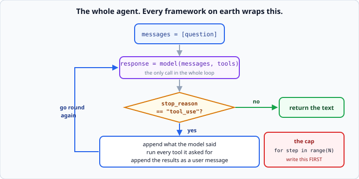
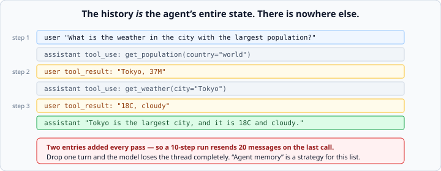

# The agent loop / ReAct pattern

*Week 7 · Day 2 · about 25 minutes*

> By the end of this you have written a working agent. All of it. No framework.

---

## Read the official documentation first

| Page | What it gives you |
|---|---|
| [**How to implement tool use**](https://docs.claude.com/en/docs/agents-and-tools/tool-use/implement-tool-use) | The loop, from the source |
| [**Building effective agents**](https://www.anthropic.com/engineering/building-effective-agents) | When an agent is the right answer, and when it is not |
| [**Messages API reference**](https://docs.claude.com/en/api/messages) | `stop_reason` values |
| [**ReAct: Synergizing Reasoning and Acting**](https://arxiv.org/abs/2210.03629) | The 2022 paper this pattern comes from |

> Read the "Building effective agents" post properly. Its central argument — that most
> tasks want a **workflow** rather than an agent, and you should reach for the simplest
> thing that works — is the judgement week 8 will test you on.

---

## The loop, in full

```
messages = [the question]

repeat, up to a limit:
    response = model(messages, tools)

    if response.stop_reason != "tool_use":
        return the text            <- it is done

    messages.append(what the model just said)
    run every tool it asked for
    messages.append(the results, as a user message)

if the limit is reached:
    give up, and say so
```



Nine lines of English. Read it twice, then write it, and notice how little there is.

**Every agent framework on earth is a wrapper around this.** Next Monday you will meet
LangGraph and it will feel obvious — because you will have already written what it
hides.

---

## In Python

```python
def run_agent(client, model: str, question: str, max_iterations: int = 10) -> str:
    """Run the agent until it answers or hits the iteration cap."""
    messages = [{"role": "user", "content": question}]

    for step in range(max_iterations):
        response = client.messages.create(
            model=model,
            max_tokens=1000,
            tools=SCHEMAS,
            messages=messages,
        )

        if response.stop_reason != "tool_use":
            return extract_text(response)

        messages.append({"role": "assistant", "content": response.content})

        results = []
        for block in response.content:
            if block.type == "tool_use":
                results.append({
                    "type": "tool_result",
                    "tool_use_id": block.id,
                    "content": run_tool(block.name, block.input),
                })

        messages.append({"role": "user", "content": results})

    return f"Stopped after {max_iterations} steps without finishing."
```

That is it. That is an agent.

---

## Why this is called ReAct

The pattern comes from a 2022 paper: **Reason + Act**. The model reasons about what it
needs, acts by calling a tool, observes the result, and reasons again.

You do not implement the reasoning. The model does that between calls, and on current
models it happens in `thinking` blocks. **You implement the loop that lets it act on its
reasoning.**

Knowing the name is worth something in an interview. Knowing that the loop is nine lines
is worth more.

---

## `stop_reason` is the whole control flow

| Value | You do |
|---|---|
| `"tool_use"` | run the tools, go round again |
| `"end_turn"` | it has answered — return the text |
| `"max_tokens"` | it was cut off — your answer is incomplete |

That is the branch the entire loop turns on. Get it wrong and you either stop too early
or never stop at all.

Note the code checks `!= "tool_use"` rather than `== "end_turn"`. That is deliberate:
`max_tokens` and `refusal` also need to exit the loop, and treating anything that is not
a tool request as "done" is the safe default. **Handle them properly rather than
silently:**

```python
if response.stop_reason == "max_tokens":
    return "[truncated] " + extract_text(response)
if response.stop_reason != "tool_use":
    return extract_text(response)
```

---

## Why `messages` grows



Every pass adds **two** entries: what the model said, and what the tools returned.

The model has no memory, so **the history is the agent's entire state**. There is
nowhere else anything is kept — no variables, no database, no hidden context. Just a
list of dicts that you keep appending to.

Three consequences worth holding on to:

**A long agent run gets expensive fast.** You resend everything, every step. A 10-step
run makes 10 calls whose input grows each time — the squared cost from week 6, now with
tool results in it.

**If you drop a turn, the model loses the thread completely.** There is no recovering
from it; the state is gone.

**"Agent memory" in any framework is a strategy for what to keep in this list.** When
LangGraph offers you a memory saver next week, that is what it is doing. Nothing more
mystical.

---

## Parallel tool calls

One assistant message can contain **several** `tool_use` blocks — the model asking for
three things at once.

```python
results = []
for block in response.content:
    if block.type == "tool_use":
        results.append({...})
messages.append({"role": "user", "content": results})
```

Note the shape: collect all the results, then append **one** user message containing all
of them.

**Splitting them across several user messages is a real bug.** It silently trains the
model to stop making parallel calls, which makes your agent slower for no visible
reason. One message, all the results.

If a tool fails, still return a result for it — with `"is_error": True` if you like.
Dropping one leaves an unanswered `tool_use` and the API rejects the request.

---

## The iteration cap is not optional

A model can ask for a tool, get a result it does not like, and ask again. Forever.

With no cap you get an infinite loop that costs real money and is running while you
sleep.

**Write the cap before you write anything else.** Every framework has one, every one of
them defaults to something small, and every production incident report about agents
mentions it.

Two more bounds worth adding on top:

```python
def run_agent(client, model, question, max_iterations=10, max_cost=0.50):
    spent = 0.0
    for step in range(max_iterations):
        ...
        spent += cost(response)
        if spent > max_cost:
            return f"Stopped: cost limit reached (${spent:.2f})"
```

A **cost cap** protects you when ten iterations of a large context turn out to be
expensive. A **wall-clock cap** protects you when a tool hangs. Both belong in anything
you would leave running.

---

## The trace

An agent that returns only its final answer is impossible to debug. Record what happened
**as it happens**:

```python
trace.append({
    "step": step + 1,
    "stop_reason": response.stop_reason,
    "tools_called": [b.name for b in response.content if b.type == "tool_use"],
    "input_tokens": response.usage.input_tokens,
    "output_tokens": response.usage.output_tokens,
})
```

When your agent gives a wrong answer, the question is never "what did it say" — it is
**"which step went wrong?"** A trace answers that in seconds; a final string does not.

Every observability product in this space — LangSmith, which you meet in week 11 — is a
prettier version of this list. Build the list yourself now and the product becomes
obvious later.

Return the trace alongside the answer:

```python
return {"answer": answer, "trace": trace, "steps": len(trace)}
```

---

## Where it goes wrong

You will hit all of these tomorrow, and knowing the shape now makes them faster to spot.

**It loops on the same tool.** The result is not what it wanted and it tries again
identically. Usually the tool's *description* is wrong, or the error message it gets back
is unhelpful.

**It never calls a tool.** It answers from memory instead. The description does not make
clear when the tool applies — or the question genuinely does not need it, which is a
correct decision you may have mistaken for a bug.

**It calls the right tool with wrong arguments.** The field descriptions are thin. Add
an example to the schema.

**It stops one step early.** It has enough to answer and does. Fine — unless your
success criterion demanded a specific tool was used, in which case your criterion is
testing the wrong thing.

Every one of these is a **prompt problem**, not a code problem, and the fix is nearly
always in the tool descriptions.

---

## Check yourself

```python
for step in range(max_iterations):
    response = client.messages.create(model=model, tools=SCHEMAS, messages=messages)
    if response.stop_reason == "end_turn":
        return extract_text(response)
    messages.append({"role": "assistant", "content": response.content})
    for block in response.content:
        if block.type == "tool_use":
            messages.append({"role": "user", "content": [{
                "type": "tool_result", "tool_use_id": block.id,
                "content": run_tool(block.name, block.input),
            }]})
```

Find three bugs.

<details>
<summary>Answers</summary>

1. **`== "end_turn"` instead of `!= "tool_use"`.** A `max_tokens` or `refusal` stop
   never exits the loop — it falls through, appends an assistant turn with no tool
   requests, and spins until the cap. Silently, and at full price.
2. **One user message per tool call.** With two parallel calls you append two separate
   user messages. It trains the model out of parallel calls, and the interleaved
   assistant/user structure is wrong.
3. **No `max_tokens` on the request.** It is required — this raises before anything else
   happens.

A fourth, arguably: nothing is recorded. When it misbehaves you have no way to see
which step did it.
</details>

---

## What you can now do

- [ ] Write the agent loop from memory, in nine lines of English
- [ ] Implement it in Python with a `for` and an iteration cap
- [ ] Explain what ReAct means and where the name comes from
- [ ] Branch on `stop_reason`, handling `max_tokens` rather than ignoring it
- [ ] Say why the message history is the agent's entire state
- [ ] Return several parallel tool results in one user message, and say why
- [ ] Add cost and iteration caps before anything else
- [ ] Record a trace and use it to find which step went wrong
- [ ] Name four common agent failures and say why they are prompt problems

**Next:** [Agent failure modes](../day-3/agent-failure-modes.md) — the ways it goes
wrong, and how to bound them.
