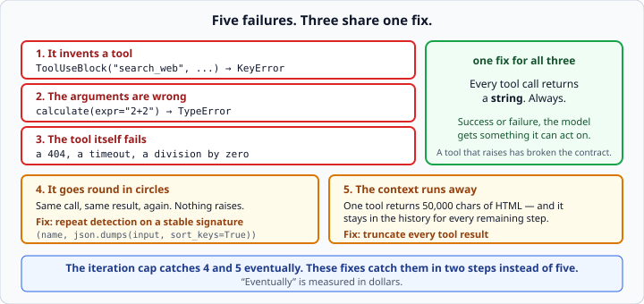

# Agent failure modes

*Week 7 · Day 3 · about 20 minutes*

> By the end of this your agent survives tools that fail, arguments that are wrong,
> names that do not exist, and its own tendency to go round in circles.

---

## Read the official documentation first

| Page | What it gives you |
|---|---|
| [**Handling tool errors**](https://docs.claude.com/en/docs/agents-and-tools/tool-use/implement-tool-use#handling-tool-errors) | `is_error` and what to send back |
| [**Building effective agents**](https://www.anthropic.com/engineering/building-effective-agents) | The guardrails section |
| [**`json.dumps` — `sort_keys`**](https://docs.python.org/3.14/library/json.html#json.dumps) | Building a stable call signature |
| [**Built-in Exceptions**](https://docs.python.org/3.14/library/exceptions.html) | `KeyError`, `TypeError` — the two you will catch |

---

## Yesterday's loop works when everything works

Today is the other 80% — and it is the part that separates a demo from something you
would leave running.



---

## 1. It invents a tool

```python
ToolUseBlock("search_web", {"query": "..."})     # you never had that tool
```

Your dispatch table raises `KeyError`.

**Do not let that crash the loop.** Send back `"Unknown tool: search_web"` as the
result. The model reads it, apologises, and usually recovers with a tool that does
exist.

An agent that dies because the model guessed wrong is an agent that cannot
self-correct — which was the entire reason for having a loop.

Name the alternatives in the message and recovery is faster:

```python
return f"Error: unknown tool '{name}'. Available tools: {', '.join(sorted(TOOLS))}"
```

Week 3's rule about error messages, aimed at a reader that happens to be a model.

---

## 2. The arguments are wrong

```python
ToolUseBlock("calculate", {"expr": "2+2"})       # you called it "expression"
ToolUseBlock("calculate", {})                    # nothing at all
```

`function(**arguments)` raises `TypeError`. Same treatment: catch it, describe it, send
it back.

```
Error: calculate() missing 1 required positional argument: 'expression'
```

That is a message the model can act on immediately, and Python's own wording is already
good enough — you rarely need to improve on it.

**If this happens repeatedly, the fix is the schema**, not the error handling. A field
whose description is `"The expression"` gets guessed at; one that says
`"The arithmetic to evaluate, e.g. '17 * 23'"` does not.

---

## 3. The tool itself fails

Division by zero, a 404, a timeout. Your tool raises.

The model needs to know what happened so it can try something else — or tell the user it
could not.

```python
def run_tool(name: str, arguments: dict) -> str:
    """Run the named tool. Always returns a string, success or failure."""
    function = TOOLS.get(name)
    if function is None:
        return f"Error: unknown tool '{name}'. Available: {', '.join(sorted(TOOLS))}"
    try:
        return str(function(**arguments))
    except Exception as error:
        return f"Error: {type(error).__name__}: {error}"
```

**All three failures have the same fix: every tool call returns a string, always.**
Success or failure, the model gets an answer. A tool that raises into your loop has
broken the contract.

Including `type(error).__name__` helps — `TimeoutError` and `ValueError` suggest
different next moves.

You can also flag it explicitly to the API:

```python
{"type": "tool_result", "tool_use_id": block.id,
 "content": message, "is_error": True}
```

Either works. The important thing is that a result comes back at all — an unanswered
`tool_use` is a `400`.

> This is the deliberate exception to week 3's "raise deep, catch shallow", and the
> broad `except Exception` is deliberate too. The caller here is a language model that
> can reason about the failure, not a `main()` that can only crash. Be able to say that
> on Friday.

---

## 4. It goes round in circles

The genuinely hard one.

The model calls `calculate("2+2")`, gets `4`, does not like it, and calls
`calculate("2+2")` again. And again. **Every call is legal, nothing raises, and the bill
grows.**

The iteration cap catches this eventually. Repeat detection catches it in two steps
instead of five, and it is cheap:

```python
import json

def call_signature(name: str, arguments: dict) -> str:
    """Return a stable identifier for one tool call. Argument order must not matter."""
    return f"{name}:{json.dumps(arguments, sort_keys=True)}"
```

```python
seen: list[str] = []
...
signature = call_signature(block.name, block.input)
if seen.count(signature) >= max_repeats:
    return "Stopped: the agent repeated the same tool call without making progress."
seen.append(signature)
```

**`sort_keys=True` matters.** `{"a": 1, "b": 2}` and `{"b": 2, "a": 1}` are the same
call, and comparing the raw dict strings would say they are not — so your detector would
never fire.

### Telling it, rather than just stopping

Better than stopping is telling the model what it is doing:

```python
if seen.count(signature) >= max_repeats:
    result = (f"Error: you have already called {block.name} with these arguments "
              f"and received the same answer. Try a different approach or answer "
              f"with what you have.")
```

Now the model gets a chance to break out itself. Stop only if it does not.

**This is the failure that costs money while you sleep.** It is the one to build first.

---

## 5. The context runs away

Every step adds the model's turn **and** the tool results. A tool that returns 50,000
characters of HTML puts all of it in the history — and it stays there for every
remaining step, re-sent and re-billed each time.

```python
MAX_RESULT_CHARS = 500

def truncate(result: str, limit: int = MAX_RESULT_CHARS) -> str:
    """Return the result, shortened with a marker if it is too long."""
    if len(result) <= limit:
        return result
    return result[:limit] + f"\n[truncated, {len(result)} chars total]"
```

Five hundred characters is almost always enough for the model to work with, and it stops
one greedy tool ending the run.

**Say that it was truncated.** A silently shortened result makes the model confidently
answer from half a document. The marker lets it ask for more, or say it could not tell.

The general principle: **a tool should return what the model needs to decide, not
everything it knows.** A search tool returning ten titles beats one returning ten full
pages, and it is cheaper on every subsequent step.

---

## Why a class, now

Yesterday's functions each passed `client`, `max_iterations` and the trace around. That
is week 4's signal that these things belong together:

```python
class Agent:
    """An agent with bounded iterations, repeat detection and a trace."""

    def __init__(self, client, model: str, max_iterations: int = 5,
                 max_repeats: int = 2, max_result_chars: int = 500) -> None:
        self.client = client
        self.model = model
        self.max_iterations = max_iterations
        self.max_repeats = max_repeats
        self.max_result_chars = max_result_chars
        self.trace: list[dict] = []
        self.stop_reason: str | None = None

    def run(self, question: str) -> str:
        self.trace = []
        ...
```

State and the behaviour that acts on it, travelling together — week 4's test, and this
class passes it clearly. `trace` and `stop_reason` become attributes you inspect after a
run, rather than return values threaded through five functions.

Note `self.trace = []` at the top of `run`, and `self.trace: list[dict] = []` in
`__init__` rather than in the class body. Week 4's shared-mutable-attribute trap is
exactly the kind of bug that would make two agent runs contaminate each other.

---

## The one that is not on the list

**It gives a confidently wrong answer.**

No exception, no repeat, no truncation, no cap hit. It ran three tools, read the
results, and drew the wrong conclusion.

Nothing in this article catches that. The only defences are:

- **the trace** — you can see what it read and where the reasoning went wrong
- **evaluation** — a set of questions with known answers, run after every change

That is week 9 and week 11. For now, notice that guardrails bound the *cost* and the
*chaos* of an agent. They do not make it *correct*, and anyone who tells you otherwise is
selling something.

---

## Check yourself

```python
def run_tool(name, arguments):
    return str(TOOLS[name](**arguments))
```

1. Name three exceptions this can raise, and what each means.
2. What does your agent loop do when it raises?
3. Why does `call_signature` need `sort_keys=True`?
4. A tool returns 50,000 characters on step 1 of a 10-step run. What does that cost?

<details>
<summary>Answers</summary>

1. `KeyError` — the model invented a tool name. `TypeError` — wrong or missing
   arguments. Anything the tool itself raises — `ZeroDivisionError`, `Timeout`, a
   `requests` error.
2. It dies. The exception propagates out of the loop and the run ends with a traceback
   instead of an answer — over a mistake the model could have recovered from in one step.
3. Because dicts with the same contents in a different order produce different JSON
   strings. Without it, `{"a":1,"b":2}` and `{"b":2,"a":1}` look like different calls and
   your repeat detector never fires on the loop it was built for.
4. It is in the history for the remaining nine steps, so you pay for roughly 12,500
   tokens **nine more times** — on top of everything else the history is carrying. One
   greedy tool can dominate the cost of an entire run.
</details>

---

## What you can now do

- [ ] Handle an invented tool name and name the available tools in the message
- [ ] Handle wrong arguments, and know when the real fix is the schema
- [ ] Make every tool call return a string, success or failure
- [ ] Explain why this is the right exception to "raise deep, catch shallow"
- [ ] Build a stable call signature and detect repeats
- [ ] Tell the model it is repeating rather than only stopping
- [ ] Truncate tool results, and say when they were truncated
- [ ] Wrap the agent in a class, avoiding the shared-mutable-attribute trap
- [ ] Say what guardrails do not protect you from

**Next:** [`asyncio` basics](../day-4/asyncio-basics.md) — running several tool calls at
once.
