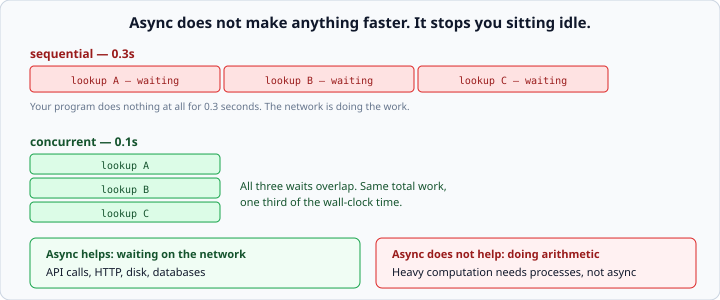

# `asyncio` basics

*Week 7 · Day 4 · about 25 minutes*

> By the end of this your agent runs several tool calls concurrently — and you know
> exactly when that helps and when it does nothing.

---

## Read the official documentation first

| Page | What it gives you |
|---|---|
| [**`asyncio` — Asynchronous I/O**](https://docs.python.org/3.14/library/asyncio.html) | The module |
| [**Coroutines and Tasks**](https://docs.python.org/3.14/library/asyncio-task.html) | `async def`, `await`, `gather` |
| [**`asyncio.run()`**](https://docs.python.org/3.14/library/asyncio-runner.html#asyncio.run) | The bridge from ordinary code |
| [**`asyncio.to_thread()`**](https://docs.python.org/3.14/library/asyncio-task.html#asyncio.to_thread) | Running a blocking function from async code |
| [**`asyncio.gather()`**](https://docs.python.org/3.14/library/asyncio-task.html#asyncio.gather) | Running several at once |

---

## One response, several tools

A model can ask for more than one tool in a single reply:

```python
response.content    # [ToolUseBlock("city_info", ...), ToolUseBlock("city_info", ...)]
```

Your loop already handles this — you run every block and put every result in the same
user message. But you run them **one after another**, and each of these tools waits on
something.

Three sequential calls that each wait a tenth of a second: 0.3 seconds. Three
concurrent: 0.1. **That gap is why this matters**, and it grows with every tool.

---

## `async` in ninety seconds

```python
import asyncio

async def slow_thing(n):
    await asyncio.sleep(1)
    return n * 2

async def main():
    results = await asyncio.gather(slow_thing(1), slow_thing(2), slow_thing(3))
    return results          # [2, 4, 6] — after ONE second, not three

asyncio.run(main())
```

| | |
|---|---|
| `async def` | a function that can pause |
| `await` | pause here and let something else run |
| `asyncio.gather(...)` | start several, wait for all of them |
| `asyncio.run(...)` | the bridge from ordinary code into async |

Four things. That is genuinely most of what you need.

### Two rules that cover most beginner errors

**`await` only works inside `async def`.** Using it at the top level of a script is a
`SyntaxError`.

**Calling an `async def` does not run it.** It returns a coroutine object, which does
nothing until awaited:

```python
slow_thing(1)               # <coroutine object slow_thing> — and a RuntimeWarning
await slow_thing(1)         # 2
```

If a value comes back as `<coroutine object ...>`, you forgot an `await`. That is the
single most common async bug, and now you can name it on sight.

---

## Async does not make anything faster



It stops your program **sitting idle while it waits**.

Three tools that each wait on a network are perfect for it. Three that each do heavy
arithmetic get **no benefit at all** — there is no waiting to overlap, and Python still
runs one thing at a time. For those you would need processes, which is a different topic
and not one you need.

The test: **is this waiting, or is it working?**

| Waiting — async helps | Working — async does not |
|---|---|
| HTTP requests | heavy arithmetic |
| database queries | parsing a huge file |
| reading files | image processing |
| API calls | sorting a million rows |

Nearly everything an agent tool does is waiting. That is why this is the single most
common real-world speedup in agent code.

---

## Running a blocking tool from async code

Your tools are ordinary functions. Calling one directly inside `async def` blocks
everything, which defeats the point:

```python
async def run_tool_async(name: str, arguments: dict) -> str:
    """Run a blocking tool without blocking the event loop."""
    function = TOOLS.get(name)
    if function is None:
        return f"Error: unknown tool '{name}'"
    try:
        return str(await asyncio.to_thread(function, **arguments))
    except Exception as error:
        return f"Error: {type(error).__name__}: {error}"
```

`asyncio.to_thread` runs it on a separate thread and lets the event loop carry on. It is
the bridge in the other direction, and it is exactly what you want for tools you did not
write as async.

**Note the error handling is unchanged.** Yesterday's contract still holds: every tool
call returns a string, always. Async changes when things run, not what they return.

---

## Running them all

```python
async def run_all_async(calls: list[tuple]) -> list[tuple]:
    """Run [(id, name, arguments), ...] concurrently, preserving order."""
    coroutines = [run_tool_async(name, arguments) for _, name, arguments in calls]
    results = await asyncio.gather(*coroutines)
    return [(call_id, result) for (call_id, _, _), result in zip(calls, results)]


def run_all(calls: list[tuple]) -> list[tuple]:
    """The ordinary function you call from normal code."""
    return asyncio.run(run_all_async(calls))
```

Week 3's comprehension, week 2's `zip`, week 4's type hints. Nothing new except
`gather`.

**`gather` preserves order.** Result *i* corresponds to coroutine *i*, however long each
took. That is what makes the `zip` back to the call ids safe — and it is a guarantee
worth knowing rather than assuming.

The `*coroutines` unpacks the list into separate arguments, because `gather` takes them
positionally.

### One failure should not kill the batch

```python
results = await asyncio.gather(*coroutines, return_exceptions=True)
```

Without `return_exceptions=True`, one raising coroutine cancels the rest and the whole
`gather` raises. With it, the exception is returned in its slot and you handle it like
any other result.

Since `run_tool_async` already catches everything, you should not need it — but it is
the right default for anything you did not write.

---

## Wiring it into the loop

```python
tool_calls = [(b.id, b.name, b.input) for b in response.content if b.type == "tool_use"]
results = run_all(tool_calls)

messages.append({
    "role": "user",
    "content": [
        {"type": "tool_result", "tool_use_id": call_id, "content": result}
        for call_id, result in results
    ],
})
```

The loop itself is unchanged. You swapped a sequential `for` for a concurrent
`run_all`, and everything else — one user message, matching ids, all results present —
still holds.

**That is what a good refactor looks like:** one thing changed, the contract intact.

---

## Where this actually pays

An agent asking for six web lookups at once. Sequentially that is six round trips of
waiting; concurrently it is one.

Every framework does this for you — which is exactly why it is worth doing once by hand.
When LangGraph next week runs your tool nodes in parallel, you will know it is
`asyncio.gather` and not magic.

### Two cautions

**Do not parallelise dependent calls.** If tool B needs tool A's result, they must run
in order. The model handles this by asking for A, seeing the result, then asking for B —
which is two loop iterations, not one parallel batch. Only the tools in *one* assistant
turn can run together.

**Watch the rate limits.** Twenty concurrent API calls is an excellent way to get
`429`s. Week 5's backoff still applies, and `asyncio.Semaphore` is how you cap
concurrency when you need to.

---

## The async client

The Anthropic SDK has an async client too:

```python
client = anthropic.AsyncAnthropic()
response = await client.messages.create(...)
```

You do not need it this week — your loop is sequential by nature, since each call
depends on the last. It matters in week 11, when your agent sits behind a web server and
a synchronous call blocks an entire worker for the whole response.

Know it exists. The shape barely changes.

---

## Check yourself

```python
import asyncio, time

async def wait(n):
    await asyncio.sleep(0.1)
    return n

# a
async def main_a():
    return [await wait(1), await wait(2), await wait(3)]

# b
async def main_b():
    return await asyncio.gather(wait(1), wait(2), wait(3))

# c
def main_c():
    return wait(1)
```

1. How long does **a** take?
2. How long does **b** take?
3. What does **c** return?

<details>
<summary>Answers</summary>

1. **0.3 seconds.** Each `await` waits for that one to finish before starting the next.
   `async` alone buys you nothing — **you have to actually run them concurrently.** This
   is the most common mistake in first async code.
2. **0.1 seconds.** `gather` starts all three, then waits for all three.
3. A **coroutine object**, and a `RuntimeWarning` that it was never awaited. `wait(1)`
   does not run anything. If a value prints as `<coroutine object ...>`, this is why.
</details>

---

## What you can now do

- [ ] Write `async def`, `await`, `asyncio.gather` and `asyncio.run`
- [ ] Explain that async removes idle waiting rather than making work faster
- [ ] Decide whether a task is waiting or working, and choose accordingly
- [ ] Run a blocking function from async code with `asyncio.to_thread`
- [ ] Run several tool calls concurrently, preserving order back to their ids
- [ ] Use `return_exceptions=True` so one failure does not kill the batch
- [ ] Recognise a forgotten `await` from a `<coroutine object>`
- [ ] Say why dependent calls cannot be parallelised

**Next:** the week 7 milestone — **Project 2**, an agent with no framework, and the
write-up. This is the keystone of the course.
