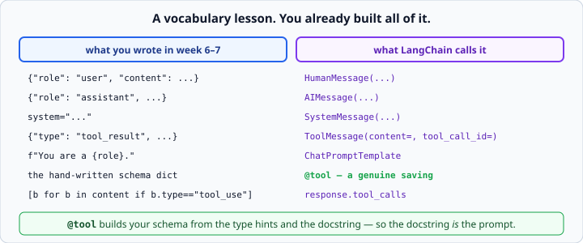
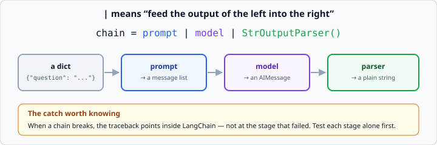

# LangChain core concepts

*Week 8 · Day 1 · about 30 minutes*

> By the end of this you can use LangChain's messages, prompt templates, tools and
> output parsers — and say which of them are worth using.

---

## Read the official documentation first

| Page | What it gives you |
|---|---|
| [**LangChain — Introduction**](https://python.langchain.com/docs/introduction/) | What it is for |
| [**Messages**](https://python.langchain.com/docs/concepts/messages/) | `HumanMessage`, `AIMessage`, `ToolMessage` |
| [**Prompt templates**](https://python.langchain.com/docs/concepts/prompt_templates/) | `ChatPromptTemplate` |
| [**Tools**](https://python.langchain.com/docs/concepts/tools/) | The `@tool` decorator |
| [**LCEL**](https://python.langchain.com/docs/concepts/lcel/) | The `\|` operator |
| [**`typing` (Python)**](https://docs.python.org/3.14/library/typing.html) | The hints `@tool` reads |

> LangChain is a third-party library — docs at **python.langchain.com**. It moves
> quickly, so check the version in your `requirements.txt` matches the docs you are
> reading. A tutorial using `LLMChain` or `initialize_agent` is out of date by years.

---

## Today is deliberately unexciting

It is a vocabulary lesson: **the same ideas you already have, with the names the
ecosystem uses.**



You spent week 7 building all of this by hand, on purpose. Today you find out what it is
called, and — crucially — you get to judge each piece rather than accept it.

The question to keep asking: **does this buy me something, or does it just rename
something?** Both are legitimate answers, and being able to tell them apart is the skill
that gets tested on Friday.

---

## Messages are objects now

```python
from langchain_core.messages import HumanMessage, AIMessage, SystemMessage, ToolMessage

messages = [
    SystemMessage("You are terse."),
    HumanMessage("What is 2+2?"),
    AIMessage("4"),
]
```

Your `{"role": "user", "content": "..."}` dicts, as classes. That is genuinely all this
is.

**What it buys:** every LangChain component agrees on the type, so a prompt template and
a model and a parser can be wired together without adapters. **What it costs:** one more
import, and a translation step whenever you touch a raw API.

`ToolMessage(content="391", tool_call_id="t1")` is your `tool_result` block. Same
fields, same rules — **including that the id has to match.** Nothing has been abstracted
away; it has been renamed.

---

## Prompt templates

```python
from langchain_core.prompts import ChatPromptTemplate

prompt = ChatPromptTemplate.from_messages([
    ("system", "You are a {role}."),
    ("human", "{question}"),
])

messages = prompt.invoke({"role": "translator", "question": "Hello in French?"})
```

An f-string with a schema attached. It validates that you supplied every variable, which
is a real convenience once a prompt has six of them and lives in another file.

**For a one-off prompt in the same function, an f-string is still fine.** Reach for a
template when the prompt is reused, configurable, or long enough to want to keep
somewhere else.

Being willing to say "not here" about a framework feature is exactly the judgement this
week is for.

---

## `@tool` — the first genuine saving

```python
from langchain_core.tools import tool

@tool
def calculate(expression: str) -> str:
    """Evaluate a basic arithmetic expression such as '2 + 2 * 3'."""
    return str(eval(expression, {"__builtins__": {}}, {}))
```

The decorator builds your week 7 schema **from the type hints and the docstring**:

```python
calculate.name          # "calculate"
calculate.description   # the docstring
calculate.args          # {"expression": {"type": "string", ...}}
calculate.invoke({"expression": "17 * 23"})     # "391"
```

Everything you hand-wrote in `schemas.py` on Monday of week 7, generated.

And notice what that means: **the docstring is now the prompt.** The thing you were told
mattered most is wired directly to the thing you write anyway. Two artefacts that could
drift apart have become one.

This is what a good abstraction looks like — it removes a *duplication*, not just a
keystroke.

> The `eval` above is from the course's toolkit and is sandboxed with
> `{"__builtins__": {}}`. That is still not something to put in production on user
> input. Week 7's security section applies unchanged: LangChain does not validate your
> tool's arguments for you.

---

## Binding tools

```python
model_with_tools = model.bind_tools([calculate, save_note])
response = model_with_tools.invoke(messages)

response.tool_calls     # [{"name": "calculate", "args": {...}, "id": "t1"}]
```

`response.tool_calls` is your
`[b for b in response.content if b.type == "tool_use"]`, done for you. A list of dicts
rather than objects, and **empty when the model did not ask for anything** — which is a
slightly nicer check than `stop_reason`:

```python
if not response.tool_calls:
    return response.content         # it answered
```

Small, real, and it removes a place you could get the branch wrong. Note it does not
remove the concept — you still have to know that a response either asks for tools or
answers.

---

## LCEL — the `|` operator

```python
from langchain_core.output_parsers import StrOutputParser

chain = prompt | model | StrOutputParser()
answer = chain.invoke({"role": "translator", "question": "Hello in French?"})
```



`|` means *feed the output of the left into the right*. The chain is itself a callable,
so it can be nested inside another chain.

Every stage also gets `.stream()` and `.batch()` for free, which is a genuine
convenience — you wrote the streaming loop by hand in week 6 and now it comes as a
method.

### The cost, which is real

**When a chain breaks, the traceback points inside LangChain**, not at the stage that
failed. You get thirty frames of framework and one line of yours.

Two habits make that survivable:

1. **Test each stage alone first.** `prompt.invoke({...})` and `model.invoke(messages)`
   are both callable on their own. Debug them separately, then compose.
2. **Do not build a six-stage chain in one go.** Build two, run it, add one.

That is week 1's "change one thing" and week 3's incremental habit, in a place where
they matter more than usual.

---

## Output parsers

```python
from langchain_core.output_parsers import PydanticOutputParser

parser = PydanticOutputParser(pydantic_object=Contact)
chain = prompt | model | parser
```

Week 6's extract-parse-validate, packaged. `parser.get_format_instructions()` even
generates the "return JSON with these keys" text to drop into your prompt.

**Judge it honestly.** It saves you the `extract_json` helper and the `model_validate`
call. It does *not* give you the retry-with-the-error-fed-back loop, which was the part
that actually made structured output reliable — you still have to build that yourself,
or reach for the API's native structured outputs.

A saving, but a smaller one than it looks.

---

## What to write on Friday

Keep a running note as you work today. For each piece:

| Piece | Bought | Cost |
|---|---|---|
| Messages | type agreement across components | an import, a translation layer |
| Prompt templates | variable validation, reuse | overkill for a one-off f-string |
| `@tool` | schema generated from code — no duplication | ties your tool to the framework |
| `bind_tools` | a cleaner "did it ask for tools" check | none worth mentioning |
| LCEL | composition, free `.stream()` / `.batch()` | tracebacks become opaque |
| Output parsers | parse and validate in one stage | no retry loop; you still build that |

**That table, filled in with your own examples and line counts, is Friday's
deliverable.** Not "LangChain is good" or "LangChain is bloated" — a specific,
defensible account of what each piece did for a real agent you had already written
without it.

That is a genuinely rare thing for a junior candidate to be able to produce.

---

## Check yourself

1. What is the LangChain equivalent of `{"role": "user", "content": "hi"}`?
2. What two things does `@tool` read to build the schema?
3. What does `response.tool_calls` replace?
4. Your chain `prompt | model | parser` raises. Where do you start?
5. Which piece today is the biggest genuine saving, and why?

<details>
<summary>Answers</summary>

1. `HumanMessage("hi")`.
2. The **type hints** (for the JSON Schema) and the **docstring** (for the description).
3. Filtering `response.content` for `tool_use` blocks and reading `stop_reason`.
4. Not in the traceback. Run `prompt.invoke({...})` alone, look at the messages, then
   `model.invoke(messages)` alone, then the parser on that output. One stage at a time.
5. `@tool` — it eliminates a **duplication** (the schema restating what the function
   already declares), not merely some typing. Everything else today mostly renames
   things you had.
</details>

---

## What you can now do

- [ ] Use `HumanMessage`, `AIMessage`, `SystemMessage` and `ToolMessage`
- [ ] Say what each maps to in the raw API
- [ ] Build a `ChatPromptTemplate`, and say when an f-string is still the right answer
- [ ] Use `@tool` and explain why generating the schema from the docstring matters
- [ ] Use `bind_tools` and `response.tool_calls`
- [ ] Compose with `|`, and debug a chain by testing each stage alone
- [ ] Judge each piece as "bought me something" or "renamed something"

**Next:** [LangGraph state and nodes](../day-2/langgraph-state-and-nodes.md) — the
machinery, on plain numbers.
