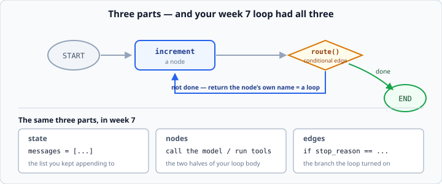
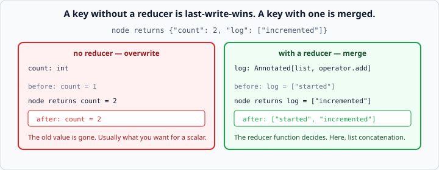

# LangGraph state and nodes

*Week 8 · Day 2 · about 30 minutes*

> By the end of this you can build a graph with state, nodes and a decision in the
> middle — and say what it does that a `while` loop does not.

---

## Read the official documentation first

| Page | What it gives you |
|---|---|
| [**LangGraph — Overview**](https://langchain-ai.github.io/langgraph/) | What it is for |
| [**Graph API concepts**](https://langchain-ai.github.io/langgraph/concepts/low_level/) | State, nodes, edges, reducers |
| [**`TypedDict` (Python)**](https://docs.python.org/3.14/library/typing.html#typing.TypedDict) | Declaring the state shape |
| [**`Annotated` (Python)**](https://docs.python.org/3.14/library/typing.html#typing.Annotated) | How a reducer is attached |
| [**`operator` (Python)**](https://docs.python.org/3.14/library/operator.html#operator.add) | `operator.add`, the simplest reducer |

---

## No model today

Just the machinery, on plain numbers, so the graph is the only thing you are thinking
about.

That is deliberate. Every confusing LangGraph tutorial mixes graph mechanics with model
calls, and when something goes wrong you cannot tell which half is at fault.

---

## The three parts

A LangGraph program is:

1. **State** — a dict, whose shape you declare
2. **Nodes** — functions that take the state and return *part* of a new one
3. **Edges** — what runs next, sometimes conditionally



**Your week 7 loop had all three too.** `messages` was the state, "call the model" and
"run the tools" were the nodes, and the `if stop_reason` was the edge.

Nothing new is being introduced. Something you built implicitly is being made explicit —
and whether that is worth it is Friday's question.

---

## State

```python
from typing import Annotated, TypedDict
import operator

class CounterState(TypedDict):
    count: int
    limit: int
    log: Annotated[list, operator.add]
```

`TypedDict` declares the keys. It is week 4's type hints again — Python does not enforce
it, but LangGraph reads it and your editor uses it.

### Reducers — the part that confuses everyone

`Annotated[list, operator.add]` attaches a **reducer**: *when a node returns a `log`,
add it to the existing one rather than replacing it.*



> **A key without a reducer is last-write-wins. A key with one is merged by that
> function.**

Say that out loud until it sticks. It is most of what people get wrong about LangGraph
state, and it explains both classic bugs:

- **"My log only has one entry."** No reducer — each node overwrote it.
- **"My count keeps growing when I set it to 5."** A reducer where you did not want one
  — `operator.add` on an `int` adds.

For messages there is a purpose-built reducer, `add_messages`, which appends *and*
handles updating a message by id. You meet it tomorrow.

### Why reducers exist at all

Because a node returns a **partial** update, and the graph has to decide how to apply
it. For a scalar, replacing is obviously right. For an accumulating log or a message
history, appending is obviously right. The reducer is where you say which.

It also matters when two branches run in parallel and both update the same key — the
reducer is what merges them. You do not need that this week; it is why the mechanism is
more general than it first looks.

---

## Nodes

```python
def increment(state: CounterState) -> dict:
    """Add one to the count and record it."""
    return {"count": state["count"] + 1, "log": ["incremented"]}
```

A node takes the **whole state** and returns a **partial update**. Keys you do not
mention are left alone.

Returning `{"log": ["incremented"]}` appends one entry — the reducer does the merging.
Note you return a **list containing one item**, not the item: the reducer is
`operator.add` on lists, so it needs a list to add.

Getting that wrong is the other classic bug. `{"log": "incremented"}` tries to add a
string to a list and raises.

### Nodes are ordinary functions

```python
def test_increment():
    result = increment({"count": 0, "limit": 5, "log": []})
    assert result == {"count": 1, "log": ["incremented"]}
```

**Testable on their own, without a graph, and you should test them that way.** No
`StateGraph`, no `compile()`, no model. Just a dict in and a dict out.

This is the biggest practical benefit of the node structure and it is easy to miss: your
week 7 loop body was a chunk of code inside a `for`, hard to test in isolation. A node
is a function with a signature.

---

## Edges

```python
from langgraph.graph import StateGraph, START, END

graph = StateGraph(CounterState)
graph.add_node("increment", increment)
graph.add_node("double", double)

graph.add_edge(START, "increment")
graph.add_edge("increment", "double")
graph.add_edge("double", END)

app = graph.compile()
result = app.invoke({"count": 0, "limit": 5, "log": []})
```

`START` and `END` are the entry and exit. `compile()` checks the graph is wired up and
gives you something you can call.

`invoke` takes the **initial state** and returns the **final state** — the whole dict,
not just one value.

**Supply every key in the initial state**, including empty lists. A missing key that a
node reads is a `KeyError` several nodes later, which is exactly the kind of failure the
`TypedDict` was supposed to prevent and does not.

---

## Conditional edges — the whole point

```python
def route(state: CounterState) -> str:
    """Return the name of the next node."""
    if state["count"] < state["limit"]:
        return "increment"
    return END

graph.add_conditional_edges("increment", route, ["increment", END])
```

The routing function returns **the name of the next node**. Returning the node you just
came from is a loop — **and that is how a graph does what your `while` did.**

Three things worth knowing:

**The routing function is a node's worth of logic with no side effects.** It reads state
and returns a name. Keep it that way; a router that mutates state is very hard to reason
about.

**The third argument lists the possible destinations.** It is optional and worth
supplying: it lets the graph be drawn, and it catches a typo in a returned name at build
time rather than at run time.

**A routing function that can return a name not in that list** is a `ValueError` mid-run
— which is a much worse place to find out.

---

## The recursion limit

```python
app.invoke(initial_state, {"recursion_limit": 25})
```

Your week 7 iteration cap, renamed and defaulted to 25.

**Every framework has one, and it is the same lesson**: a graph with a loop in it can
run forever, so something has to stop it. Exceeding it raises
`GraphRecursionError`, which is at least loud.

Note what has happened here. You were told in week 7 to write the cap before anything
else. LangGraph writes it for you, with a default. That is a genuine benefit — and it is
also how a beginner ends up with a bounded agent without ever understanding why the
bound exists.

That trade — safe defaults versus understood mechanisms — is worth a paragraph on
Friday.

---

## What a graph buys you over a `while` loop

Be specific about this. Both sides are real.

**What it buys:**

- **Testable nodes.** Each step is a function with a signature.
- **The structure is data.** You can draw it — `app.get_graph().draw_ascii()` — and a
  picture of your agent is genuinely useful when explaining it.
- **Streaming per step** comes free. You meet that on Thursday.
- **Persistence and interrupts** plug in without rewriting the loop. That is week 10, and
  it is where the graph structure really earns its keep.
- **Parallel branches** are declarative rather than something you wire with `asyncio`.

**What it costs:**

- **More concepts.** State schema, reducers, node names, routing functions — all to
  express nine lines of English.
- **Errors are harder to place.** A typo in a node name fails at compile time if you are
  lucky and mid-run if you are not.
- **Indirection.** "Where does this go next?" is answered in a different place from the
  node itself.
- **A dependency**, with a release cadence you do not control.

For a five-line loop, a graph is overkill and you should say so. For an agent with
persistence, human approval steps and parallel branches, hand-rolling all of that is how
you accidentally write a worse LangGraph.

**The honest answer is "it depends on what you are building", and Friday wants you to
say what it depends on.**

---

## Check yourself

```python
class State(TypedDict):
    count: int
    log: Annotated[list, operator.add]

def bump(state: State) -> dict:
    return {"count": state["count"] + 1, "log": ["bumped"]}
```

1. After `bump` runs twice from `{"count": 0, "log": []}`, what is the state?
2. What happens if you drop the `Annotated[...]` from `log`?
3. What happens if `bump` returns `{"log": "bumped"}` instead of `["bumped"]`?
4. A routing function returns `"increement"`. When do you find out?

<details>
<summary>Answers</summary>

1. `{"count": 2, "log": ["bumped", "bumped"]}`. `count` is overwritten each time;
   `log` accumulates.
2. `log` becomes last-write-wins, so it ends as `["bumped"]` — one entry, however many
   times the node ran. This is the "my log only has one entry" bug.
3. `TypeError` — `operator.add` on a list and a string. The reducer needs the same type
   it is merging into.
4. If you passed the destination list to `add_conditional_edges`, at **build** time. If
   you did not, at **run** time — mid-execution, possibly in production. Which is the
   whole argument for passing it.
</details>

---

## What you can now do

- [ ] Declare state with `TypedDict`
- [ ] Attach a reducer with `Annotated`, and state the last-write-wins rule
- [ ] Write a node that returns a partial update, and test it without a graph
- [ ] Wire nodes with `add_edge`, `START` and `END`, and `compile()`
- [ ] Write a routing function and `add_conditional_edges`, with the destination list
- [ ] Create a loop by routing back to a node
- [ ] Explain the recursion limit as your week 7 cap
- [ ] Say what a graph buys over a `while` loop, and what it costs

**Next:** [Building an agent in LangGraph](../day-3/agent-in-langgraph.md) — porting
week 7's agent, node by node.
